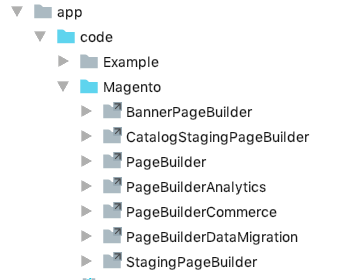

## Page Builder pre-release access

Pre-release access to Page Builder is opened to all Magento Partners with *no support* from Magento team.
Use this access to:

- Explore extension points to build custom modules and integrations for 3rd party services, such as Facebook and Instagram.
- Try out customization options and extend its functionality beyond its default features.
- Preview to prepare a migration plan from BlueFoot 1.0 to Page Builder.

Should you find an issue in Page Builder functionality, please report it on GitHub.

## GitHub installation only

**The pre-release version of Page Builder MUST be installed by cloning the GitHub repos as described here.**

Before installing Page Builder, make sure you have:

* A local development installation of Magento Commerce 2.3+
* Access to the Page Builder repository
* [npm package manager](https://www.npmjs.com/get-npm)

1. Clone the Page Builder repos into the root directory of your Magento Commerce 2.3+ installation:

    ```bash
    git clone https://github.com/magento/magento2-page-builder
    git clone https://github.com/magento/magento2-page-builder-ee
    ```

2. From the root directory of your Magento Commerce installation, use the `dev/tools/build-ee.php` script to symlink `magento2-page-builder` and `magento2-page-builder-ee` repos into your Magento Commerce installation:

    ```bash
    php dev/tools/build-ee.php --command=link --ee-source="magento2-page-builder" --ce-source="."
    php dev/tools/build-ee.php --command=link --ee-source="magento2-page-builder-ee" --ce-source="."
    ```
    
    The results should look like this:
    
    

3. Enable the Page Builder module using the following command:

    ```bash
    bin/magento setup:upgrade
    ```

## Developer documentation

We will update the developer documentation frequently during beta. Please use this link to access the latest updates: 
[Page Builder developer documentation](https://devdocs.magedevteam.com/72/page-builder/docs/getting-started/introduction.html)

## Contribute to Page Builder

We appreciate any and all contributions to Page Builder. If you are interested in contributing to this repository, please see our [Contribution Guide].

## TypeScript
This module utilises TypeScript within our adminhtml web directory. This requires an additional build step or watch command to be running during development on this module.

We use a combination of `tsc` from TypeScript and Babel 7.* with the TypeScript env. This enables us to have fast build times for the large TypeScript code base we have.

#### `npx ts:build`
Runs a single build of all TypeScript files within the defined directory. This utilises Babel with the TypeScript present.

#### `npx ts:watch`
Runs a continuous watch of files and builds them as it detects file changes.

#### `npx ts:lint`
Runs TSLint to verify linting of all TypeScript files

#### `npx ts:defs`
Generates TypeScript definitions for the whole module to be published as a types package.

#### `npx ts:errors`
Displays any TypeScript errors currently within the code base. This utilises `tsc` with the no emit flag.

#### `npx ts:errors:watch`
Same as above but watches for file changes.

#### `npx start`
Command used to start development on this module, uses `concurrently` to spawn instances of `npx ts:watch` and `npx ts:errors:watch`.

[Contribution Guide]: CONTRIBUTING.md
[Slack]: https://magentocommeng.slack.com/messages/GANS1R4C9
