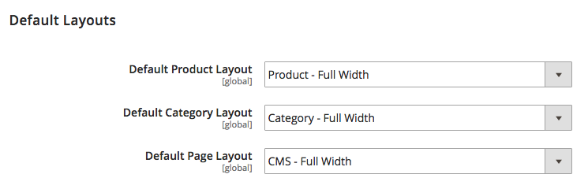
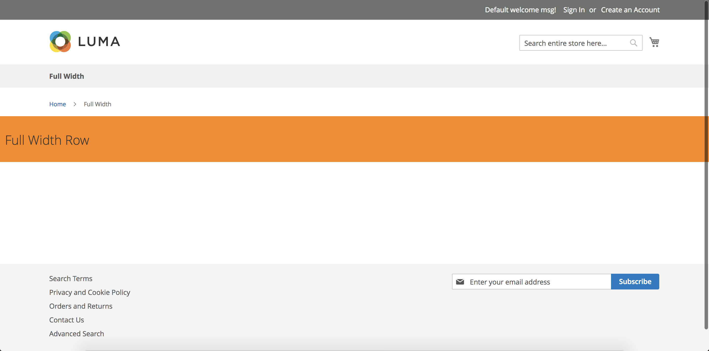

# Full width page layouts

## Navigation

1. [Introduction]
2. [Installation guide]
3. [Contribution guide]
4. [Developer documentation]
    1. [Architecture overview]
    1. [BlueFoot to PageBuilder data migration]
    1. [Third-party content type migration]
    1. [Iconography]
    1. [Add image uploader to content type]
    1. [Module integration]
    1. [Additional data configuration]
    1. [Content type configuration]
    1. [How to add a new content type]
    1. [Events]
    1. [Bindings]
    1. [Master format]
    1. [Visual select] 
    1. [Reuse product conditions in content types]
    1. [Store component master format as widget directive]
    1. [Use the block chooser UI component]
    1. [Use the inline text editing component]
    1. [Render a backend content type preview]
    1. [Custom Toolbar]
    1. **Full width page layouts**
5. [Roadmap and known issues]
6. [How to create custom PageBuilder content type container]

[Introduction]: README.md
[Contribution guide]: CONTRIBUTING.md
[Installation guide]: install.md
[Developer documentation]: developer-documentation.md
[Architecture overview]: architecture-overview.md
[BlueFoot to PageBuilder data migration]: bluefoot-data-migration.md
[Third-party content type migration]: new-content-type-example.md
[Iconography]: iconography.md
[Add image uploader to content type]: image-uploader.md
[Module integration]: module-integration.md
[Additional data configuration]: custom-configuration.md
[Content type configuration]: content-type-configuration.md
[How to add a new content type]: how-to-add-new-content-type.md
[Events]: events.md
[Bindings]: bindings.md
[Master format]: master-format.md
[Visual select]: visual-select.md
[Reuse product conditions in content types]: product-conditions.md
[Store component master format as widget directive]: widget-directive.md
[Use the block chooser UI component]: block-chooser-component.md
[Use the inline text editing component]: inline-editing-component.md
[Render a backend content type preview]: content-type-preview.md
[Custom Toolbar]: toolbar.md
[Full width page layouts]: full-width-page-layouts.md
[Add image uploader to content type]: image-uploader.md
[Roadmap and Known Issues]: roadmap.md
[How to create custom PageBuilder content type container]: how-to-create-custom-content-type-container.md

## What's in this topic
This topic describes the new full-width page layouts in Page Builder, along with instructions on how you can use them in custom themes.

**Note:** These layouts use the Luma theme page structures. They may not work as expected in your custom themes.

## New Page Layout defaults
Page Builder sets the default layouts to the new full-width layouts supplied by our Page Builder module. So unless you change the page layout, new pages are full width by default.



**Note:** The full-width layouts are specific to Product, Category, and CMS Page. Using one of these layouts outside of its intended scope could yield unpredictable results.

## CMS Full Width
This template simply removes the left and right gutters from a CMS page's content. It is implemented with `cms-full-width.xml` and extends from the `1column` page layout.

As this template extends from the `1column` page layout we restore the `page-layout-1column` class within the `Magento\PageBuilder\Plugin\Result\Page` plugin.

We do this by referencing the `main.content` container and replacing the `page-main` with our new `page-main-full-width`. 

```xml
<referenceContainer name="main.content" htmlTag="main" htmlClass="page-main-full-width" />
```



## Category Full Width
This template takes the `columns.top` section of the page and moves it out of the `main.content` section, allowing us to break out of the gutter to provide full width on just the description. It is implemented with `category-full-width.xml` and extends the `2columns-left` page layout.

As this template extends from the `2columns-left` page layout we restore the `page-layout-2columns-left` class within the `Magento\PageBuilder\Plugin\Result\Page` plugin.

We do this within `category-full-width.xml` by creating new wrapping containers in the root and then moving the image, description and CMS blocks out of the original columns top. We move description into a dedicated container to enable the full width capabilities.
```xml
<container name="columns.top.wrapper" htmlTag="div" htmlClass="page-main"/>
<move element="columns.top" destination="columns.top.wrapper"/>
<move element="columns.top.wrapper" destination="page.wrapper" after="page.top"/>
<move element="category.view.container" destination="page.wrapper" after="columns.top.wrapper"/>

<container name="category.image.wrapper" htmlTag="div" htmlClass="page-main"/>
<move element="category.image" destination="category.image.wrapper"/>
<move element="category.image.wrapper" destination="category.view.container"/>

<container name="category.description.wrapper" htmlTag="div"/>
<move element="category.description" destination="category.description.wrapper"/>
<move element="category.description.wrapper" destination="category.view.container" after="category.image.wrapper"/>

<container name="category.cms.wrapper" htmlTag="div" htmlClass="page-main"/>
<move element="category.cms" destination="category.cms.wrapper"/>
<move element="category.cms.wrapper" destination="category.view.container" after="category.description.wrapper"/>
```


## Product Full Width
This template takes the description out of the tabs section and moves it just above the reviews tab. It is implemented with `product-full-width.xml` and extends the `1column` page layout.

As this template extends from the `1column` page layout we restore the `page-layout-1column` class within the `Magento\PageBuilder\Plugin\Result\Page` plugin.

In `product-full-width.xml`, we create a new wrapper for product details & descriptions. The product details wrapper is added after `main.content` but contains the necessary `page-main` class to have the gutters on the tabs. We then create a new wrapper for the description section without the gutter. Finally we move the original description and details blocks into these new wrappers.
```xml
<referenceContainer name="page.wrapper">
    <!-- Create new product details wrapper under main.content for tabs section -->
    <container name="product.info.details.wrapper" after="main.content" htmlTag="div" htmlClass="page-main page-main-details">
        <container name="product.info.details.wrapper.columns" htmlTag="div" htmlClass="columns">
            <container name="product.info.details.wrapper.main" label="Product Details Main Content Container" htmlTag="div" htmlClass="column main"/>
        </container>
    </container>
    <!-- Create wrapper for description without page-main class which adds gutters -->
    <container name="product.info.description.wrapper" after="main.content" before="product.info.details.wrapper" htmlTag="div" htmlClass="page-main-description" htmlId="description"/>
</referenceContainer>

<!-- Move details & description into their new wrappers -->
<move element="product.info.details" destination="product.info.details.wrapper.main"/>
<move element="product.info.description" destination="product.info.description.wrapper"/>
```


## Custom Theme Full Width
We cannot guarantee these full-width layouts will work as expected with your custom themes as your page's structure may differ from Luma's.

To enable full width within your custom themes, you must ensure the appropriate block is not within your page's main wrapper. This implementation will differ on a case-by-case basis but the above implementations for Luma should give you a good indication on how to approach these.

## Disabling Page Builder
If you apply one of our custom layouts to an entity and then disable or remove the Page Builder module you'll be required to manually update those entities with new page layouts. This is due to disabling Page Builder will make the new full width layouts unavailable thus causing entities to render incorrectly.
