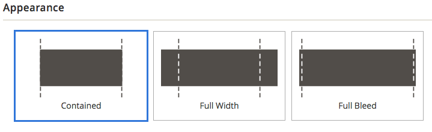
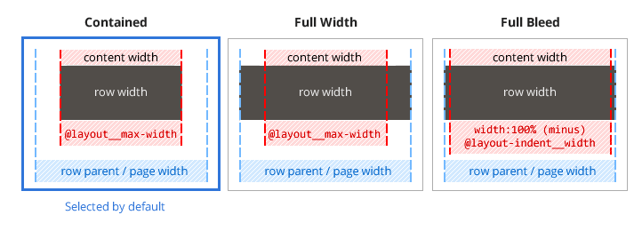

# Row Appearance

## Navigation

1. [Introduction]
2. [Installation guide]
3. [Contribution guide]
4. [Developer documentation]
    1. [Architecture overview]
    1. [BlueFoot to PageBuilder data migration]
    1. [Third-party content type migration]
    1. [Iconography]
    1. [Add image uploader to content type]
    1. [Module integration]
    1. [Additional data configuration]
    1. [Content type configuration]
    1. [How to add a new content type]
    1. [Events]
    1. [Bindings]
    1. [Master format]
    1. [Visual select] 
    1. [Reuse product conditions in content types]
    1. [Store component master format as widget directive]
    1. [Use the block chooser UI component]
    1. [Render a backend content type preview]
    1. [Custom Toolbar]
    1. [Full width page layouts]
    1. **Row appearance**
5. [Roadmap and known issues]

[Introduction]: README.md
[Contribution guide]: CONTRIBUTING.md
[Installation guide]: install.md
[Developer documentation]: developer-documentation.md
[Architecture overview]: architecture-overview.md
[BlueFoot to PageBuilder data migration]: bluefoot-data-migration.md
[Third-party content type migration]: new-content-type-example.md
[Iconography]: iconography.md
[Add image uploader to content type]: image-uploader.md
[Module integration]: module-integration.md
[Additional data configuration]: custom-configuration.md
[Content type configuration]: content-type-configuration.md
[How to add a new content type]: how-to-add-new-content-type.md
[Events]: events.md
[Bindings]: bindings.md
[Master format]: master-format.md
[Visual select]: visual-select.md
[Reuse product conditions in content types]: product-conditions.md
[Store component master format as widget directive]: widget-directive.md
[Render a backend content type preview]: content-type-preview.md
[Use the block chooser UI component]: block-chooser-component.md
[Custom Toolbar]: toolbar.md
[Full width page layouts]: full-width-page-layouts.md
[Add image uploader to content type]: image-uploader.md
[Roadmap and Known Issues]: roadmap.md

## Overview

Row appearance refers to how a row and its contents are laid out on the page. Page Builder provides users with three options: **Contained**, **Full Width**, and **Full Bleed**. These options are accessible in the Row editor, in the Appearance section as shown here:



A more descriptive explanation for each option is shown here:



One of the most interesting aspects of row appearance is how the content width for **Contained** and **Full Width** options is controlled by a single variable: `@layout__max-width`. This variable (along with the two indent variables used for **Full Bleed** layouts) can be found in the `_layout.less` file as shown here:

```less
// <Magento-Root>/lib/web/css/source/lib/variables/_layout.less

@layout__max-width: 1280px;
@layout-indent__width: 20px;
@layout__width-xs-indent: 15px;
```

## Contained

Contained sets both the content width and row width using the `@layout__max-width` variable. The `contained` style is applied through the `data-appearance` attribute in the `_contained.less` file as shown here:

```less
// PageBuilder/view/frontend/web/css/source/content-type/row/_contained.less

[data-appearance='contained'] {
    margin-left: auto !important;
    margin-right: auto !important;
    max-width: @layout__max-width;
}
```

## Full Width

Full Width sets the width of a row's content (that is, any direct child of a row: ` > *`) using `@layout__max-width`, but the row width itself is 100% of the row's parent or page width. The `full-width` style is applied through the `data-appearance` attribute in the `_full-width.less` file as shown here:

```less
// PageBuilder/view/frontend/web/css/source/content-type/row/_full-width.less

[data-appearance='full-width'] > * {
    margin-left: auto;
    margin-right: auto;
    max-width: @layout__max-width;
    width: 100%;
}
```

## Full Bleed

Full Bleed is the default layout when users have not selected Contained or Full Width to "contain" a row's content. Full Bleed sets the content width and row width to 100% of the row's parent or page width, while indenting the content by 20px using `@layout-indent__width` or 15px using `@layout__width-xs-indent` (if the user is viewing from a smaller device).

## Full-Width Page Layouts

In order for a Full Width or Full Bleed row appearance to display correctly on a page, the page's layout must be set to one of the full-width options: `Product -- Full Width`, `Category -- Full Width`, or `Page -- Full Width`. See [Full Width Page Layouts] for more information.

[Full Width Page Layouts]: full-width-page-layouts.md