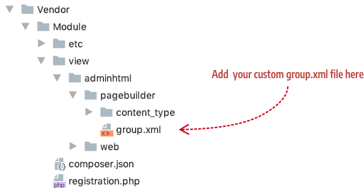

<!--  -->

# Panel configurations

By default, the Page Builder panel has four groups (Layout, Elements, Media, Add Content) and 16 content types as shown here:


You can customize the panel menu in many ways:

- Rename panel groups.

- Reorder panel groups.

- Add new panel groups.

- Add content types to different panel groups.

{: .bs-callout .bs-callout-info }
For the sake of the user experience, please don't forget the affect your panel configurations may have on the end user. User's should have access the most important content types first, so be careful how you reorder groups and content types within groups. We strongly encourage you to place your content types into the existing groups when possible, instead of creating your own group.

## Rename panel groups

To rename the panel groups, you need to extend the defaults configured in the Page Builder `group.xml` file as follows:

1. Add an XML file named `group.xml` to your module's `view/adminhtml/pagebuilder/` directory:

    

2. Your `group.xml` file should extend the Page Builder `group.xml` (located here: `app/code/Magento/PageBuilder/view/adminhtml/pagebuilder/group.xml`) as follows:

    ```xml
    <?xml version="1.0"?>
    <config xmlns:xsi="http://www.w3.org/2001/XMLSchema-instance" xsi:noNamespaceSchemaLocation="urn:magento:module:Magento_PageBuilder:etc/group.xsd">
       <!--group definitions go here-->
    </config>
    ```

3. Change one or more of the existing groups by overriding their `label` values. This example changes the layout group from "Layout" to "Structure": 

    ```xml
    <?xml version="1.0"?>
    <config xmlns:xsi="http://www.w3.org/2001/XMLSchema-instance" xsi:noNamespaceSchemaLocation="urn:magento:module:Magento_PageBuilder:etc/group.xsd">
        <group name="layout" translate="label" sortOrder="1" label="Structure"/>
    </config>
    ```

## Reorder panel groups

To reorder existing panel groups, you need to override the default `sortOrder`s applied to existing panel groups. The `sortOrder` is defined as a `byte` value, so technically, it can be set any where from -128 to 127, but we don't recommend using negative values! Just keep the byte value in mind when you try to set the `sortOrder` above 127. The following example changes the order of the `layout` and `elements` groups to display as the last two groups. 

```xml
<?xml version="1.0"?>
<config xmlns:xsi="http://www.w3.org/2001/XMLSchema-instance" xsi:noNamespaceSchemaLocation="urn:magento:module:Magento_PageBuilder:etc/group.xsd">
    <group name="layout" sortOrder="100"/>
    <group name="elements" sortOrder="127"/>
</config>
```

The result looks like this:


## Add new panel groups

To add a new panel group, add a new `<group>` element  in your module's `group.xml` file with a unique `name` as shown here:

```xml
<?xml version="1.0"?>
<config xmlns:xsi="http://www.w3.org/2001/XMLSchema-instance" xsi:noNamespaceSchemaLocation="urn:magento:module:Magento_PageBuilder:etc/group.xsd">
    <group name="my_controls" translate="label" sortOrder="100" label="My Controls"/>
</config>
```

The result shows the new group (My Controls) positioned at the bottom of the panel because the `sortOrder` is set to `100`, after the default `sortOrder` of `add_content` group, which is set at `30`.


## Add content types to different panel groups

To add your content type to a new group or one of the existing groups, set your content types configuration `group` attribute to the name of the group. This example configuration example adds `my-content-type` to the the `layout` group:

```xml
<?xml version="1.0"?>
<config xmlns:xsi="http://www.w3.org/2001/XMLSchema-instance" xsi:noNamespaceSchemaLocation="urn:magento:module:Magento_PageBuilder:etc/content_type.xsd">
    <type name="my-content-type  "
          label="My Content Type"
          group="layout"
          sortOrder="100"
          ...
          >
```

The result looks like this:


<!--  -->