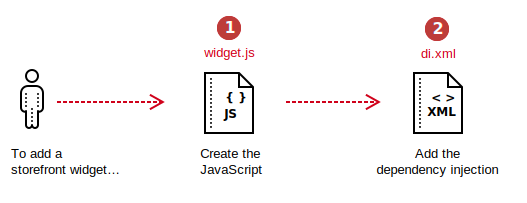
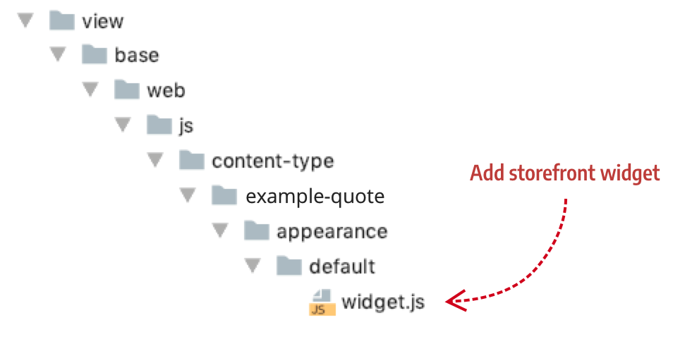

# How to add a storefront widget

A storefront widget is a JavaScript component that handles the behavior of a content type after being rendered on the storefront. For example, the Tabs and Sliders use their own storefront widgets to handle the end-user's tapping of tabs and the swiping of slides.

Adding a storefront widget to your content type is a simple two-step process:





## Step 1: Create the JavaScript

Name your JavaScript file `widget.js` and put it in the following directory structure: `/view/base/web/js/content-type/{content-type-name}/appearance/{appearance-name}/widget.js`. An example from the PageBuilderQuote content type follows:

{:width="477px" height="auto"}

The JavaScript for the widget can handle events, initialize third-party controls, or do whatever else you need in order to control your content type's behavior after Page Builder renders the master format template on the frontend.

``` javascript
define([
    'jquery',
], function ($) {
    'use strict';

    return function (config, element) {
        var element = $(element);
        console.log("ELEMENT: " + element.data('element'));
    };
});
```

## Step 2: Configure the widget initializer

To configure your `widget.js` to so that Page Builder can initialize and load it on the storefront, create a new `WidgetInitializerConfig` type in your module's `etc/di.xml` file. An example of the initializer from the PageBuilderQuote module follows:

``` xml
<config xmlns:xsi="http://www.w3.org/2001/XMLSchema-instance" xsi:noNamespaceSchemaLocation="urn:magento:framework:ObjectManager/etc/config.xsd">
    <type name="Magento\PageBuilder\Model\WidgetInitializerConfig">
        <arguments>
            <argument name="config" xsi:type="array">
                <item name="example_quote" xsi:type="array">
                    <!-- Name is the appearance name -->
                    <item name="default" xsi:type="array">
                        <!--required argument-->
                        <item name="component" xsi:type="string">Example_PageBuilderQuote/js/content-type/example-quote/appearance/default/widget</item>
                    </item>
                </item>
            </argument>
        </arguments>
    </type>
</config>
```

The XML configuration loads the widget on the frontend, and on the stage, so you can preview content inside both the block and dynamic block content types.

**[I don't understand the reference to blocks and dynamic blocks in the previous sentence.]**

**[Can you briefly explain how Page Builder loads the widget on the frontend using this `di.xml` file? Thanks.]**

