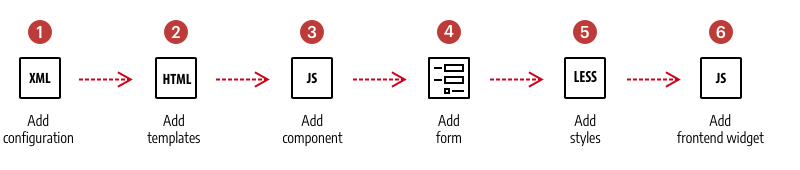

# Introduction

***
The development of this tutorial is currently **IN PROGRESS**.

***

Page Builder comes with 16 content types (controls) you can use to build your storefront pages. In this tutorial, you will add a new content type: a **Quote** control, which you can use to show customer testimonials or other quotations within your storefront.

## Quote content type

Here's an example of three Quote control instances rendered in three-columns on the Admin stage: 

And here are the same three quote controls rendered on a mock testimonial page in the storefront:

## Prerequisites

This tutorial assumes you are starting with a basic, registered module, as follows.

## Overview

The steps for building the Quote content type are illustrated and described below. While the reality is not quite this linear, these steps do represent the basic phases and flow for building new Page Builder content types.

1. **Add configuration**: Create an XML file to define your content type and reference the other files that control the appearance and behavior of your content type.  
2. **Add templates**: Create HTML templates that define the appearance of your content types on the Admin stage (preview.html) and the storefront (master.html).
3. **Add component**: Create a JavaScript file that defines the behavior of your content type on the Admin stage (preview.js) and the storefront (master.js).
4. **Add form**: Create a UI component form and a layout so users can edit your content type within the Page Builder editor.
5. **Add styles**: Create LESS files to style your content types when rendered in the Admin UI and on the storefront. 
6. **Add frontend widget**: Create a JavaScript file to control the UI behavior (user interactivity) of your content type on the storefront.  

## File structure

Before you get started, take a look at what you will be building. The block on the left shows the empty module structure you will start with. The block on the right shows all the files you will add to your module, labeled by the steps in the process. 

## Conventions

The file structure represents an overview of the conventions used for content types. Many of the conventions used are simply those defined for developing UI components. However, the conventions specific to Page Builder start within the directories called `content_type` or `content-type`. Page Builder instantiates a content type from the files defined within these directories. We discuss these conventions within each step of the process.

## Next
[Step 1: Add configuration](step-1-add-configuration.md)