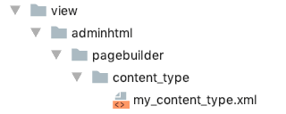

# Step 1: Add configuration

Creating a configuration file is the first step to creating a new content type. Through the configuration file, you can specify things like the label, location, and icon of your content type within the Page Builder panel menu. You can specify where your content type can be dropped on the stage, and reference the many other files you will use to control the appearance and behavior your content type.

## Create the configuration file

1. Create a new XML file in the following directory structure of your module: `view/adminhtml/pagebuilder/content_type/my-content-type.xml`. 

    

2. Copy the contents of this example into your `my-content-type.xml` file:
    ``` xml
    <?xml version="1.0"?>
    <config xmlns:xsi="http://www.w3.org/2001/XMLSchema-instance" xsi:noNamespaceSchemaLocation="urn:magento:module:Magento_PageBuilder:etc/content_type.xsd">
        <type name="my-content-type"
              label="My Content Type"
              group="layout"
              component="Magento_PageBuilder/js/content-type-collection"
              preview_component="Magento_PageBuilder/js/content-type/preview"
              master_component="Magento_PageBuilder/js/content-type/master"
              form=""
              icon=""
              sortOrder="-1"
              is_hideable="true"
              translate="label">
            <appearances>
                <appearance name="default"
                            default="true"
                            preview_template="Vendor_Module/content-type/my-content-type/default/preview"
                            render_template="Vendor_Module/content-type/my-content-type/default/master"
                            reader="Magento_PageBuilder/js/master-format/read/configurable">
                    <elements>
                        <element name="main">
                            <attribute name="name" source="data-role"/>
                            <attribute name="appearance" source="data-appearance"/>
                        </element>
                    </elements>
                </appearance>
            </appearances>
        </type>
    </config>
    ```

If you try to view Page Builder at this point, Page Builder will throw an error noting that the `preview_template` and `render_template` from the `<appearance` element are missing. These templates are required before we can add our content type to Page Builder. Let's do that in [Step 2: Add templates](step-2-add-templates.md).
