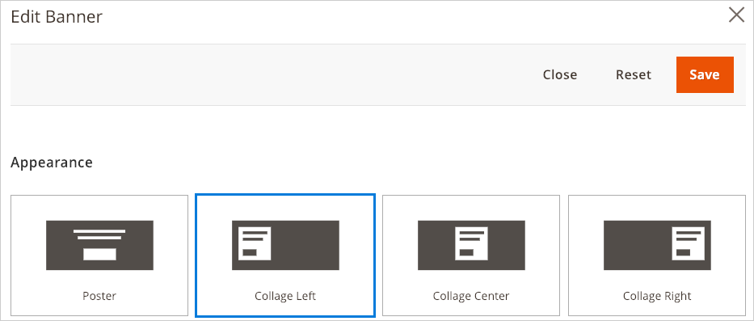

# Step 1: Add configuration

***
The development of this tutorial is currently **IN PROGRESS**.

***

The configuration file defines the basic settings and files that compose your content type. 

## Convention

By convention, Page Builder requires the configuration for a content type to be in the `adminhtml` area within a directory named `pagebuilder` and a subdirectory named `content_type` or `content-type`.

The name of your configuration file should also reflect the name of your content type. Our example content type is called Quote, so we should name our configuration file `quote.xml` and add it to our module within the following directory structure (`view/adminhtml/pagebuilder/content_type/`):


{: .bs-callout .bs-callout-info }
If your content type name uses multiple words, use underscores to separate the words in the name. 

## Example configuration

{: .bs-callout .bs-callout-info }
In this example, only a subset of configuration elements are described (enough to understand the configuration file's basic role). For more details, refer to [Content type configurations](../configurations/content-type-configuration.md) and [Additional configurations](../configurations/additional-configurations.md).


The following configuration shows the complete configuration file for our Quote content type. An overview of these elements and attributes are described in the tables that follow.

```xml
<?xml version="1.0"?>
<config xmlns:xsi="http://www.w3.org/2001/XMLSchema-instance" xsi:noNamespaceSchemaLocation="urn:magento:module:Magento_PageBuilder:etc/content_type.xsd">
  <type name="quote"
        label="Quote"
        group="elements"
        component="Magento_PageBuilder/js/content-type"
        preview_component="Magento_PageBuilder/js/content-type/preview"
        master_component="Magento_PageBuilder/js/content-type/master"
        form="pagebuilder_quote_form"
        icon="icon-pagebuilder-heading"
        sortOrder="21"
        translate="label">
    <children default_policy="deny"/>
    <parents default_policy="deny">
      <parent name="column" policy="allow"/>
    </parents>
    <appearances>
      <appearance name="default"
                  default="true"
                  preview_template="Vendor_Module/content-type/quote/default/preview"
                  render_template="Vendor_Module/content-type/quote/default/master"
                  reader="Magento_PageBuilder/js/master-format/read/configurable">
        <elements>
          <element name="main">
            <style name="text_align" source="text_align"/>
            <style name="border" source="border_style" converter="Magento_PageBuilder/js/converter/style/border-style"/>
            <style name="border_color" source="border_color"/>
            <style name="background_color" source="background_color"/>
            <style name="border_width" source="border_width" converter="Magento_PageBuilder/js/converter/style/border-width"/>
            <style name="border_radius" source="border_radius" converter="Magento_PageBuilder/js/converter/style/remove-px"/>
            <style name="margins" storage_key="margins_and_padding" reader="Magento_PageBuilder/js/property/margins" converter="Magento_PageBuilder/js/converter/style/margins"/>
            <style name="padding" storage_key="margins_and_padding" reader="Magento_PageBuilder/js/property/paddings" converter="Magento_PageBuilder/js/converter/style/paddings"/>
            <style name="display" source="display" converter="Magento_PageBuilder/js/converter/style/display" preview_converter="Magento_PageBuilder/js/converter/style/preview/display"/>
            <attribute name="name" source="data-role"/>
            <attribute name="appearance" source="data-appearance"/>
            <css name="css_classes"/>
          </element>
          <element name="quote">
            <html name="quote_text" converter="Magento_PageBuilder/js/converter/html/tag-escaper"/>
            <css name="quote_css"/>
          </element>
          <element name="author">
            <style name="text_align" source="text_align"/>
            <html name="quote_author" converter="Magento_PageBuilder/js/converter/html/tag-escaper"/>
          </element>
          <element name="author_title">
            <style name="text_align" source="text_align"/>
            <html name="quote_author_desc" converter="Magento_PageBuilder/js/converter/html/tag-escaper"/>
          </element>
        </elements>
      </appearance>
    </appearances>
  </type>
</config>
```

## The `type` element

The `<type>` element defines the key properties of your content type. The attributes are described here:

| Attribute           | Description                                                                                                                                                                                                                                                                                                                                       |
|---------------------|---------------------------------------------------------------------------------------------------------------------------------------------------------------------------------------------------------------------------------------------------------------------------------------------------------------------------------------------------|
| `name`              | Name of the content type that Magento uses for XML merging. The convention for using multi-word names is to separate the words with hyphens.                                                                                                                                                                                                      |
| `label`             | Label displayed in the Page Builder panel, option menu, and on the Admin stage.                                                                                                                                                                                                                                                                   |
| `group`             | Group or category in the panel menu where your content type is displayed. The default groups are Layout, Elements, Media, and Add Content. See [Panel configurations](../configurations/panel-configurations.md) for more details.                                                                                                                |
| `component`         | Currently there are two component types to choose from: `content-type` and `content-type-collection`. Use `Magento_PageBuilder/js/content-type` for static content types that do not have children. Use `Magento_PageBuilder/js/content-type-collection` for content types that can contain children, otherwise known as container content types. |
| `preview_component` | JavaScript file that provides preview-specific rendering logic within the Admin UI.                                                                                                                                                                                                                                                               |
| `master_component`  | JavaScript file that provides master format rendering logic generic for all appearances of your content type when rendered on the storefront.                                                                                                                                                                                                     |
| `form`              | UI component form that provides the form controls for editing your content type.                                                                                                                                                                                                                                                                  |
| `icon`              | Optional. PNG or SVG image displayed in the Page Builder panel alongside the label.                                                                                                                                                                                                                                                               |
| `sortOrder`         | Optional. The listed order within the menu group. For example, `sortOrder=21` puts the content type third in the `Elements` menu group, after the content types with `sortOrder`s of 10 and 20. |
| `translate`         | Identifies the attribute you want Magento to translate. Here, the `label` value is set for translation.                                                                                                                                                                                                                                           |


## The  `children` element

The `children` element determines if your content type can contain other content types as children. In the Admin UI, it either allows or prevents you from dragging and dropping *other* content types from the panel into *your* content type. 

```xml
<children default_policy="deny"/>
```

In our configuration, we don't allow any other content types to be children of our content type. Put another way, our content type cannot be a parent; we only want it to be the child of other content types, which leads us to the `parents` element.

## The `parents` element

The `parents` element determines if other content types can be a parent to your content type. In the Admin UI, it either allows or prevents you from dragging and dropping *your* content type into *other* content types on the stage.

```xml
<parents default_policy="deny">
  <parent name="column" policy="allow"/>
</parents>
```

In our configuration, the `parents` element first prevents our content type from having any parents. If we left it there, we could not drag our content type onto the stage at all because even the stage is a parent. So we limit our content type's parents to only one: the `column` content type. This allows you to drag and drop your content type into columns, but nowhere else.

## The `appearances` element

The `<appearances>` element specifies one or more views for displaying your content type. For example, the Banner has four appearances you can choose from within its editor as shown here:



Each of these appearances are defined as an `appearance` within the Banner configuration file (`app/code/Magento/PageBuilder/view/adminhtml/pagebuilder/content_type/banner.xml`):

```xml
<appearances>
  <appearance name="collage-left"...>
  <appearance name="collage-centered"...>
  <appearance name="collage-right"...>
  <appearance name="poster" default="true" ...>
</appearances>
```

Going further, each `appearance` is defined by exactly two HTML templates, one to display a preview appearance in the Admin (`preview.html`) and the other to display the master appearance (`master.html`) on your storefront. We will discuss HTML templates more in [Step 2: Add templates](step-2-add-templates.md).

Our Quote only has one appearance, so we define it as the default:

```xml
<appearances>
  <appearance name="default"
              default="true"
              preview_template="Vendor_Module/content-type/quote/default/preview"
              render_template="Vendor_Module/content-type/quote/default/master"
              reader="Magento_PageBuilder/js/master-format/read/configurable">
    <elements...>
  </appearance>
</appearances>
```

The `<appearance>` attributes are described as follows:

| Attribute          | Description                                                  |
| ------------------ | ------------------------------------------------------------ |
| `name`             | Name of the appearance so it can be extended as needed.      |
| `default`          | Content types must specify one of the appearances as the default appearance. That means if you only have one appearance, it must be set as the default. |
| `preview_template` | `preview.html` - the HTML template for rendering the preview appearance of a content type on the Admin stage during page development. |
| `render_template`  | `master.html` - the HTML template for rendering the storefront appearance of a content type for customers. |
| `reader`           | Reads data for the content type from the master format       |

## The `elements` element

The purpose of `<elements>` as defined within an appearance is to map the data from the content type's edit form to the content type's master format so that the values entered in the form can be stored and rendered correctly on the Admin stage and storefront. These elements will be explained more fully in [Step 4: Add form](step-4-add-form.md)

## Next

[Step 2: Add templates](step-2-add-templates.md).