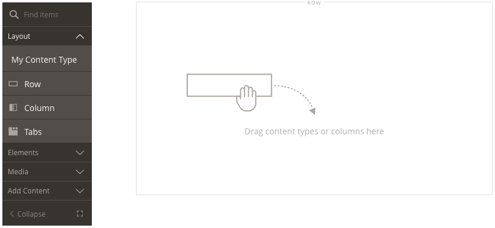
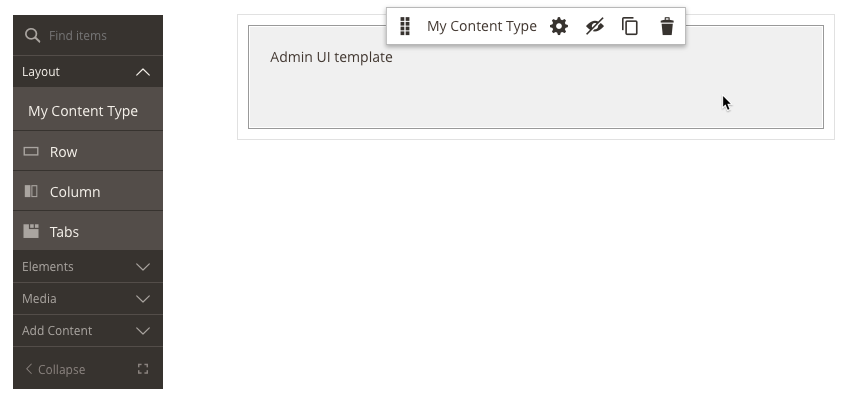
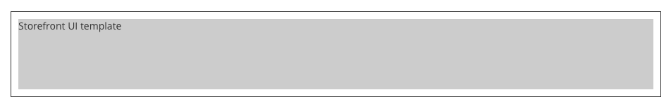

<!--  -->

# Step 2: Add templates

Page Builder templates are HTML files that define the appearance of content types within both the Admin UI (using the preview.html) and the storefront UI (using the master.html). Content types cannot be rendered without these templates, so let's create the ones already specified in the `<appearance>` element of our configuration file.

``` xml
<appearance name="default"
            default="true"
            preview_template="Vendor_Module/content-type/my-content-type/default/preview"
            render_template="Vendor_Module/content-type/my-content-type/default/master"
            reader="Magento_PageBuilder/js/master-format/read/configurable">
```

1. Create the `preview_template` and `render_template` files (as noted above) within the specified directory structure, `view/adminhtml/web/template/content_type/my-content-type/default/`, using the example content that follows.

    
  
    ```html
    <!--master.html-->
    <div attr="data.main.attributes" ko-style="data.main.style" css="data.main.css">
        <div attr="data.main.attributes" css="data.main.css" ko-style="data.main.style">
            <div style="width: 100%; height: 100px; background-color: #cccccc;">Storefront UI template</div>
        </div>
    </div>
    ```
       
    ```html
    <!--preview.html-->
    <div class="pagebuilder-content-type" event="{ mouseover: onMouseOver, mouseout: onMouseOut }, mouseoverBubble: false">
        <render args="getOptions().template" />
        <div attr="data.main.attributes" css="data.main.css" ko-style="data.main.style">
            <div style="width: 100%; height: 100px; background-color: #f1f1f1; padding: 20px;">Admin UI template</div>
        </div>
    </div>
    ```

2. Flush your config cache `bin/magento cache:flush config` and view Page Builder from the Home Page editor (as a convenience for storefront viewing later). The Page Builder panel menu should show your content type at the top of the layout group:
   
    
   
3. Drag your new content type onto the stage and **Save**. You should see something similar to this:

     
    
    Notice that you also have an options menu when you hover over your content type. This is provided by including the `<render args="getOptions().template" />` within your `preview.html` template. See [Option menu configurations](option-menu-configurations.md) for more details.
    
4. Open the Home Page on the storefront to see how the `master.html` template renders, as shown here:

     
    
<!--  -->