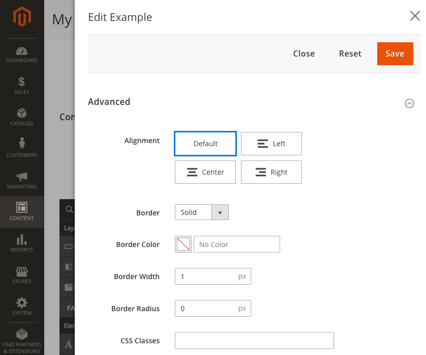
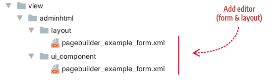

# Step 4: Add editor

Page Builder provides an editor that slides out from the right of the screen within the Admin UI to give users a way to add content and customize the appearance of your content type, as shown in the screen shot. All you have to do is create a UI component form and a layout for the editor to use.



## Configuration

Reference your UI component form as shown here in the `<type>` element of your configuration file:

```xml
<config xmlns:xsi="http://www.w3.org/2001/XMLSchema-instance" 
        xsi:noNamespaceSchemaLocation="urn:magento:module:Magento_PageBuilder:etc/content_type.xsd">
  <type name="example"
        label="Example"
        form="pagebuilder_example_form"
```

| Attribute | Description                                                  |
| --------- | ------------------------------------------------------------ |
| form      | `pagebuilder_example_form.xml` - UI component form that provides the editor for your content type. |

{:style="table-layout:auto"}

## Location

Add the layout and form to your module as shown here:

- `view/adminhtml/web/layout/`
- `view/adminhtml/web/ui-component/`




## Create UI component form

In this example, we create a form that extends `pagebuilder_base_form` to provide a basic form editor for our content type. The code is provided here followed by descriptions of the key parts.

```xml
<?xml version="1.0" encoding="UTF-8"?>
<form xmlns:xsi="http://www.w3.org/2001/XMLSchema-instance" xsi:noNamespaceSchemaLocation="urn:magento:module:Magento_Ui:etc/ui_configuration.xsd" extends="pagebuilder_base_form">
  <argument name="data" xsi:type="array">
    <item name="js_config" xsi:type="array">
      <item name="provider" xsi:type="string">pagebuilder_example_form.pagebuilder_example_form_data_source</item>
    </item>
    <item name="label" xsi:type="string" translate="true">Heading</item>
  </argument>
  <settings>
    <deps>
      <dep>pagebuilder_example_form.pagebuilder_example_form_data_source</dep>
    </deps>
  </settings>
  <dataSource name="pagebuilder_example_form_data_source">
    <argument name="data" xsi:type="array">
      <item name="js_config" xsi:type="array">
        <item name="component" xsi:type="string">Magento_PageBuilder/js/form/provider</item>
      </item>
    </argument>
    <dataProvider name="pagebuilder_example_form_data_source" class="Magento\PageBuilder\Model\ContentType\DataProvider">
      <settings>
        <requestFieldName/>
        <primaryFieldName/>
      </settings>
    </dataProvider>
  </dataSource>
  <fieldset name="appearance_fieldset" component="Magento_PageBuilder/js/form/element/dependent-fieldset">
    <settings>
      <label translate="true">Appearance</label>
      <additionalClasses>
        <class name="admin__fieldset-visual-select-large">true</class>
      </additionalClasses>
      <collapsible>false</collapsible>
      <opened>true</opened>
      <imports>
        <link name="hideFieldset">${$.name}.appearance:options</link>
        <link name="hideLabel">${$.name}.appearance:options</link>
      </imports>
    </settings>
    <field name="appearance" formElement="select" sortOrder="10" component="Magento_PageBuilder/js/form/element/dependent-visual-select">
      <argument name="data" xsi:type="array">
        <item name="config" xsi:type="array">
          <item name="default" xsi:type="string">default</item>
        </item>
      </argument>
      <settings>
        <additionalClasses>
          <class name="admin__field-wide">true</class>
          <class name="admin__field-visual-select-container">true</class>
        </additionalClasses>
        <dataType>text</dataType>
        <validation>
          <rule name="required-entry" xsi:type="boolean">true</rule>
        </validation>
        <elementTmpl>Magento_PageBuilder/form/element/visual-select</elementTmpl>
      </settings>
      <formElements>
        <select>
          <settings>
            <options class="AppearanceSourceHeading"/>
          </settings>
        </select>
      </formElements>
    </field>
  </fieldset>
  <fieldset name="general" sortOrder="20">
    <settings>
      <label/>
    </settings>
    <field name="heading_type" sortOrder="10" formElement="select">
      <argument name="data" xsi:type="array">
        <item name="config" xsi:type="array">
          <item name="source" xsi:type="string">page</item>
          <item name="default" xsi:type="string">h2</item>
        </item>
      </argument>
      <settings>
        <label translate="true">Heading Type</label>
        <dataType>text</dataType>
        <dataScope>heading_type</dataScope>
      </settings>
      <formElements>
        <select>
          <settings>
            <options>
              <option name="h1" xsi:type="array">
                <item name="value" xsi:type="string">h1</item>
                <item name="label" xsi:type="string" translate="false">H1</item>
              </option>
              <option name="h2" xsi:type="array">
                <item name="value" xsi:type="string">h2</item>
                <item name="label" xsi:type="string" translate="false">H2</item>
              </option>
              <option name="h3" xsi:type="array">
                <item name="value" xsi:type="string">h3</item>
                <item name="label" xsi:type="string" translate="false">H3</item>
              </option>
              <option name="h4" xsi:type="array">
                <item name="value" xsi:type="string">h4</item>
                <item name="label" xsi:type="string" translate="false">H4</item>
              </option>
              <option name="h5" xsi:type="array">
                <item name="value" xsi:type="string">h5</item>
                <item name="label" xsi:type="string" translate="false">H5</item>
              </option>
              <option name="h6" xsi:type="array">
                <item name="value" xsi:type="string">h6</item>
                <item name="label" xsi:type="string" translate="false">H6</item>
              </option>
            </options>
          </settings>
        </select>
      </formElements>
    </field>
    <field name="heading_text" sortOrder="20" formElement="input">
      <argument name="data" xsi:type="array">
        <item name="config" xsi:type="array">
          <item name="source" xsi:type="string">page</item>
        </item>
      </argument>
      <settings>
        <dataScope>example_text</dataScope>
        <dataType>text</dataType>
        <label translate="true">Example Text</label>
      </settings>
    </field>
  </fieldset>
  <fieldset name="advanced">
    <field name="margins_and_padding">
      <argument name="data" xsi:type="array">
        <item name="config" xsi:type="array">
          <item name="default" xsi:type="null"/>
        </item>
      </argument>
    </field>
  </fieldset>
</form>

```


## Create layout


