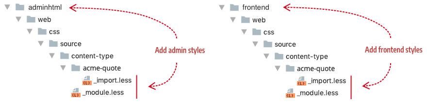

<!--  -->

# Step 5: Add styles

{: .bs-callout .bs-callout-info }
The development of this tutorial is currently **IN PROGRESS**.

Like in the rest of Magento, you use LESS files to style your content types in the Admin UI and on the storefront (frontend). 

## Configuration

CSS classes from your LESS files are typically used within your HTML templates. However, you can also allow end-users to apply CSS classes directly to your content types from within the editor, using the CSS Classess input field as shown here:


To display this field within your content type's editor, add the `<css>` element to the `main` element of your configuration:

```xml
<elements>
  <element name="main">
    <css name="css_classes"/>
    ...
  </element>
</elements>
```

## Location

Add your LESS files here:

- For Admin UI previews: `view/adminhtml/web/css/source/content-type/<content-type-name>/`
- For storefront display: `view/frontend/web/css/source/content-type/<content-type-name>/`



## Create LESS files

In this example... 

<!--  -->