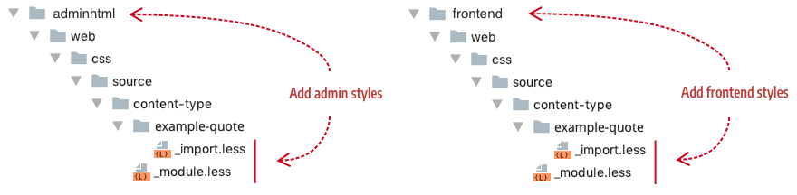

# Step 5: Add styles

***
The development of this tutorial is currently **IN PROGRESS**.

***

In this step, we will create CSS styles (using LESS) so that we can give end-users different options for customizing the Quote's appearance in the Admin and on the storefront.

## About styles

Page Builder specifies two ways to 

Describe how the Quote content type combines the usage of style files from end-user specification of classes in forms, to non-interactive styles used in the templates. 

And more discussion of the `pagebuilder-content-type` style.

## Style conventions

Add your LESS files here:

- For Admin UI previews: `view/adminhtml/web/css/source/content-type/example-quote/`
- For storefront display: `view/frontend/web/css/source/content-type/example-quote/`




**Discuss the need for naming ``_module.less` file in the `source` directory and then how the styles are compiled and imported together and where the combined styles ultimately end up.**


## Style configuration

CSS classes from your LESS files are typically used within your HTML templates. However, you can also allow end-users to apply CSS classes to your content types from within the form editor, using the CSS Classess input field as shown here:


```xml
<elements>
  <element name="main">
    <css name="css_classes"/>
    ...
  </element>
</elements>
```
## Quote LESS files

## Create LESS files
