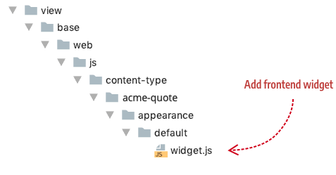

<!--  -->

# Step 6: Add frontend widget

{: .bs-callout .bs-callout-info }
The development of this tutorial is currently **IN PROGRESS**.

The frontend widget is a JavaScript file that controls the UI behavior (user interactivity) of your content type when it is rendered on the storefront. 

## Configuration

## Location

Add it to your module in the following location (`view/base/web/js/content-type/example/appearance/default/`):

<!--  -->