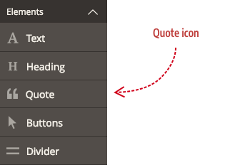
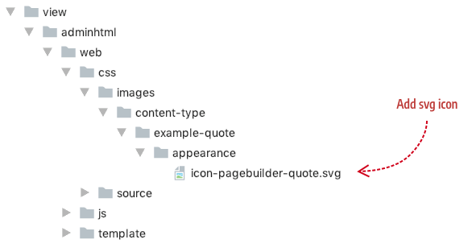

# Step 6: Add icon

In this last step, we will create a panel icon for our Quote content type so that it has a unique but visually consistent identity alongside Page Builder's native font icons. When finished, the panel icon for our Quote content type will look something like this:



## About icons

The icons used for Page Builder's built-in content types are actually font icons. You could create your own font icons and use those within your module in a similar manner, but we recommend a simpler, more straightforward way by using SVG or PNG images instead.

A summary of the steps for creating and adding this icon are listed here:

1. Create your SVG or PNG icon.
2. Create a CSS class for the icon.
3. Reference the icon class in the config file.

## Create your icon

As mentioned, you can create a PNG or an SVG icon, but we recommend creating SVG icons for their smaller size and resolution independent rendering in browsers and mobile devices. Use the following specifications to create a panel icon that integrates seemlessly with the existing panel icons.


As the illustration shows, the artboard represents the actual width and height of your icon when it is exported from your graphics application (16 x 16px). The artwork represents the content of your icon. Following these dimensions ensures your icons will match the size and positioning of the existing Page Builder icons within the panel.

When finished, add your icon to your `images` directory as follows:



## Create CSS class for icon

The next step to integrating your icon into the panel is creating a CSS class that references your SVG file. This class should be added to your LESS file in `adminhtml` as shown here:


The CSS for integrating SVG and PNG images with the font icons used by Page Builder can be a bit tricky in terms of matching size and positioning. As such, we recommend the following CSS rule set and conventions, changing only the content url path to your icon:  

```css
.icon-pagebuilder-quote {
    content: url(../Example_PageBuilderQuote/css/images/content-type/example-quote/appearance/icon-pagebuilder-quote.svg);
    width: 18px;
    height: 18px;
    margin-bottom: -1px;
}
```

| Attribute       | Description                                                  |
| --------------- | ------------------------------------------------------------ |
| `class name`    | To match the class names of Page Builder's native icons, we recommend prefixing your icon names with `icon-pagebuilder` as we have done with our Quote icon. |
| `content`       | The relative path to your SVG or PNG icon when rendered from `pub/static`. More details follow below. |
| `width`         | Sets the width of the content area that most closely matches the widths of Page Builder icon fonts. |
| `height`        | Sets the height of the content area that most closely matches the widths of Page Builder icon fonts. |
| `margin-bottom` | Pulls the SVG or PNG image down within the panel container to more closely match the positioning of Page Builder's font icon. |

### Content path to icon image

When you add the relative content path to your SVG or PNG image, you must start from the consolidated `styles.css` within `pub/static` as shown below. 


In the case of our Quote icon, the relative path must be set as: 

```css
.icon-pagebuilder-quote {
  content: url(../Example_PageBuilderQuote/css/images/content-type/example-quote/appearance/icon-pagebuilder-quote.svg);
  ...
}
```

This referencing your image from your CSS icon class ensures that the link to your image will be created in the static output and the icon will resolve in the browser. 

## Add icon class to config file

The last step is to add our icon's class name to our config file. Previous to this step, we used an existing icon class: `icon-pagebuilder-heading`. Now we can replace this class with our new class: `icon-pagebuilder-quote`, as shown here:  

```xml
<config xmlns:xsi="http://www.w3.org/2001/XMLSchema-instance" xsi:noNamespaceSchemaLocation="urn:magento:module:Magento_PageBuilder:etc/content_type.xsd">
  <type name="example_quote"
        label="Quote"
        group="elements"
        component="Magento_PageBuilder/js/content-type"
        preview_component="Example_PageBuilderQuote/js/content-type/example-quote/preview"
        master_component="Magento_PageBuilder/js/content-type/master"
        form="pagebuilder_example_quote_form"
        icon="icon-pagebuilder-quote"
        sortOrder="21"
        translate="label"
  >
```

That's it. Now you can regenerate your static assets, empty your browser cache, and do a hard reload of your Admin page to see your new icon in the panel. 


