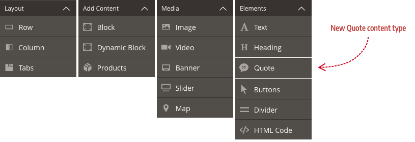
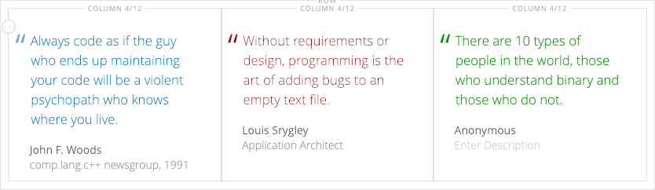
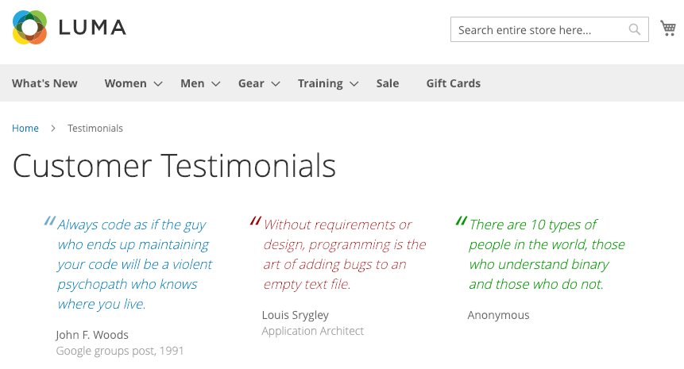
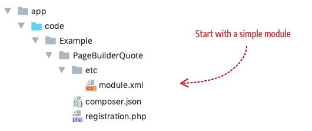
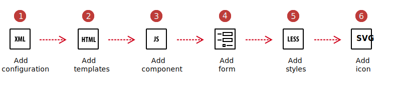
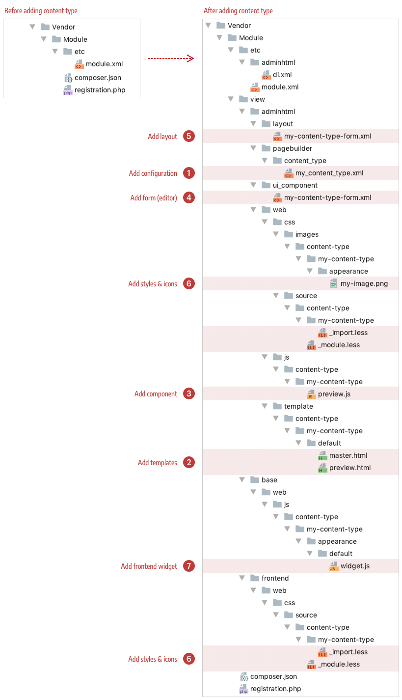

# Overview

Page Builder comes with several content types (controls) you can use to build your storefront pages. In this tutorial, you will add a new content type: a **Quote** control, which you can use to show customer testimonials or other types of quotations within your storefront.

## Quote preview

The following screenshot shows three instances of the Quote control you will build in this tutorial: 

And the same three Quote controls are shown rendered here on a mock testimonial page in the storefront:

## Quote module

As with most things in Magento, content types for Page Builder are housed in modules. The convention for naming modules that are solely dedicated to Page Builder, such as our Quote content type, is to prefix all content type names with `PageBuilder`. This helps visually group content type modules within your vendor directory. Of course, this convention does not apply if you are adding a content type as part of an existing module.

Applying this convention to the module for our Quote content type, we get the name `PageBuilderQuote`, and can set up our module as shown here:

After registering your module (`bin/magento setup:upgrade`) you will be ready to begin this tutorial by following the content type creation process outlined next.

## Quote creation

The steps for creating the Quote content type are illustrated and described below. The reality is not quite this linear, but these steps do represent the basic phases and flow for building new Page Builder content types.

1. **Add configuration**: Create an XML file to define your content type and reference the other files that control the appearance and behavior of your content type.  
2. **Add templates**: Create HTML templates that define the appearance of your content types on the Admin stage (`preview.html`) and the storefront (`master.html`).
3. **Add component**: Create a JavaScript file that defines the behavior of your content type on the Admin stage (`preview.js`) and the storefront (`master.js`).
4. **Add form**: Create a UI component form and a layout so Admin users can edit your content type within the Page Builder editor.
5. **Add styles**: Create LESS files to style your content types when rendered in the Admin UI and on the storefront. 
6. **Add an icon**: Create an SVG icon to visually identify your content type within the Page Builder panel.

## Quote file structure

Before we get started, take a look at what you will be building. The directory structure on the left shows the basic `PageBuilderQuote` module you will start with (as previously described). The directory structure on the right shows all the files you will add to the `PageBuilderQuote` module throughout this tutorial, labeled by the steps in the process. 

## Conventions

The `PageBuilderQuote` module structure represents an overview of the conventions used for content types. Many of these conventions are simply those defined for developing UI components. However, the conventions specific to Page Builder content types appropriately start within the directories called `content_type` or `content-type`. Page Builder instantiates a content type from the files defined within these directories. We will discuss these content type conventions within each step of the process.

## Next
[Step 1: Add configuration](step-1-add-configuration.md)
