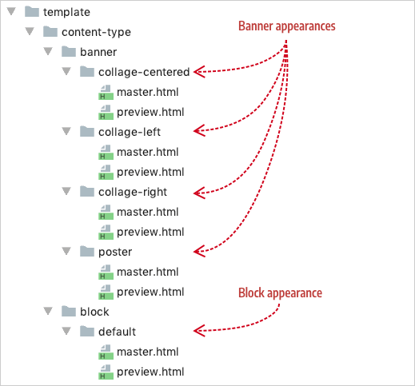
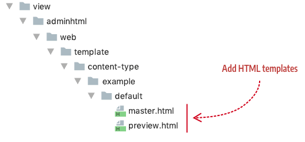

# Step 2: Add templates

Content type templates are the HTML files (HTML fragments) that define how your content type *appears* on both the Admin stage and within your storefront. The combination of these templates (one `preview.html` and one `master.html`) creates an `appearance`. As discussed in the previous configuration step, you must have at least one `appearance` (two templates) defined for your content type. But like the Banner, you can define several appearances for users to choose from as shown here:


## Template conventions

Conventions for adding content type templates are as follows.

- Page Builder requires you to name your templates `preview.html` for the Admin preview template and `master.html` for the master format storefront template.

- Page Builder requires the name of an `appearance` to match the name of the directory containing the appearance templates. If they don't match, your content type appearances will not render. 

  For example, if you navigate to the Banner's appearance templates (`PageBuilder/view/adminhtml/web/template/content-type/banner`) you can see that the names of the template directories match the names of the four appearances defined in the `banner.xml` configuration file as shown here:

  ```xml
  <appearances>
      <appearance name="collage-left"...>
      <appearance name="collage-centered"...>
      <appearance name="collage-right"...>
      <appearance name="poster" default="true" ...>
  </appearances>
  ```

  

For content types with only one appearance (as noted in the screenshot with block), we use the name `default` for both the content type's appearance name and the name of the template directory.

## Template configuration

The Quote example defines only one `appearance`. Therefore, by convention, set the name of the Quote `appearance` and the name of the template directory to `default` as shown here:

```xml
<appearances>
    <appearance name="default"
    ...
```



These files can be blank initially; they just need to exist in their proper location for now so we can reference them in the `appearance` element of our `example_quote.xml` configuration file as shown here:

```xml
<appearances>
    <appearance name="default"
              default="true"
              preview_template="Example_PageBuilderQuote/content-type/example-quote/default/preview"
              master_template="Example_PageBuilderQuote/content-type/example-quote/default/master"
              reader="Magento_PageBuilder/js/master-format/read/configurable">
    <elements...>
    </appearance>
</appearances>
```

The following table describes each `appearance` attribute in our example.

| Attribute          | Description                                                  |
| ------------------ | ------------------------------------------------------------ |
| `name`             | As noted by convention, the name of the appearance and the name of the directory for the appearance templates *must* match. |
| `default`          | Every content type must have a default appearance. If you only define one appearance for your content type, you must set the default to `true`. |
| `preview_template` | References the `preview.html` (the Admin preview template) for rendering the preview appearance of your content type on the stage within the Admin UI. |
| `master_template`  | References the `master.html` (the master format storefront template) for rendering the appearance of your content type on the storefront for customers to see. |
| `reader`           | Reads content type data from the master format.      |
{:style="table-layout:auto"}

## Quote `preview_template`

The Quote `preview_template`  (`preview.html`) is shown here in full, followed by the attribute descriptions to help you understand the basics of content type templates.

```html
<!-- preview.html -->
<div attr="data.main.attributes" 
     ko-style="data.main.style" 
     class="pagebuilder-content-type" 
     css="data.main.css" 
     event="{ mouseover: onMouseOver, mouseout: onMouseOut }, mouseoverBubble: false">
    <render args="getOptions().template" />
    <blockquote attr="data.quote.attributes" 
              ko-style="data.quote.style" 
              css="data.quote.css" 
              data-bind="liveEdit: { field: 'quote_text', placeholder: $t('Enter Quote') }">
    </blockquote>
    <div class="quote-author" 
       attr="data.author.attributes" 
       ko-style="data.author.style" 
       css="data.author.css" 
       data-bind="liveEdit: { field: 'quote_author', placeholder: $t('Enter Author') }">
    </div>
    <div class="quote-title" 
       attr="data.author_title.attributes" 
       ko-style="data.author_title.style" 
       css="data.author_title.css" 
       data-bind="liveEdit: { field: 'quote_author_desc', placeholder: $t('Enter Description') }">
    </div>
</div>
```

### attr

The `attr` attribute allows binding of data from the content type form (UI component) to the html elements in the template. 

The value for `attr` is derived from the `element` name in the configuration file followed by `attributes`. For example, the `attr` value used to bind data for the  `blockquote` on line 8 of the Quote `preview.html` is `attr="data.quote.attributes"`. This corresponds to the  `element` named `quote` in the `example_quote.xml` configuration file, as shown here:

```xml
<!-- example_quote.xml -->
<element name="quote">
    <html name="quote_text" converter="Magento_PageBuilder/js/converter/html/tag-escaper"/>
    <css name="quote_css"/>
</element>
```

The nodes declared within an `element` define the bindings that can be applied to your templates.

### ko-style

The `ko-style` attribute applies the `<style>` attributes from the form to a template element. For example, the `main` element for the Quote configuration defines several style bindings as shown here:

```xml
<!-- example_quote.xml -->
<element name="main">
    <style name="text_align" source="text_align"/>
    <style name="border" source="border_style" converter="Magento_PageBuilder/js/converter/style/border-style"/>
    <style name="border_color" source="border_color"/>
    <style name="background_color" source="background_color"/>
    <style name="border_width" source="border_width" converter="Magento_PageBuilder/js/converter/style/border-width"/>
    <style name="border_radius" source="border_radius" converter="Magento_PageBuilder/js/converter/style/remove-px"/>
    <style name="margins" storage_key="margins_and_padding" reader="Magento_PageBuilder/js/property/margins" converter="Magento_PageBuilder/js/converter/style/margins"/>
    <style name="padding" storage_key="margins_and_padding" reader="Magento_PageBuilder/js/property/paddings" converter="Magento_PageBuilder/js/converter/style/paddings"/>
    ...
</element>
```

As we discuss more in [Step 4: Add form](step-4-add-form.md), the `element` styles define bindings to fields in our form. In turn, these form fields provide user-entered data or default values that we apply to the HTML elements in our templates using the `ko-style` attribute. 

The following snippet shows the `ko-style` (Knockout binding) that applies the styles defined in the main `element` to the  `div` node of the Quote's Admin preview template: 

```html
<!-- preview.html -->
<div attr="data.main.attributes" ko-style="data.main.style"...>
<!-- other template elements -->
</div>
```

The `ko-style` value is derived from the configuration `element` name  (`main`) and the attribute to be bound (`style`) to give us `data.main.style`.

### css

The `css` attribute applies CSS classes entered by users on the form to a template element. More on this when we discuss forms in [Step 4: Add form](step-4-add-form.md).

### class

 Just as with any other HTML template, you can add your own classes to your template elements. However, **always add the `pagebuilder-content-type` as the first class in the top node in your `preview.html` template** as shown for the Quote. Page Builder uses the `pagebuilder-content-type` class to add visual indicators and mouseover effects to the Admin preview template, such as correctly positioning the options menu. Defining custom LESS/CSS classes for your content type is discussed in [Step 5: Add styles](step-5-add-styles.md).

### liveEdit

The `liveEdit` binding enables end users to enter HTML content directly on the Admin stage. The basic usage from the Quote control includes specifying the form field it binds to and adding placeholder text as follows:

```html
<!-- preview.html -->
<blockquote attr="data.quote.attributes" 
            data-bind="liveEdit: { field: 'quote_text', placeholder: $t('Enter Quote') }">
</blockquote>
```

### event

The `event` attribute enables the options menu to be shown and hidden when users interact with the content type using the mouse. If you have a special circumstance with the way you wish to handle your option menus, you can modify this logic to suit your needs.

## Quote `master_template`

The Quote `master_template` (`master.html`) is shown here in full. The same attributes and descriptions from the `preview.html` template apply to the `master.html` template as well. However, the  `master.html` template introduces one addition attribute, `html`, which is described after the code.

```html
<!--master.html-->
<div attr="data.main.attributes">
    <blockquote class="quote-content"
              attr="data.quote.attributes" 
              ko-style="data.quote.style" 
              css="data.quote.css" 
              html="data.quote.html">
    </blockquote>
    <div class="quote-author" 
       attr="data.author.attributes" 
       ko-style="data.author.style" 
       css="data.author.css" 
       html="data.author.html">
    </div>
    <div class="quote-title" 
       attr="data.author_title.attributes" 
       ko-style="data.author_title.style" 
       css="data.author_title.css" 
       html="data.author_title.html">
    </div>
</div>
```

### html

The `html` attribute applies the actual user-entered HTML content to the template element. In our Quote example, the end-user enters their quote text either on the Admin stage using `liveEdit` (which is bound to the `quote_text` field in the form editor) or on the form, directly into the`quote_text` field itself.

For example, from the Quote `preview.html` template, the `liveEdit` binding on the `blockquote` is bound to the `quote_text` field that stores the HTML content, as shown here (`{ field: 'quote_text'...}`):

```html
<!--preview.html-->
<blockquote data-bind="liveEdit: { field: 'quote_text', placeholder: $t('Enter Quote') }">
</blockquote>
```

The master format storefront template uses the `html` attribute to retrieve the HTML content and display it in the `blockquote` element as follows: 

```html
<!--master.html-->
<blockquote html="data.quote.html"></blockquote>
```

The `html` value is derived from the configuration `element` name  (`quote`) and the attribute to be bound (`html`) to give us `data.quote.html`.

```xml
<element name="quote">
    <html name="quote_text" converter="Magento_PageBuilder/js/converter/html/tag-escaper"/>
    ...
</element>
```

## Next

[Step 3: Add components](step-3-add-components.md)

