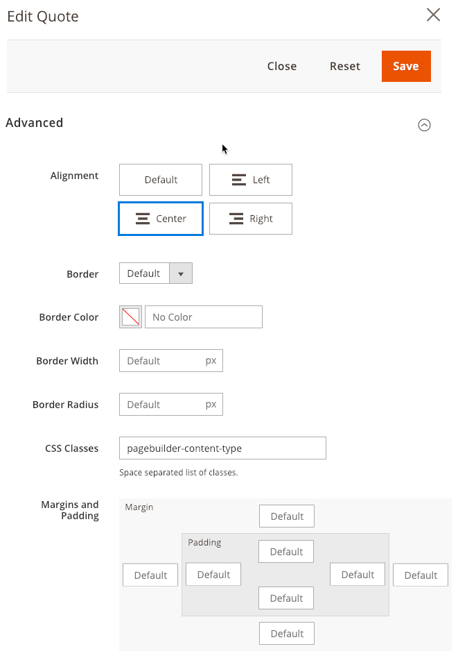
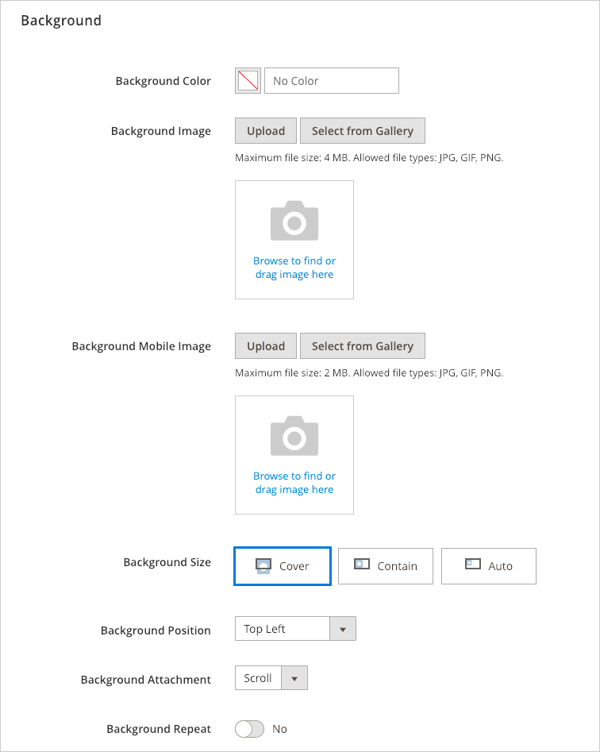
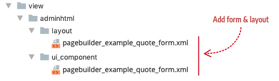
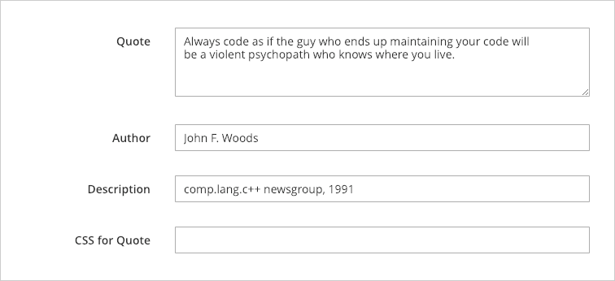
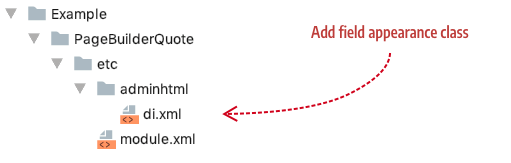

# Step 4: Add form

In this step, we will create a UI component form. This form will give users another way to enter text for the Quote and style the text's appearance.

## About forms

Page Builder provides two base forms that give you a ton of functionality you can inherit from right out-of-the-box:

- `pagebuilder_base_form`

- `pagebuilder_base_form_with_background_attributes` (inherits from `pagebuilder_base_form`)

Inheriting from either base form gives you an editor for your content type that slides out from the right side of the Admin screen. 

### `pagebuilder_base_form`

The `pagebuilder_base_form` gives you the following form fields in a fieldset named Advance, along with the Close, Reset, and Save buttons as shown here:



### `pagebuilder_base_form_with_background_attributes`

In addition to all the fields from `pagebuilder_base_form`,  the `pagebuilder_base_form_with_background_attributes` gives you the following "Background" form fields as shown here:



The base form you inherit from depends on the complexity of the content type you create and the level of customization you want to give to end-users.

## Form and layout conventions

The conventions for naming your form and its layout are as follows:

- The name for your form should follow this pattern: `pagebuilder_` + `content_type_name_` + `form.xml`. For example `pagebuilder_example_quote_form.xml`.
- The name for your layout must match the name of your form, in this case: `pagebuilder_example_quote_form.xml`.

Add your form and layout files to your module in the following locations:

- `view/adminhtml/layout/`
- `view/adminhtml/ui_component/`



## Form configuration

In your configuration file, add your form name (without the .xml file extension) to the `form` attribute within the `<type>` element, as shown here:

```xml
<config xmlns:xsi="http://www.w3.org/2001/XMLSchema-instance" 
        xsi:noNamespaceSchemaLocation="urn:magento:module:Magento_PageBuilder:etc/content_type.xsd">
    <type name="example_quote"
        label="Quote"
        form="pagebuilder_example_quote_form"
        ...>
```

| Attribute | Description                                                  |
| --------- | ------------------------------------------------------------ |
| `form`    | Name of the UI component form that provides the form editor for your content type. |
{:style="table-layout:auto"}

## The Quote form

In our Quote form, we will inherit from `pagebuilder_base_form_with_background_attributes`. This will give end-users all the native Page Builder form fields shown in the two previous screenshots. In addition to those fields, we want to add four specific content entry and styling fields, as shown here:



The purpose of each field is described as follows:

| Field         | Description                                                  |
| ------------- | ------------------------------------------------------------ |
| Quote         | A textarea for writing or pasting in the quote's text.       |
| Author        | A text input field for the author's name.                    |
| Description   | A text input field to describe the author's title or origin of the quote. |
| CSS for Quote | A text input field for end-users to add CSS class names for styling the text in the Quote field. This option is detailed in [Step 5: Add styles](step-5-add-styles.md). |
{:style="table-layout:auto"}

The Quote form is shown in full here for you to copy into your `pagebuilder_example_form.xml` file, followed by descriptions of the key parts.

```xml
<?xml version="1.0" encoding="UTF-8"?>
<form xmlns:xsi="http://www.w3.org/2001/XMLSchema-instance" xsi:noNamespaceSchemaLocation="urn:magento:module:Magento_Ui:etc/ui_configuration.xsd" extends="pagebuilder_base_form_with_background_attributes">
    <argument name="data" xsi:type="array">
        <item name="js_config" xsi:type="array">
            <item name="provider" xsi:type="string">pagebuilder_example_quote_form.pagebuilder_example_quote_form_data_source</item>
        </item>
        <item name="label" xsi:type="string" translate="true">Quote</item>
    </argument>
    <settings>
        <namespace>pagebuilder_example_quote_form</namespace>
        <deps>
            <dep>pagebuilder_example_quote_form.pagebuilder_example_quote_form_data_source</dep>
        </deps>
    </settings>
    <dataSource name="pagebuilder_example_quote_form_data_source">
        <argument name="data" xsi:type="array">
            <item name="js_config" xsi:type="array">
                <item name="component" xsi:type="string">Magento_PageBuilder/js/form/provider</item>
            </item>
        </argument>
        <dataProvider name="pagebuilder_example_quote_form_data_source" class="Magento\PageBuilder\Model\ContentType\DataProvider">
            <settings>
                <requestFieldName/>
                <primaryFieldName/>
            </settings>
        </dataProvider>
    </dataSource>
    <fieldset name="appearance_fieldset" sortOrder="10" component="Magento_PageBuilder/js/form/element/dependent-fieldset">
        <settings>
            <label translate="true">Appearance</label>
            <additionalClasses>
                <class name="admin__fieldset-visual-select-large">true</class>
            </additionalClasses>
            <collapsible>false</collapsible>
            <opened>true</opened>
            <imports>
                <link name="hideFieldset">${$.name}.appearance:options</link>
                <link name="hideLabel">${$.name}.appearance:options</link>
            </imports>
        </settings>
        <field name="appearance" formElement="select" sortOrder="10" component="Magento_PageBuilder/js/form/element/dependent-visual-select">
            <argument name="data" xsi:type="array">
                <item name="config" xsi:type="array">
                    <item name="default" xsi:type="string">default</item>
                </item>
            </argument>
            <settings>
                <additionalClasses>
                    <class name="admin__field-wide">true</class>
                    <class name="admin__field-visual-select-container">true</class>
                </additionalClasses>
                <dataType>text</dataType>
                <validation>
                    <rule name="required-entry" xsi:type="boolean">true</rule>
                </validation>
                <elementTmpl>Magento_PageBuilder/form/element/visual-select</elementTmpl>
            </settings>
            <formElements>
                <select>
                    <settings>
                        <options class="AppearanceSourceQuote"/>
                    </settings>
                </select>
            </formElements>
        </field>
    </fieldset>
    <fieldset name="general" sortOrder="20">
        <settings>
            <label/>
        </settings>
        <field name="quote_text" sortOrder="10" formElement="textarea">
            <argument name="data" xsi:type="array">
                <item name="config" xsi:type="array">
                    <item name="source" xsi:type="string">page</item>
                </item>
            </argument>
            <settings>
                <dataScope>quote_text</dataScope>
                <dataType>text</dataType>
                <label translate="true">Quote</label>
            </settings>
        </field>
        <field name="quote_author" sortOrder="20" formElement="input">
            <argument name="data" xsi:type="array">
                <item name="config" xsi:type="array">
                    <item name="source" xsi:type="string">page</item>
                </item>
            </argument>
            <settings>
                <dataScope>quote_author</dataScope>
                <dataType>text</dataType>
                <label translate="false">Author</label>
            </settings>
        </field>
        <field name="quote_author_desc" sortOrder="30" formElement="input">
            <argument name="data" xsi:type="array">
                <item name="config" xsi:type="array">
                    <item name="source" xsi:type="string">page</item>
                </item>
            </argument>
            <settings>
                <dataScope>quote_author_desc</dataScope>
                <dataType>text</dataType>
                <label translate="false">Author Description</label>
            </settings>
        </field>
        <field name="quote_css" sortOrder="40" formElement="input">
            <argument name="data" xsi:type="array">
                <item name="config" xsi:type="array">
                    <item name="source" xsi:type="string">page</item>
                </item>
            </argument>
            <settings>
                <dataScope>quote_css</dataScope>
                <dataType>text</dataType>
                <label translate="true">CSS for Quote</label>
            </settings>
        </field>
    </fieldset>
</form>
```

### appearance fieldset and field

Page Builder requires you to add the `appearance_fieldset` along with its `appearance` field for all your content type forms. Even though our Quote content type doesn’t have any additional appearances, the field is still required/expected so that other modules can add appearances to your content type as needed.

To ensure your appearance field renders, create a `di.xml` file located here:



 Then add the source implementation as referenced in the `appearance` field (`<options class="AppearanceSourceQuote"/>`) as shown here:

```xml
<?xml version="1.0"?>
<config xmlns:xsi="http://www.w3.org/2001/XMLSchema-instance" xsi:noNamespaceSchemaLocation="urn:magento:framework:ObjectManager/etc/config.xsd">
    <virtualType name="AppearanceSourceQuote" type="Magento\PageBuilder\Model\Source\VisualSelect">
        <arguments>
            <argument name="optionsSize" xsi:type="string">large</argument>
            <argument name="optionsData" xsi:type="array">
                <item name="0" xsi:type="array">
                    <item name="value" xsi:type="string">default</item>
                    <item name="title" xsi:type="string" translate="true">Default</item>
                </item>
            </argument>
        </arguments>
    </virtualType>
</config>
```

Again, even though our Quote control doesn't currently define an appearance, we must implement all the parts so that other modules can expect each Page Builder content type to have an appearance defined, even if it is not used. 

### fieldset

Page Builder requires fields to be grouped within named `<fieldset>` elements. Fieldsets provide your fields with a basic grouping mechanism and an optional label. You can define as many fieldsets as you want.

| Attribute   | Description                                                  |
| ----------- | ------------------------------------------------------------ |
| `name`      | You can name your fieldset whatever you want. Currently, it has no significance for data binding. |
| `sortOrder` | Determines where Page Builder puts the fieldset within the editor in relation to other fieldsets. Page Builder sets the `sortOrder` for the `pagebuilder_base_form` fieldset to `90`. Setting your fieldset to a value less than that (such as `20`) will put your fieldset above both inherited fieldsets. A value greater than `90` will put your fieldset below the inherited fieldsets. |
{:style="table-layout:auto"}

### field

The `<field>` element creates the actual HTML form element as specified by the `formElement` attribute, such as input, select, textarea, and colorPicker.

| Attribute     | Description                                                  |
| ------------- | ------------------------------------------------------------ |
| `name`        | The name of the field used for data bindings.                |
| `sortOrder`   | Determines where Page Builder puts the field within the fieldset in relation to other fields. |
| `formElement` | Determines the HTML form element to render for the field.    |
{:style="table-layout:auto"}

### data source

Defines the data source for the field. The source` node's value corresponds to a key (`page`) in the data array returned by the `\Magento\Framework\View\Element\UiComponent\DataProvider\DataProviderInterface::getData` method of your UI component.

```xml
<field name="quote_text" sortOrder="10" formElement="textarea">
    <argument name="data" xsi:type="array">
        <item name="config" xsi:type="array">
            <item name="source" xsi:type="string">page</item>
        </item>
    </argument>
```

For example, the `quote_text` field above specifies that the `source` of its data should come from the data stored under the key `page` returned by the page's DataProvider.

### settings

The `<settings>` element defines the data scope, data type, and label to use for the field, as shown here:

```xml
<settings>
    <dataScope>quote_text</dataScope>
    <dataType>text</dataType>
    <label translate="true">Quote</label>
</settings>
```

| Attribute   | Description                                                  |
| ----------- | ------------------------------------------------------------ |
| `dataScope` | Specifies the name of your input field for data binding. The `dataScope` node allows you to change the value of the `name` attribute for your input field. We do not need to change the field name value, so we keep our dataScope value the same as our field name. |
| `dataType`  | Specifies the data type for the field's data. Common values are `text` and `boolean`. |
| `label`     | Specifies the text label applied to the input field on the form. |
{:style="table-layout:auto"}

## Quote form layout

The layout for our Quote form is shown in full here for you to copy into your `pagebuilder_example_form.xml` layout file. For more information about layouts, see [Layout instructions](https://devdocs.magento.com/guides/v2.3/frontend-dev-guide/layouts/xml-instructions.html).

```xml
<?xml version="1.0"?>
<page xmlns:xsi="http://www.w3.org/2001/XMLSchema-instance" layout="admin-1column" xsi:noNamespaceSchemaLocation="urn:magento:framework:View/Layout/etc/page_configuration.xsd">
    <update handle="styles"/>
    <body>
        <referenceContainer name="content">
            <uiComponent name="pagebuilder_example_quote_form"/>
        </referenceContainer>
    </body>
</page>
```

## Configuration data mapping

As mentioned in [Step 1: Add configuration](step-1-add-configuration.md), the `elements` section of your configuration file, maps the data from your form to the content type's master format so that the values entered in the form can be stored and rendered correctly on the Admin stage and storefront.

The following elements are from our `example_quote.xml` configuration. These elements are shown here in full for you to copy into your configuration file. Descriptions of the key attributes follow.

```xml
<elements>
    <element name="main">
        <style name="text_align" source="text_align"/>
        <style name="border" source="border_style" converter="Magento_PageBuilder/js/converter/style/border-style"/>
        <style name="border_color" source="border_color"/>
        <style name="background_color" source="background_color"/>
        <style name="background_image" source="background_image" converter="Magento_PageBuilder/js/converter/style/background-image" preview_converter="Magento_PageBuilder/js/converter/style/preview/background-image"/>
        <style name="border_width" source="border_width" converter="Magento_PageBuilder/js/converter/style/border-width"/>
        <style name="border_radius" source="border_radius" converter="Magento_PageBuilder/js/converter/style/remove-px"/>
        <style name="margins" storage_key="margins_and_padding" reader="Magento_PageBuilder/js/property/margins" converter="Magento_PageBuilder/js/converter/style/margins"/>
        <style name="padding" storage_key="margins_and_padding" reader="Magento_PageBuilder/js/property/paddings" converter="Magento_PageBuilder/js/converter/style/paddings"/>
        <style name="display" source="display" converter="Magento_PageBuilder/js/converter/style/display" preview_converter="Magento_PageBuilder/js/converter/style/preview/display"/>
        <attribute name="name" source="data-content-type"/>
        <attribute name="appearance" source="data-appearance"/>
        <css name="css_classes"/>
    </element>
    <element name="quote">
        <style name="text_align" source="text_align"/>
        <html name="quote_text" converter="Magento_PageBuilder/js/converter/html/tag-escaper"/>
        <css name="quote_css"/>
    </element>
    <element name="author">
        <style name="text_align" source="text_align"/>
        <html name="quote_author" converter="Magento_PageBuilder/js/converter/html/tag-escaper"/>
    </element>
    <element name="author_title">
        <style name="text_align" source="text_align"/>
        <html name="quote_author_desc" converter="Magento_PageBuilder/js/converter/html/tag-escaper"/>
    </element>
</elements>
```

#### element

The `<element>` element provides a scope for the data bindings within it.

| Attribute | Description                                                  |
| --------- | ------------------------------------------------------------ |
| `name`    | Specifies the name of the element scope for the data binding when applied to template elements. In our example, the element name of `main` is used as the scope for binding styles and other attributes to the top-level `<div>` element in our template: `<div attr="data.main.attributes" ko-style="data.main.style">` |
{:style="table-layout:auto"}

#### style

The `<style>` element configures the bindings from the form style fields to the template elements.

| Attribute           | Description                                                  |
| ------------------- | ------------------------------------------------------------ |
| `name`              | By convention, the name of the element should match the source. |
| `source`            | The name of the form field you want the style bound to.      |
| `converter`         | Converts the value after reading or before saving to the DOM. |
| `preview_converter` | Converts the value for the preview. Used for cases where the conversion logic is different between the two views. |
| `storage_key`       | Optional variable name for value in the data storage. If no value is provided, the `name` attribute will be used. |
| `reader`            | Reader used for parsing attributes and properties out of the DOM. Should not be used with read-only persistence_mode. |
{:style="table-layout:auto"}

#### attribute

The `<attribute>` element provides a mechanism to attach DOM attributes to template elements.

| Attribute | Description                                                  |
| --------- | ------------------------------------------------------------ |
| `name`    | Unique name used for configuration merging, and the default value for storage_key if none is provided. |
| `source`  | The name of the property or attribute in the DOM. Must be in snake_case. |
{:style="table-layout:auto"}

#### css

The `<css>` element sets the binding for the CSS Classes form field (`css_classes`) from the `pagebuilder_base_form`, or from any custom input field you add to your form. When we define the `<css>` element, Page Builder applies the class names from the form's CSS Classes field to the template elements that use the `css` binding element.

| Attribute | Description                                      |
| --------- | ------------------------------------------------ |
| `name`    | Specifies the name of the form field to bind to. |
{:style="table-layout:auto"}

For example, in our Quote configuration, we define an `<element>` named `quote` with a `<css>` element bound to an input field in our form named `quote_css`, as shown here: 

```xml
<!-- from example_quote.xml -->
<element name="quote">
    ...
    <css name="quote_css"/>
</element>
```

The corresponding `quote_css` form field is shown here:

```xml
<!-- from pagebuilder_example_quote_form.xml -->
<field name="quote_css" sortOrder="40" formElement="input">
    <argument name="data" xsi:type="array">
        <item name="config" xsi:type="array">
            <item name="source" xsi:type="string">page</item>
        </item>
    </argument>
    <settings>
        <dataScope>quote_css</dataScope>
        <dataType>text</dataType>
        <label translate="true">CSS for Quote</label>
    </settings>
</field>
```

And the `css` binding is applied in the `preview.html` template, as shown here:

```html
<!-- from preview.html -->
<blockquote css="data.quote.css" ...></blockquote>
```

In [Step 5: Add styles](step-5-add-styles.md), we will revisit the `css` attribute in detail to show how users can style templates with additional CSS classes.

#### html

The `<html>` element binds the HTML content entered in a form field. When the `<html>` element names a field for binding, content entered into the field is applied to the template elements that use them.

| Attribute | Description                                      |
| --------- | ------------------------------------------------ |
| `name`    | Specifies the name of the form field to bind to. |
{:style="table-layout:auto"}

For example, as with the previous `css` binding, the Quote configuration defines the `<element>` named `quote` with an `<html>` element that is bound to an input field in our form named `quote_text`, as shown here: 

```xml
<!-- from example_quote.xml -->
<element name="quote">
    ...
    <html name="quote_text" converter="Magento_PageBuilder/js/converter/html/tag-escaper"/>
    <css name="quote_css"/>
</element>
```

The corresponding `quote_text` form field is shown here:

```xml
<!-- from pagebuilder_example_quote_form.xml -->
<field name="quote_text" sortOrder="10" formElement="textarea">
    <argument name="data" xsi:type="array">
        <item name="config" xsi:type="array">
            <item name="source" xsi:type="string">page</item>
        </item>
    </argument>
    <settings>
        <dataScope>quote_text</dataScope>
        <dataType>text</dataType>
        <label translate="true">Quote</label>
    </settings>
</field>
```

And the `html` binding is applied in the `master.html` template, as shown here:

```html
<!-- from master.html -->
<blockquote css="data.quote.css" html="data.quote.html"></blockquote>
```

## Next

[Step 5: Add styles](step-5-add-styles.md)

