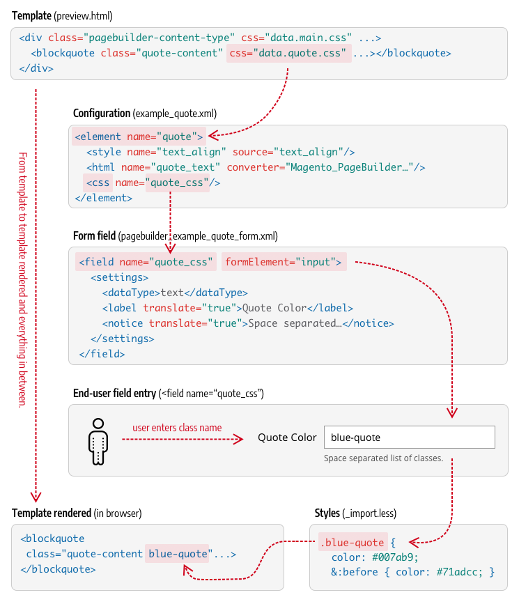
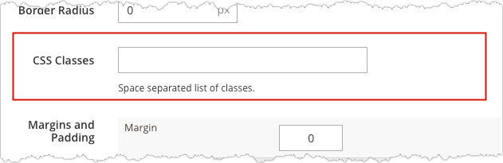
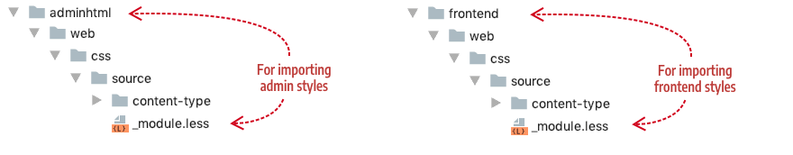
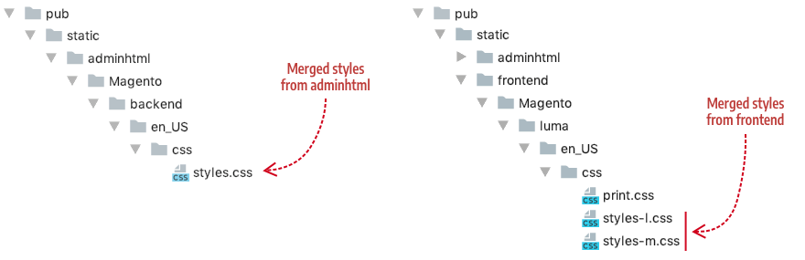
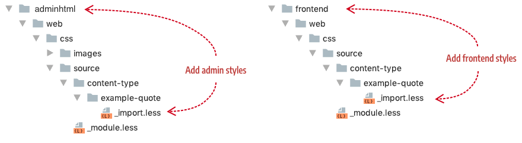
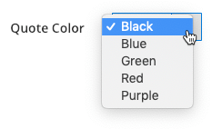

# Step 5: Add styles

In this step, we will create CSS styles (using LESS) to define the Quote's base appearance. We will also create several optional CSS classes that end-users can apply to our Quote.

## About styles

Page Builder provides two ways to style your content type's HTML templates using LESS: 

1. You can use the standard `class` attribute to define the base look and feel of a content type.

2. You can use the `css` attribute to provide end-users with CSS customization options.

### `class` attribute

The `class` attribute is the typical, non-dynamic way to including static class styles in HTML templates. This means the `class` will always be present to define the "built-in" styles for your content type. Styles assigned to `class` cannot be changed by the content editor. In contrast, using the `css` attribute lets users add or change certain CSS class styles to customize your content type.

### `css` attribute

The `css` attribute gives end-users the option to customize the appearance of your content type using CSS classes. As the developer, you determine the list of CSS classes you want to provide as options. 

Unlike the `class` attribute, which always includes the defined classes, the `css` attribute provides a binding to a form field in your content type. End-users then use that form field to add the CSS class values that are in turn applied to the HTML template.

The following diagram details how the `css` binding works starting from the HTML template (`preview.html`), the configuration (`example_quote.xml`), the form field from `pagebuilder_example_quote_form.xml`, to the CSS stylesheet (`_import.less`) and finally to the rendered HTML. The highlighted parts of the code and the arrows between them should give you a good idea for how things are connected to make the `css` binding work. 

{:width="745px" height="auto"}

As shown, the end result appends the user-entered CSS classes to the rendered template element along with any other `class` styles you already defined.

The `pagebuilder_base_form` has a form field for the `css` attribute already built-in as shown here:  



As the field notice indicates, the end-user can enter more than one CSS class into the field. Page Builder then applies each class to the HTML element you bind with the `css` attribute.

## Add LESS files

The first thing we need to do is add our LESS files to appropriate places in our module, according to convention. The conventions for LESS files and how they work within Page Builder are identical to how they work in core Magento.

To ensure that Magento can merge your content type styles with all the other styles, you must add a single LESS file named `_module.less` to both your `adminhtml/web/css/source` and `frontend/web/css/source` directories as shown here:



The `_module.less` file serves as the facade for importing your content type's styles. By convention, it should only contain `@import` statements for your content type's LESS files, such as:

```css
@import "content-type/example-quote/_import.less";
```

Magento uses the `_module.less` file to merge your content type's styles into the `pub/static` output with all the other module styles, as shown here:



For our Quote content type, add a file named `_import.less` to the `adminhtml/web/css/source/content-type/example-quote/` and `frontend/web/css/source/content-type/example-quote/` areas as shown here:



These files will contain the actual styles for our Quote control type.

You can name your LESS file (or files) whatever you want, as long as you import them using the correct path and name in your `_module.less` files. For example, since we are only using one file name (`_imports.less`) for the files in each area, the contents of our `_module.less` files for both areas are identical:

```css
@import "content-type/example-quote/_import.less";
```

You can also break your styles into multiple LESS files. Import each file in your `_module.less` file so that they all get merged with the rest of the Magento styles.

If you break your styles into multiple LESS files, make sure you `@import` each file in your `_module.less` file.

## Add `class` styles

The following sample shows the `class` styles used for our Quote content type:

```css
// Content type base styling
blockquote {
    display: block;
    font-size: 1.2em;
    margin: 1em;
    padding: 0.5em 10px;
    quotes: "\201C" "\201D" "\2018" "\2019";
    text-decoration: none;
    word-break: normal !important;
    line-height: 1.5;
    padding: 0;
    font-weight: 300;
    &:before {
      content: open-quote;
      font-size: 2.6em;
      margin-right: 0.14em;
      vertical-align: -0.4em;
      line-height: 0;
      margin-left: -0.45em;
      font-weight: 300;
    }
    &:after {
      content: close-quote;
      font-size: 0;
      line-height: 0;
      margin-left: 0;
    }
}
div {
  &.quote-author {
    padding-right: 30px;
    font-size: 14px;
    color: #666666;
    margin-left: 1.1em;
    word-break: normal !important;
  }
  &.quote-description {
    padding-right: 30px;
    font-size: 14px;
    color: #999999;
    margin-left: 1.1em;
    font-weight: 300;
    word-break: normal !important;
  }
}
```

The `class` attributes reference these styles in both our Admin preview template (`preview.html`) and our master format storefront template (`master.html`) as shown here:

```html
<!--preview.html-->
<div attr="data.main.attributes" ko-style="data.main.style" class="pagebuilder-content-type" css="data.main.css" event="{ mouseover: onMouseOver, mouseout: onMouseOut }, mouseoverBubble: false">
    <render args="getOptions().template" />
    <blockquote class="quote-content" css="data.quote.css" attr="data.quote.attributes" ko-style="data.quote.style" data-bind="liveEdit: { field: 'quote_text', placeholder: $t('Enter Quote') }"></blockquote>
    <div class="quote-author" attr="data.author.attributes" ko-style="data.author.style" data-bind="liveEdit: { field: 'quote_author', placeholder: $t('Enter Author') }"></div>
    <div class="quote-description" attr="data.author_title.attributes" ko-style="data.author_title.style" data-bind="liveEdit: { field: 'quote_author_desc', placeholder: $t('Enter Description') }"></div>
</div>
```

```html
<!--master.html-->
<div attr="data.main.attributes">
    <blockquote class="quote-content" attr="data.quote.attributes" ko-style="data.quote.style" css="data.quote.css" html="data.quote.html"></blockquote>
    <div class="quote-author" attr="data.author.attributes" ko-style="data.author.style" css="data.author.css" html="data.author.html"></div>
    <div class="quote-description" attr="data.author_title.attributes" ko-style="data.author_title.style" css="data.author_title.css" html="data.author_title.html"></div>
</div>
```

Next, we will add the `css` bindings that give our Quote some end-user customization options.

## Add `css` style binding

Part of using the `css` binding option is deciding what CSS styling options you want to give end-users. The two base forms (`pagebuilder_base_form` and `pagebuilder_base_form_with_background_attributes`) already provide end-users with several styling options such as alignments, borders, paddings, margins, and various background properties. So you will want to use the `css` binding for other changes not covered by the base forms.

For our Quote content type, we will use the `css` binding to enable users to change the color of the Quote's text using CSS styles. Let's start by defining our CSS styles in our `_import.less` files.

### Define CSS

To change the color of our Quote's text, we will define a few color CSS classes to use as follows (formatting is semi-compressed to save space):

```css
// Content type's CSS classes for end-user styling options
.black-quote { color: #333333; &:before { color: #333333; } }
.blue-quote { color: #007ab9; &:before { color: #71adcc; } }
.green-quote { color: #009900; &:before { color: #009900; } }
.red-quote { color: #990000; &:before { color: #990000; } }
.purple-quote { color: #990099; &:before { color: #990099; } }
```

Defining these classes allow us to specify exactly what we want the end-user to be able to apply, and nothing more. The next step is to add the form field for the user to enter these classes.

### Add form field

The simplest way to provide end-user CSS styling for our Quote is to add a text input field to our form, as follows:

```xml
<field name="quote_css" sortOrder="40" formElement="input">
    <settings>
        <dataType>text</dataType>
        <label translate="true">Quote Color</label>
        <notice translate="true">Classes you can enter include blue-quote, green-quote, red-quote, purple-quote, black-quote</notice>
    </settings>
</field>
```

However, this method puts the burden on the end-user to know and successfully enter the valid CSS class names. So we will not use this method.

Instead, we will use a simple `selector` to define and limit the color options available to end-users for coloring our Quote text, as shown here:

```xml
<field name="quote_css" sortOrder="40" formElement="select">
    <argument name="data" xsi:type="array">
        <item name="config" xsi:type="array">
            <item name="default" xsi:type="string">black-quote</item>
        </item>
    </argument>
    <settings>
        <dataType>text</dataType>
        <label translate="true">Quote Color</label>
    </settings>
    <formElements>
        <select>
            <settings>
                <options>
                    <option name="0" xsi:type="array">
                        <item name="value" xsi:type="string">black-quote</item>
                        <item name="label" xsi:type="string" translate="true">Black</item>
                    </option>
                    <option name="1" xsi:type="array">
                        <item name="value" xsi:type="string">blue-quote</item>
                        <item name="label" xsi:type="string" translate="true">Blue</item>
                    </option>
                    <option name="2" xsi:type="array">
                        <item name="value" xsi:type="string">green-quote</item>
                        <item name="label" xsi:type="string" translate="true">Green</item>
                    </option>
                    <option name="3" xsi:type="array">
                        <item name="value" xsi:type="string">red-quote</item>
                        <item name="label" xsi:type="string" translate="true">Red</item>
                    </option>
                    <option name="4" xsi:type="array">
                        <item name="value" xsi:type="string">purple-quote</item>
                        <item name="label" xsi:type="string" translate="true">Purple</item>
                    </option>
                </options>
            </settings>
        </select>
    </formElements>
</field>
```

When rendered in the form editor, the selector field provides users with a simple color list. Page Builder applies the class name as the selected value: 



Next we need to setup the bindings.

### Add configuration bindings

To create the binding between the CSS class values selected in our `quote_css` form field and our template, we need to do two things:

1. Add a `<css>` binding element to the `quote` element in our `example_quote.xml` configuration file.
2. Add a `css` binding attribute to the `<blockquote>` element in our HTML template files (`preview.html` and `master.html`).

**Config file entry**: For our Quote, we want the `<css>` element to bind to our `quote_css` by name as follows:

```xml
<element name="quote">
    <style name="text_align" source="text_align"/>
    <html name="quote_text" converter="Magento_PageBuilder/js/converter/html/tag-escaper"/>
    <css name="quote_css"/>
</element>
```

**Template file entry:** Now we want the value from our `quote_css` field to be applied to our Quote's HTML templates. As noted previously, this is done using the `css` attribute (`css="data.quote.css"`) to point to the `<css>` element in the config file. In the following example, the `css` attribute has been applied to the `<blockquote>` element:

```html
<!--preview.html-->
<div attr="data.main.attributes" ko-style="data.main.style" class="pagebuilder-content-type" css="data.main.css" event="{ mouseover: onMouseOver, mouseout: onMouseOut }, mouseoverBubble: false">
    <blockquote class="quote-content" css="data.quote.css" attr="data.quote.attributes" ko-style="data.quote.style" data-bind="liveEdit: { field: 'quote_text', placeholder: $t('Enter Quote') }"></blockquote>
    <div class="quote-author" attr="data.author.attributes" ko-style="data.author.style" data-bind="liveEdit: { field: 'quote_author', placeholder: $t('Enter Author') }"></div>
    <div class="quote-description" attr="data.author_title.attributes" ko-style="data.author_title.style" data-bind="liveEdit: { field: 'quote_author_desc', placeholder: $t('Enter Description') }"></div>
</div>
```

## Quote styles

The full file contents for both the `adminhtml` and `frontend` LESS files are provided below.

### LESS for `adminhtml`

The `_import.less` file content for the Admin preview template: 

```css
// Content type's base styling
blockquote {
    display: block;
    font-size: 1.2em;
    margin: 1em;
    padding: 0.5em 10px;
    quotes: "\201C" "\201D" "\2018" "\2019";
    text-decoration: none;
    word-break: normal !important;
    line-height: 1.5;
    padding: 0;
    font-weight: 300;
    &:before {
      content: open-quote;
      font-size: 2.6em;
      margin-right: 0.14em;
      vertical-align: -0.4em;
      line-height: 0;
      margin-left: -0.45em;
      font-weight: 300;
    }
    &:after {
      content: close-quote;
      font-size: 0;
      line-height: 0;
      margin-left: 0;
    }
}
div {
  &.quote-author {
    padding-right: 30px;
    font-size: 14px;
    color: #666666;
    margin-left: 1.1em;
    word-break: normal !important;
  }
  &.quote-description {
    padding-right: 30px;
    font-size: 14px;
    color: #999999;
    margin-left: 1.1em;
    font-weight: 300;
    word-break: normal !important;
  }
}

// Content type's CSS classes for end-user styling options
.black-quote { color: #333333; &:before { color: #333333; } }
.blue-quote { color: #007ab9; &:before { color: #71adcc; } }
.green-quote { color: #009900; &:before { color: #009900; } }
.red-quote { color: #990000; &:before { color: #990000; } }
.purple-quote { color: #990099; &:before { color: #990099; } }
```

### LESS for `frontend`

The `_import.less` file content for the master format storefront template:

```css
// Content type's base styling
blockquote {
    display: block;
    font-size: 1.2em;
    margin: 1em;
    padding: 0.5em 10px;
    quotes: "\201C" "\201D" "\2018" "\2019";
    text-decoration: none;
    word-break: normal !important;
    line-height: 1.5;
    padding: 0;
    font-weight: 300;
    &:before {
      content: open-quote;
      font-size: 2.6em;
      margin-right: 0.2em;
      vertical-align: -0.35em;
      line-height: 0;
      margin-left: -0.5em;
      font-weight: 300;
    }
    &:after {
      content: close-quote;
      font-size: 0;
      line-height: 0;
      margin-left: 0;
    }
}

div {
  &.quote-author {
    text-align: left;
    padding-right: 30px;
    font-size: 14px;
    color: #666666;
    margin-left: 1.1em;
  }
  &.quote-description {
    text-align: left;
    padding-right: 30px;
    font-size: 14px;
    color: #999999;
    margin-left: 1.1em;
    font-weight: 300;
  }
}

// Content type's CSS classes for end-user styling options
.black-quote { color: #333333; &:before { color: #333333; } }
.blue-quote { color: #007ab9; &:before { color: #71adcc; } }
.green-quote { color: #009900; &:before { color: #009900; } }
.red-quote { color: #990000; &:before { color: #990000; } }
.purple-quote { color: #990099; &:before { color: #990099; } }
```

## Next

[Step 6: Add icon](step-6-add-icon.md)

