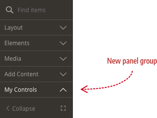
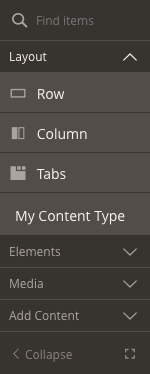

<!--  -->

# Customize the Panel

By default, the Page Builder panel has four groups (Layout, Elements, Media, Add Content) and 16 content types as shown here:


You can customize the panel menu in three ways:

1. Rename panel groups.
2. Add new panel group.
3. Add your content type to a panel group.

## Rename the panel groups

To rename the panel groups, you need to override the defaults configured in the Page Builder `group.xml` file as follows:

1. Add a file called `group.xml` to your module's `view/adminhtml/pagebuilder/` directory:

    

2. Copy the contents from `app/code/Magento/PageBuilder/view/adminhtml/pagebuilder/group.xml` :

    ```xml
    <?xml version="1.0"?>
    <config xmlns:xsi="http://www.w3.org/2001/XMLSchema-instance" xsi:noNamespaceSchemaLocation="urn:magento:module:Magento_PageBuilder:etc/group.xsd">
        <group name="layout" translate="label" sortOrder="1" label="Layout"/>
        <group name="elements" translate="label" sortOrder="10" label="Elements"/>
        <group name="media" translate="label" sortOrder="20" label="Media"/>
        <group name="add_content" translate="label" sortOrder="30" label="Add Content"/>
    </config>
    ```

3. Change the `label` values to suit your preferences:

    ```xml
    <?xml version="1.0"?>
    <config xmlns:xsi="http://www.w3.org/2001/XMLSchema-instance" xsi:noNamespaceSchemaLocation="urn:magento:module:Magento_PageBuilder:etc/group.xsd">
        <group name="layout" translate="label" sortOrder="1" label="Structure"/>
        <group name="elements" translate="label" sortOrder="10" label="Form Controls"/>
        <group name="media" translate="label" sortOrder="20" label="Visual Controls"/>
        <group name="add_content" translate="label" sortOrder="30" label="Content"/>
    </config>
    ```

    If you only want to change one of the group labels, you only have to include the `<group>` element you want to change, as shown here:

    ```xml
    <?xml version="1.0"?>
    <config xmlns:xsi="http://www.w3.org/2001/XMLSchema-instance" xsi:noNamespaceSchemaLocation="urn:magento:module:Magento_PageBuilder:etc/group.xsd">
        <group name="add_content" translate="label" sortOrder="30" label="Content"/>
    </config>
    ```

## Add a new panel group

To add a new panel group, add a new `<group>` element  in your module's `group.xml` file with a unique `name` as shown here:

```xml
<?xml version="1.0"?>
<config xmlns:xsi="http://www.w3.org/2001/XMLSchema-instance" xsi:noNamespaceSchemaLocation="urn:magento:module:Magento_PageBuilder:etc/group.xsd">
    <group name="my_controls" translate="label" sortOrder="0" label="My Controls"/>
</config>
```

The result shows the new group (My Controls) positioned at the top of the panel because the `sortOrder` is set to `0`, less than the sort order of `1` set for the `layout` group. You can also use negative numbers (`-1`) for the sort order as needed.



Now to populate the new and existing groups with content types.

## Add a content type to a panel group

To do this, set your configuration's `group` attribute to the `<group>` element's name. For example, to add your content type to the Layout group,

```xml
<group name="my_controls" translate="label" sortOrder="0" label="My Controls"/>
```

Specify "my_controls" as the value of the `group` attribute in your configuration file, as shown here:

```xml
<?xml version="1.0"?>
<config xmlns:xsi="http://www.w3.org/2001/XMLSchema-instance" xsi:noNamespaceSchemaLocation="urn:magento:module:Magento_PageBuilder:etc/content_type.xsd">
    <type name="bestcontrolever"
          label="Best Control Ever"
          group="my_controls"
					...>
```



The same technique applies to adding a content type to an existing panel groups: `layout`, `elements`, `media`, and `add_content` as shown here:

```xml
<group name="layout" translate="label" sortOrder="1" label="Layout"/>
<group name="elements" translate="label" sortOrder="10" label="Elements"/>
<group name="media" translate="label" sortOrder="20" label="Media"/>
<group name="add_content" translate="label" sortOrder="30" label="Add Content"/>
```

<!--  -->