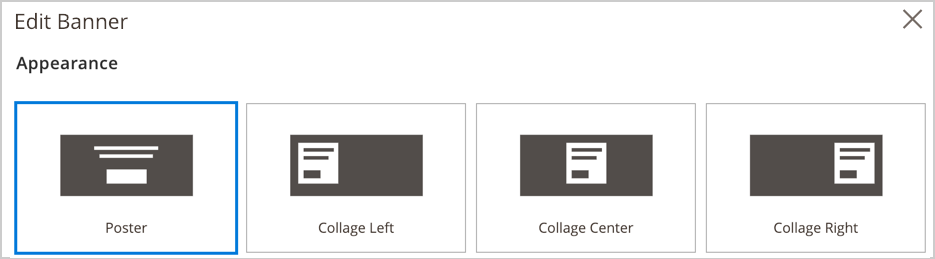
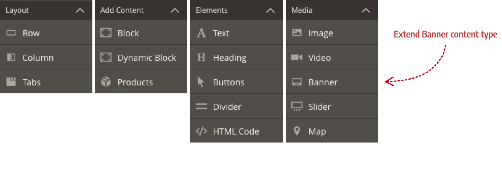
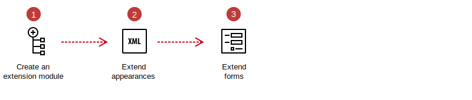

# Overview

One of the quickest ways to customize Page Builder is by changing how _existing_ content types look and behave. End users can already use Page Builder's content types to customize their content using the form editor. But your end users may want to change the structure or set properties that do not exist on the content type. In those cases, you can extend an existing content type by customizing its  _appearance_ or adding a new _appearance_.

## Appearances

An **appearance** is an XML element (in the content type's configuration file) that defines a view for your content type. This view defines HTML templates, styles, form fields, and other elements that you can customize in various ways. To extend existing Page Builder content types, you can either modify existing appearances or create new ones.

Many of Page Builder's content types have only one `appearance` element. These include the Heading, Text, Image, Video, Tabs, and more. Other content types have several appearances. For example, the Banner content type has four appearances, as shown here:

  

Page Builder defines these appearances in the Banner's configuration file (`Magento/PageBuilder/view/adminhtml/pagebuilder/content_type/banner.xml`), as shown here:

```xml
<appearances>
    <appearance name="collage-left"...>
    <appearance name="collage-centered"...>
    <appearance name="collage-right"...>
    <appearance name="poster" default="true" ...>
</appearances>
```

In Page Builder 1.0.0, when you customize content types that have multiple appearances (like the Banner), you must apply your changes to all the appearances, not just one. Customizing a single appearance of a content type that defines multiple appearances is not currently supported.  
You can use appearances to change content types in the following ways:

- Add new style properties.
- Add or change templates.
- Add to or change existing forms.
- Add new attributes.
- Move data between elements.

## Banner extension tutorial

In this tutorial, you will learn how to extend one of Page Builder's existing content types by adding a new `max-height` style property to the Banner's existing appearances.

{:width="815px" height="auto"}

## Banner extension steps

These steps show the basic pattern for adding style properties and form fields to existing content type appearances:



1. **Create an extension module**: Create a basic module for your Banner extensions.
2. **Extend appearances**: Extend the existing content type's configuration file by customizing an existing appearance with new style properties.
3. **Extend forms**: Extend the existing content type's UI component form by adding new form fields and/or changing defaults for existing fields.

## Next

[Step 1: Create an extension module](step-1-create-extension-module.md)

