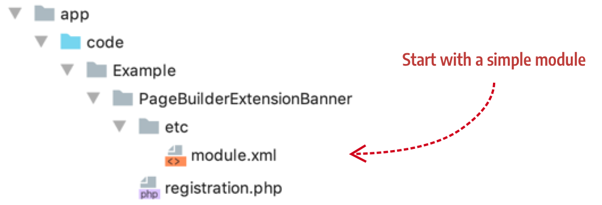

# Step 1: Create an extension module

The first step to creating appearance customizations for existing Page Builder content types is to create a standard Magento module. In this step, we create an empty module so we can add our appearance and form extensions in steps 2 and 3:

{:width="826px" height="auto"}

## Add a directory structure

To create a module for the Banner extensions, name your vendor directory `Example` and name your module `PageBuilderExtensionBanner`, as shown here:

{:width="530px" height="auto"}

The convention for naming extension modules is to prefix your extension of an existing content type with `PageBuilderExtension`, followed by the name of the content type. This is not a required convention, but we find it helps group extension modules within your vendor directory.

## Add module file

Your module file should look like this:

```xml
<?xml version="1.0"?>
<config xmlns:xsi="http://www.w3.org/2001/XMLSchema-instance" xsi:noNamespaceSchemaLocation="urn:magento:framework:Module/etc/module.xsd">
    <module name="Example_PageBuilderExtensionBanner" setup_version="1.0.0">
        <sequence>
            <module name="Magento_PageBuilder"/>
        </sequence>
    </module>
</config>
```

## Add registration file

Your registration file should look like this:

```php
<?php

use \Magento\Framework\Component\ComponentRegistrar;

ComponentRegistrar::register(ComponentRegistrar::MODULE, 'Example_PageBuilderExtensionBanner', __DIR__);
```

## Install your module

From your Magento root directory, use `bin/magento setup:upgrade` to install and enable your module.

## Next

[Step 2: Extend appearances](step-2-extend-appearances.md)
