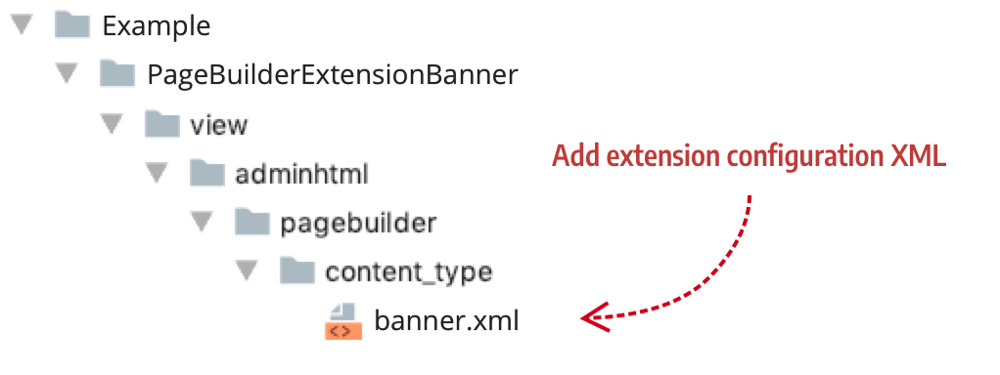

# Step 2: Extend appearances

In this step, you will extend all four Banner appearances by adding a new `max_height` style to each. The `max-height` property stops the Banner from growing beyond a certain height as end users enter banner text.

## Create a content configuration file

As mentioned before, Page Builder defines the Banner's appearances within the `banner.xml` configuration file, as shown collapsed here:

```xml
<appearances>
    <appearance name="collage-left"...>
    <appearance name="collage-centered"...>
    <appearance name="collage-right"...>
    <appearance name="poster" default="true" ...>
</appearances>
```

To customize these appearances, you must create a new configuration file named `banner.xml`. The configuration file must use the same name as the Banner's configuration file. This ensures that Magento merges the appearance customizations with the Banner's existing configuration. Your file structure for the `banner.xml` extension should look like this:

{:width="511px" height="auto"}

## Add properties to appearances

In the Page Builder 1.0.0, you cannot extend just one appearance of a content type. You must extend them all. In the following example, we are extending all four appearances of the Banner content type by adding a `max-height` style property to these appearances:

```xml
<?xml version="1.0"?>
<config xmlns:xsi="http://www.w3.org/2001/XMLSchema-instance" xsi:noNamespaceSchemaLocation="urn:magento:module:Magento_PageBuilder:etc/content_types.xsd">
    <type name="banner">
        <appearances>
            <appearance name="collage-left">
                <elements>
                    <element name="wrapper">
                        <style name="max_height" source="max_height" converter="Magento_PageBuilder/js/converter/style/remove-px"/>
                    </element>
                </elements>
            </appearance>
            <appearance name="collage-right">
                <elements>
                    <element name="wrapper">
                        <style name="max_height" source="max_height" converter="Magento_PageBuilder/js/converter/style/remove-px"/>
                    </element>
                </elements>
            </appearance>
            <appearance name="poster">
                <elements>
                    <element name="wrapper">
                        <style name="max_height" source="max_height" converter="Magento_PageBuilder/js/converter/style/remove-px"/>
                    </element>
                </elements>
            </appearance>
            <appearance name="collage-centered">
                <elements>
                    <element name="wrapper">
                        <style name="max_height" source="max_height" converter="Magento_PageBuilder/js/converter/style/remove-px"/>
                    </element>
                </elements>
            </appearance>
        </appearances>
    </type>
</config>
```

The following table describes the elements in our extension configuration.

| Element       | Description                                                  |
| ------------- | ------------------------------------------------------------ |
| `type`        | The type `name` defines the name of the content type. Make sure you name this configuration `banner` so that Magento will merge this configuration with the Banner's configuration. |
| `appearances` | The grouping element that specifies one or more `appearance` elements. |
| `appearance`  | The appearance `name` that Magento uses for XML merging. Again, make sure you use the same appearance names as the Banner so that Magento can merge your appearance extensions with the Banner appearances you want to change. |
| `elements`    | The grouping element that specifies one or more `element` nodes. |
| `element`     | The `element` maps styles and other appearance extensions from the form editor to the HTML templates. In our markup, we map our new style properties for each appearance to the `wrapper` element of the Banner's HTML templates. |
| `style`       | The `style` element configures the bindings from the form field to the HTML template elements. Here, we apply our style to the `wrapper` element of the template. The style `name` represents the CSS `max-height` style. The `source` is the name of the form field you want the style bound to. That means that the field name we will add in step 3 will be `max-height`. |
{:style="table-layout:auto"}

## Next

[Step 3: Extend forms](step-3-extend-forms.md) 

