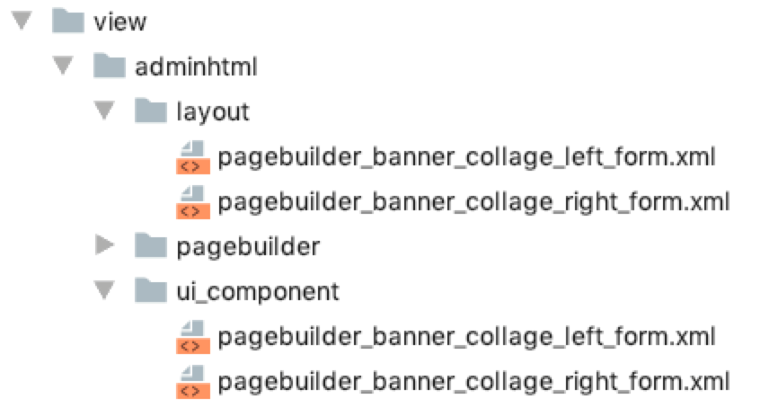
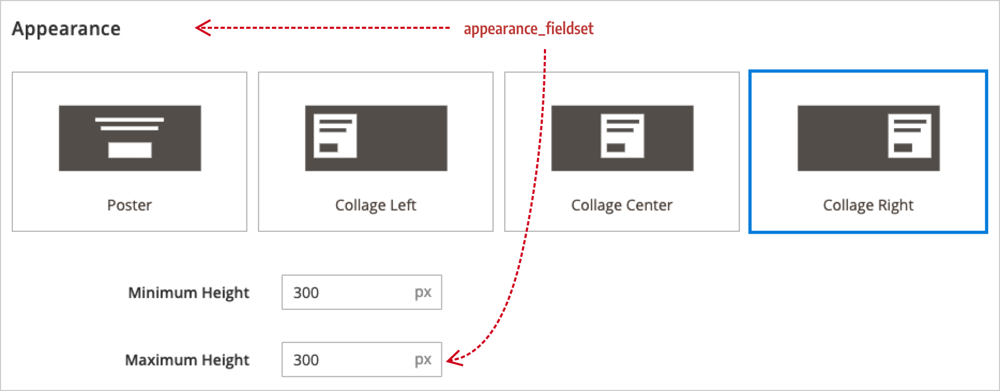

# Step 3: Extend forms

In this step, you will customize the Banner form (`pagebuilder_banner_form.xml`) by adding a form field for entering a `max-height` value for the `collage-left` and `collage-right` appearances.

## Create the appearance form

Page Builder forms are UI component forms. This means they follow the same conventions as any other UI component form in Magento. If you are not already familiar with UI component forms, you can learn more about them from the [UI Components Guide](https://devdocs.magento.com/guides/v2.3/ui_comp_guide/concepts/ui_comp_xmldeclaration_concept.html). For this tutorial, we provide you with the basic markup for setting up an empty form.

Your file structure for the Banner extension form and corresponding layout should look like this:

{:width="544px" height="auto"}

### Extension form

When customizing an existing form, make sure you name your form with the same name as the existing content type's form. In our case, we are customizing the Banner's form, which means we must name our form: `pagebuilder-banner-form.xml`. Here's the basic XML configuration for the Banner form extension:

```xml
<?xml version="1.0" encoding="UTF-8"?>
<form xmlns:xsi="http://www.w3.org/2001/XMLSchema-instance"
      xsi:noNamespaceSchemaLocation="urn:magento:module:Magento_Ui:etc/ui_configuration.xsd">
    <argument name="data" xsi:type="array">
        <item name="js_config" xsi:type="array">
            <item name="provider" xsi:type="string">
                pagebuilder_banner_form.pagebuilder_banner_form_data_source
            </item>
        </item>
        <item name="label" xsi:type="string" translate="true">Banner</item>
    </argument>
    <settings>
        <deps>
            <dep>pagebuilder_banner_form.pagebuilder_banner_form_data_source</dep>
        </deps>
        <namespace>pagebuilder_banner_form</namespace>
    </settings>
    <dataSource name="pagebuilder_banner_form_data_source">
        <argument name="data" xsi:type="array">
            <item name="js_config" xsi:type="array">
                <item name="component" xsi:type="string">Magento_PageBuilder/js/form/provider</item>
            </item>
        </argument>
        <dataProvider name="pagebuilder_banner_form_data_source" class="Magento\PageBuilder\Model\ContentType\DataProvider">
            <settings>
                <requestFieldName/>
                <primaryFieldName/>
            </settings>
        </dataProvider>
    </dataSource>

  <!--Add Fieldsets and fields-->

</form>
```

## Add fieldsets and fields

Before you add a field to the form of an existing content type, you need to know where to add it. In other words, you need to decide which fieldset to put your field in. We want to put our new `max_height` field below the Banner's existing `min_height` field, which is in the the `appearance_fieldset`.

The markup for adding the field to the fieldset looks like this:

```xml
<fieldset name="appearance_fieldset"
          sortOrder="10"
          component="Magento_PageBuilder/js/form/element/dependent-fieldset">
    <field name="max_height" sortOrder="30" formElement="input">
        <argument name="data" xsi:type="array">
            <item name="config" xsi:type="array">
                <item name="default" xsi:type="number">300</item>
            </item>
        </argument>
        <settings>
            <label translate="true">Maximum Height</label>
            <additionalClasses>
                <class name="admin__field-small">true</class>
            </additionalClasses>
            <addAfter translate="true">px</addAfter>
            <dataType>text</dataType>
            <dataScope>max_height</dataScope>
            <validation>
                <rule name="validate-number" xsi:type="boolean">true</rule>
            </validation>
        </settings>
    </field>
</fieldset>
```

The following table describes some key elements:

| Elements   | Description                                                  |
| ---------- | ------------------------------------------------------------ |
| `fieldset` | The fieldset `name` should match the name of the fieldset from the Banner's form. The `appearance_fieldset` is common to all the content type forms and, by default, appears at the top of the forms using the `sortOrder` of 10. |
| `field`    | The field `name` should match the CSS max-height style property, but in snake_case. Fields also have a `sortOrder` you can use to place your field above or below existing fields. The `formElement` for a field describes the HTML form type, such as input, checkbox, select, and more. |
| `argument` | Provides the way to add a `default` value to your field. We set our default value to `300`. |
| `settings` | Provides the markup that gives your field a label, CSS styling, validation, and other properties as needed. |
{:style="table-layout:auto"}

After adding the `max_height` field, flush your cache, drag a banner to the Admin stage, open the editor, and see your new style property field being rendered in the Banner's form, as shown here:

{:width="934px" height="auto"}

## Conclusion

That's it! You should now be familiar with the basics of extending an existing content type. There is much more to learn, but we hope this gives you a better understanding of how you can customize the existing Page Builder content types to fit your end-user's needs.
