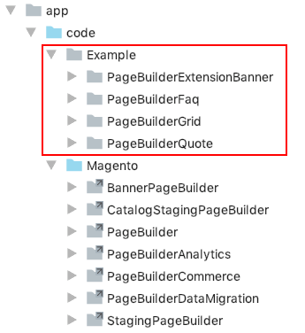
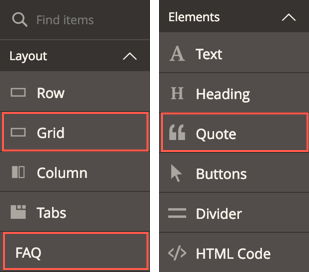

# Install Page Builder Examples

You can find the Page Builder examples used in this documentation on GitHub in the [pagebuilder-examples repo](https://github.com/magento-devdocs/pagebuilder-examples). The repo contains three types of examples:

- Custom content type modules
- Extension modules for existing content types
- Example code for how-to topics

## Custom content type modules

The [Example directory](https://github.com/magento-devdocs/pagebuilder-examples/tree/master/Example) on the repo provides custom content-type modules for you to download and install. The Page Builder team members created these modules to serve as examples for learning. They are not fully tested or guaranteed to work perfectly. However, we will do our best to improve these examples and keep them updated with the latest releases of Page Builder. 

- **[PageBuilderQuote](https://github.com/magento-devdocs/pagebuilder-examples/tree/master/Example/PageBuilderQuote)** — Create by [Bruce Denham](https://github.com/bdenham). This module shows you how to create a content type for a customer testimonial page. This is the completed Quote module featured in the [Create a content type tutorial](../create-custom-content-type/overview.md).
- **[PageBuilderGrid](https://github.com/magento-devdocs/pagebuilder-examples/tree/master/Example/PageBuilderGrid)** — Created by [Dave Macaulay](https://github.com/davemacaulay). This module shows you how to create a content type that recreates the layout of the Magento Luma-themed home page using a grid structure with grid items.
- **[PageBuilderFaq](https://github.com/magento-devdocs/pagebuilder-examples/tree/master/Example/PageBuilderFaq)** — Created by [Igor Melnikov](https://github.com/melnikovi). This module shows you how to create a content type for an FAQ page that uses an accordion for the questions and answers.

## Extension modules for existing content types

The [Example directory](https://github.com/magento-devdocs/pagebuilder-examples/tree/master/Example) also provides the completed extension module featured in the [Extend a content type tutorial](../extend-existing-content-type/overview.md):

- **[PageBuilderExtensionBanner](https://github.com/magento-devdocs/pagebuilder-examples/tree/master/Example/PageBuilderExtensionBanner)** — This Banner extension module shows the basic pattern for customizing existing content types using appearances.

## Additional extension modules

- **[PageBuilderLazyLoading](https://github.com/magento-devdocs/pagebuilder-examples/tree/master/Example/PageBuilderLazyLoading)** — This module shows how to add lazy loading behavior to the Image content type. For this example, we use the [lazysizes](https://github.com/aFarkas/lazysizes) loader. Created by @bruce on [#pagebuilder](https://app.slack.com/client/T4YUW69CM/CHB455HPF).
- **[DeactivatingPageBuilder](https://github.com/magento-devdocs/pagebuilder-examples/tree/master/Example/DeactivatingPageBuilder)** — This example module shows you how to disable Page Builder for a particular page in Magento, specifically Pages, Blocks, and Dynamic Blocks. Created by @bruce on [#pagebuilder](https://app.slack.com/client/T4YUW69CM/CHB455HPF).
- **[PageBuilderExtensionBaseForms](https://github.com/magento-devdocs/pagebuilder-examples/tree/master/Example/PageBuilderExtensionBaseForms)** — This module shows you how to remove fields and fieldsets from Page Builder's built-in forms. Created by @bruce on [#pagebuilder](https://app.slack.com/client/T4YUW69CM/CHB455HPF).
- **[PageBuilderExtensionText](https://github.com/magento-devdocs/pagebuilder-examples/tree/master/Example/PageBuilderExtensionText)** — This module shows you how to customize the Page Builder's Text toolbar, integrate your own theme's typography, and add TinyMCE's `code` plugin to the toolbar so you can view the HTML code directly. Created by @bruce on [#pagebuilder](https://app.slack.com/client/T4YUW69CM/CHB455HPF).
- **[PageBuilderExtensionSlider](https://github.com/magento-devdocs/pagebuilder-examples/tree/master/Example/PageBuilderExtensionSlider)** — This module shows you how to add `centerMode` and `centerPadding` settings from the [slick carousel](https://kenwheeler.github.io/slick/) used by the Slider. Create by @bruce on [#pagebuilder](https://app.slack.com/client/T4YUW69CM/CHB455HPF).

## Example code for how-to topics

**In Progress**. The how-to directories in the repo correspond to the how-to topics in this documentation. Each how-to directory provides the files and code changes featured in the how-to topics.

For example, the topic [How to add a custom toolbar](../how-to/how-to-add-custom-toolbar.md), has a corresponding directory within the [pagebuilder-examples repo](https://github.com/magento-devdocs/pagebuilder-examples) called [how-to-add-custom-toolbar](https://github.com/magento-devdocs/pagebuilder-examples/tree/master/how-to-add-custom-toolbar). This directory provides the files with the code changes you need to make in order to add a custom toolbar to the `PageBuilderQuote` module.

## Installation

Assuming you have Page Builder already installed, you can install the example modules as follows:

1. Clone the pagebuilder-examples repo:

    ```terminal
    git clone https://github.com/magento-devdocs/pagebuilder-examples
    ```

2. Navigate to your `<Magento2_installation>/app/code/` directory.

3. Copy or symlink the `Example` directory from your local `pagebuilder-examples` clone into your `app/code/` directory.
    
    **To Symlink**:
    ```terminal
    ln -s <Relative_route_to_cloned_Example_directory>
    ```
    
    
    
4. Enable the modules using the `setup:upgrade` command:

   ```terminal
   bin/magento setup:upgrade
   ```
   
5. Navigate to a Page Builder instance to ensure the example content types appear in the Page Builder panel, as shown here:

   

 
