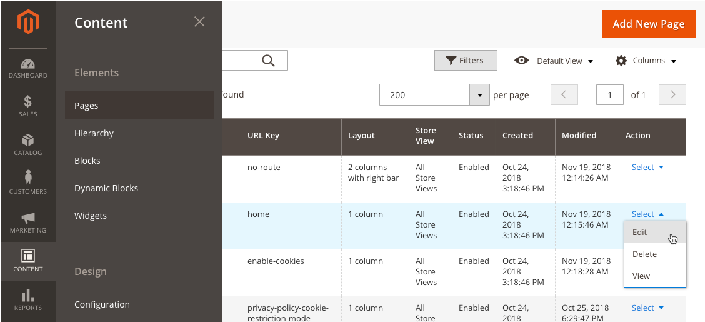
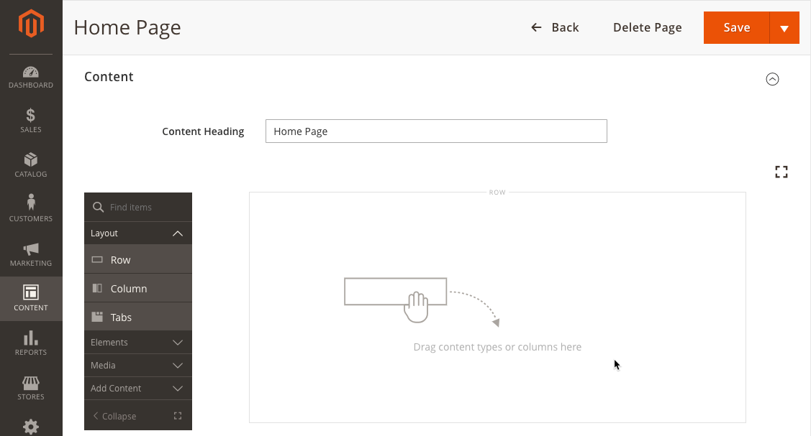

# View Page Builder

You can view Page Builder by navigating to one of several locations within the Admin UI:

- Catalog Product
- Catalog Category
- CMS Page
- CMS Block

**Commerce Only:**

- Content Staging
- Dynamic Block (formally banner)

The following example shows Page Builder active within the Home Page by selecting **Content** > **Pages** > **Home Page** > **Edit**, as shown here:

Page Builder is shown here within the **Content** section of the Home Page.

