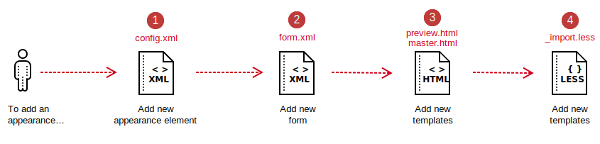

# How to add an appearance

This topic describes how to add a new appearance to a content type so that you can give end-users the custom features they require when creating content.

## Step 1: Add appearance to config file

In progress...