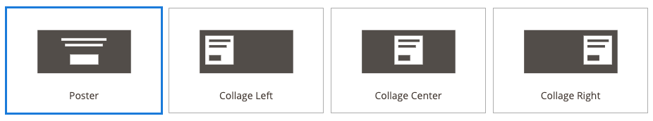
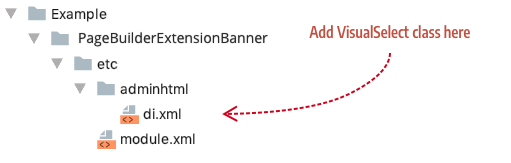
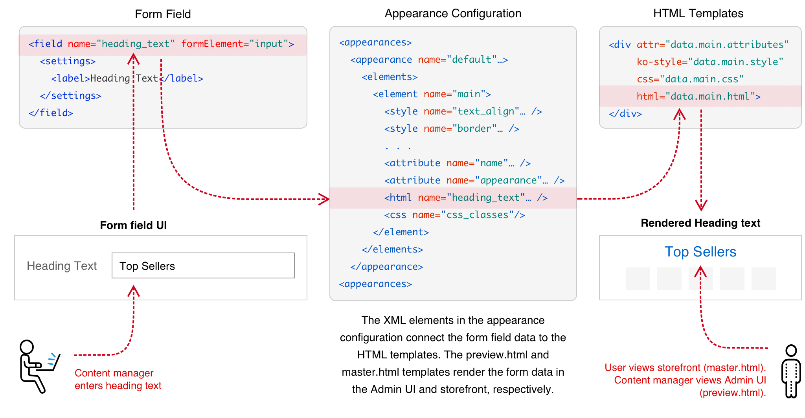
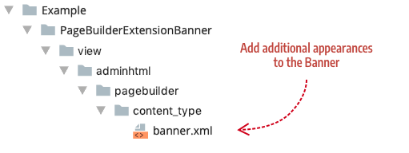
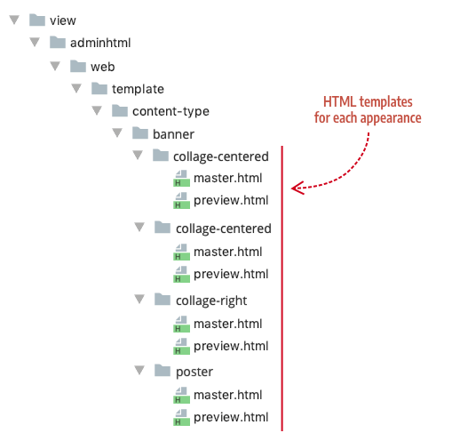
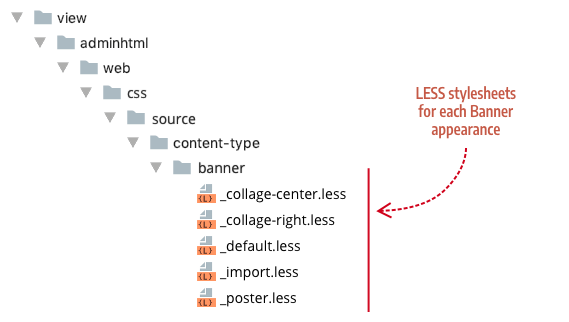
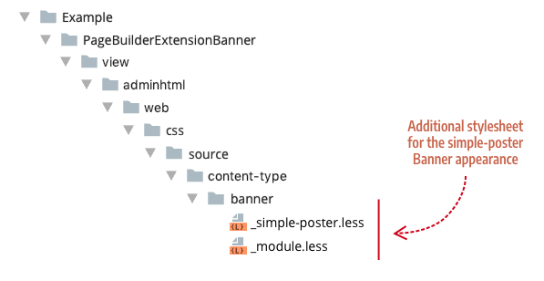

# How to add an appearance

Appearances provide different layout and styling options for a content type. For example, the Banner content type has four appearances. Each appearance shows a different layout for the Banner's text and button.

This topic shows how to add appearances to existing content types. An overview of the steps and the files you need to add are illustrated here:


_Steps for adding appearances_

Even though this topic describes how to add appearances to Page Builder's native content types, the steps can be applied to adding more appearances to your custom content types as well.

## Step 1: Add VisualSelect class

First, we need a way select an appearance within the Admin UI. In Page Builder, we use the `VisualSelect` class. This class provides the UI for selecting different appearances. For example, the `VisualSelect` class for the Banner provides four appearances to choose from:



_Visual selector for Banner_

To add a new appearance option for one of Page Builder's native content types, like the Banner, create a new `di.xml` file in your module, as shown here:



_File and location for the VisualSelect class_

Within the `di.xml` file, add a `VisualSelect` class using the Banner's `VisualSelect` class name (`<virtualType name="AppearanceSourceBanner"`), as shown here:

```xml
<config xmlns:xsi="http://www.w3.org/2001/XMLSchema-instance" xsi:noNamespaceSchemaLocation="urn:magento:framework:ObjectManager/etc/config.xsd">
    <virtualType name="AppearanceSourceBanner" type="Magento\PageBuilder\Model\Source\VisualSelect">
        <arguments>
            <argument name="optionsSize" xsi:type="string">large</argument>
            <argument name="optionsData" xsi:type="array">
                <item name="4" xsi:type="array">
                    <item name="value" xsi:type="string">simple-poster</item>
                    <item name="title" xsi:type="string" translate="true">Simple Poster</item>
                    <item name="icon" xsi:type="string">Example_PageBuilderBannerAppearance/css/images/content-type/banner/appearance/simple-poster.svg</item>
                </item>
            </argument>
        </arguments>
    </virtualType>
</config>
```
_VisualSelect class for new Banner appearance_

Using the same class name as the Banner ensures that Magento's XML merging will add your new visual appearance option to the existing Banner appearance options.

The following table describes the configuration arguments for each appearance option.

| Arguments       | Description                                                  |
| --------------- | ------------------------------------------------------------ |
| `optionsSize`   | The size of the icons that display each option. Use `large` for appearance options. |
| `optionsData`   | Grouping array for all the appearance options of a content type. |
| `item array`    | Grouping array of properties that define an appearance option. The `name="4"` signifies the index order for displaying the option. The Banner's existing options stop with an index of 3 (`name="3"`), ensuring that our new appearance option is positioned after the last Banner option. |
| `value`         | Assigns the unique key used in the component dataSource.     |
| `title`         | Display name for the appearance option. Banner example: Poster. |
| `icon`          | Path to the `.svg` icon for the appearance: `view/adminthtml/web/css/images/content-type/[content-type-name]/appearance/*.svg`. See Creating an icon for your appearance |
| `noticeMessage` | (Not shown in example.) The `noticeMessage` displays a message below the appearance options when the appearance is selected. For example, two of the Row appearances (`full-width` and `full-bleed`) define `noticeMessage` strings that display when selected. |
{:style="table-layout:auto"}

To add more appearance options, simply create more ` item` arrays, as shown here:

```xml
<item name="5" xsi:type="array">
    <item name="value" xsi:type="string">tall</item>
    <item name="title" xsi:type="string" translate="true">Tall</item>
    <item name="icon" xsi:type="string">Example_PageBuilderExtensionBanner/css/images/content-type/banner/appearance/tall.svg</item>
</item>
<item name="6" xsi:type="array">
    <item name="value" xsi:type="string">short</item>
    <item name="title" xsi:type="string" translate="true">Short</item>
    <item name="icon" xsi:type="string">Example_PageBuilderBannerExtensionBanner/css/images/content-type/banner/appearance/short.svg</item>
</item>
```
_Example of additional appearance options_

### Creating an appearance icon

Appearance icons are `.svg` files that graphically depict the layout of an appearance. Use the following SVG template as a starting place for creating your own appearance icon:

```xml
<svg xmlns="http://www.w3.org/2000/svg" width="218" height="110" viewBox="0 0 218 110">
  <g fill="none" fill-rule="evenodd">
    <rect width="149" height="69" x="35" y="21" fill="#524D49"/>
    <rect width="45" height="16" x="87" y="60" fill="#FFF"/>
    <rect width="72" height="4" x="73" y="34" fill="#FFF"/>
    <rect width="60" height="4" x="79" y="43" fill="#FFF"/>
  </g>
</svg>
```
_SVG appearance template_

You can use whatever tool you want to create your SVG. Just make sure you follow these specific dimensions to ensure your icon fits in with the existing appearance icons:

| Property                     | Value       |
| ---------------------------- | ----------- |
| `svg width`                  | 218         |
| `svg height`                 | 110         |
| `svg viewbox`                | 0 0 218 110 |
| `g fill`                     | none        |
| background `rect width`      | 149         |
| background `rect height`     | 69          |
| background `rect x`          | 35          |
| background `rect y`          | 21          |
| background `rect fill`       | #524D49     |
| other `rect fill` properties | #FFF        |
{:style="table-layout:fixed"}

## Step 2: Add appearance configurations

Appearance configurations connect the data entered in a content type's form to its HTML templates. For example, the Heading content type has an `<html>` config element (`<html name="heading_text" />`)  that maps the text entered into the content type's `heading_text` form field (`<field name="heading_text" formElement="input">`) to the Heading's Knockout template binding (`html="data.main.html"`), as illustrated here:



_Appearance configurations explained_

The same concept applies to `styles`, `attributes`, and `css` elements. These elements ensure that the form settings (both content and styles) get applied to the templates as expected.

To add a new Banner appearance configuration, create a content type config file named `banner.xml`, as shown here:



_Add additional appearances to Banner content type_

{: .bs-callout .bs-callout-info }
This procedure applies to any native content type you want to extend. In other words, you can use the file name (`heading.xml`) and type name (`<type name="heading">`) of any native Page Builder content type to extend it based on Magento's XML merging behavior.

An example `banner.xml` config file for a new `simple-poster` appearance is shown here:

```xml
<?xml version="1.0"?>
<config xmlns:xsi="http://www.w3.org/2001/XMLSchema-instance" xsi:noNamespaceSchemaLocation="urn:magento:module:Magento_PageBuilder:etc/content_type.xsd">
    <type name="banner">
        <children default_policy="deny"/>
        <appearances>
            <appearance name="simple-poster"
                        preview_template="Example_PageBuilderBannerAppearance/content-type/banner/simple-poster/preview"
                        master_template="Example_PageBuilderBannerAppearance/content-type/banner/simple-poster/master"
                        reader="Magento_PageBuilder/js/master-format/read/configurable">
                <elements>
                    <element name="main">
                        <style name="display" source="display" converter="Magento_PageBuilder/js/converter/style/display" preview_converter="Magento_PageBuilder/js/converter/style/preview/display"/>
                        <style name="margins" storage_key="margins_and_padding" reader="Magento_PageBuilder/js/property/margins" converter="Magento_PageBuilder/js/converter/style/margins"/>
                        <attribute name="name" source="data-content-type"/>
                        <attribute name="appearance" source="data-appearance"/>
                        <attribute name="show_button" source="data-show-button"/>
                        <attribute name="show_overlay" source="data-show-overlay"/>
                        <css name="css_classes"/>
                    </element>
                    . . .
            </appearance>
        </appearances>
    </type>
</config>
```
_Additional simple-poster appearance for the Banner content type_

## Step 3: Add appearance forms

Appearances for a content type can share the same form or use different forms. For example, the Products content type uses two different forms, one for each appearance. The Grid appearance uses the `pagebuilder_products_form.xml` to provide options for displaying products in a grid. While the Carousel appearance uses the `pagebuilder_products_carousel_form.xml` to provide extra options for displaying products in a carousel.

To add a form for an appearance, add a `<form>` element as a child of the `<appearance>` element in your content type's config file. As mentioned, the Products content type does this for its Carousel appearance, shown here:

```xml
<appearance name="carousel"
            preview_template="Magento_PageBuilder/content-type/products/grid/preview"
            master_template="Magento_PageBuilder/content-type/products/grid/master"
            reader="Magento_PageBuilder/js/master-format/read/configurable">
    <form>pagebuilder_products_carousel_form</form>
    <elements>
    . . .
```
_Adding a form to an appearance_

## Step 4: Add appearance templates

Appearances use different HTML templates to create different layouts and apply different styles to those layouts. For example, the Banner content type uses four sets of `preview.html` and `master.html` templates, to create the visual differences for each content type:



_Banner appearance templates_

Each template set is located within a folder named after the appearance for which they are used. The folder names must match the appearance names assigned in the content type's config file.

To create appearance templates for additional Banner appearances, such as the `simple-poster` appearance described in steps 1 and 2, you must add a new appearance folder for your module's templates, as shown here:


_Adding additional appearance templates_

## Step 5: Add appearance styles

Appearances use different CSS/LESS files to create different visual styles for a content type. For example, the Banner content type uses a different `.less` file for each appearance, as shown here:



_Banner stylesheets_

To create a LESS stylesheet for an additional Banner appearances, such as the `simple-poster`, you must add a new appearance folder for your module's templates, as shown here:



_Adding additional stylesheets_

The `_module.less` file is an import file that ensures the additional stylesheet gets added to the existing Banner styles. The `_module.xml` file for our `simple-poster.less` file looks like this:

```scss
@import "_simple-poster";
```
_Use _module.less for import statements_

## Conclusion

Using appearances to extend Page Builder's native content types represents one of Page Builder's best practices for creating a variety of new content building blocks based on existing content types. We hope this topic has helped adequately describe this best practice.

## Example Module

An example module for this topic is available for download in the [pagebuilder-examples repository](https://github.com/magento-devdocs/pagebuilder-examples/tree/master/Example/PageBuilderBannerAppearance).
