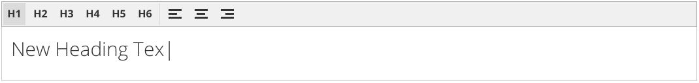
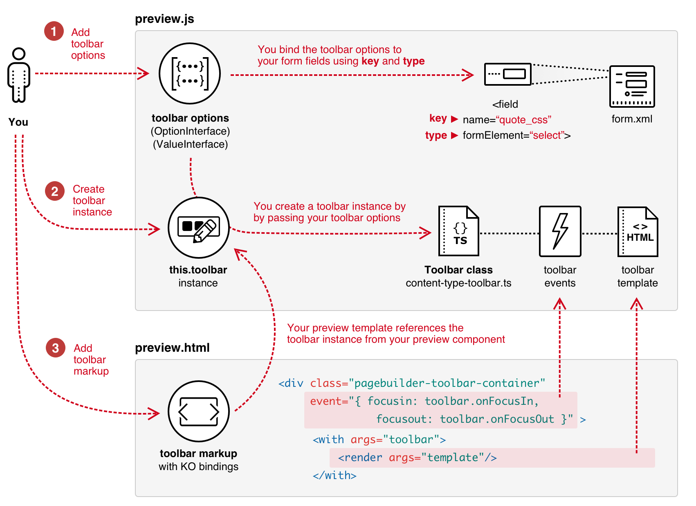

# How to add a custom Toolbar

This topic shows you how to implement an inline toolbar for your content type. You can see an example of a toolbar in Page Builder's Heading content type, as shown here: 



Toolbars provide end-users with a quick way to change common properties of your content type (such as text alignment and heading types) without needing to open the full editor. The toolbar does not replace the need for form fields in the editor; it simply extends those fields.

## How the Toolbar works

The diagram below shows the basic steps for adding a toolbar to your content type. It also shows how the various parts connect and work together.

{:width="851px" height="auto"}


## Step 1: Add toolbar options

Toolbar options are the clickable items in a toolbar that represent the property values of a form field. For example, the Heading content type adds toolbar options for the `text_align` field from `pagebuilder_base_form.xml`. The Heading adds the values of the `text_align` field (`left`, `center`, and `right`) as items on the toolbar, represented with the images provided by the icon CSS classes as shown here:

```js
{
    key: "text_align",
    type: "select",
    values: [
        {
            value: "left",
            label: "Left",
            icon: "icon-pagebuilder-align-left",
        },
        {
            value: "center",
            label: "Center",
            icon: "icon-pagebuilder-align-center",
        },
        {
            value: "right",
            label: "Right",
            icon: "icon-pagebuilder-align-right",
        },
    ],
},
```

The `OptionInterface` and `ValueInterface` define the structure of toolbar options. You can find these interfaces in `magento2-page-builder/app/code/Magento/PageBuilder/view/adminhtml/web/ts/js/content-type-toolbar.types.ts`. Descriptions of the elements follow:

| Element  | Description                                                  |
| -------- | ------------------------------------------------------------ |
| `key`    | The field `name` you are binding to. For example: `<field name="quote_css"...>` |
| `type`   | The `formElement` of the key field. For example: `<field ... formElement="select">` |
| `values` | Array of field option values.                                |
| `value`  | Field option value, such as a CSS class (as shown in the code example). |
| `label`  | Field option label, such as a label for a select option (as shown in the code example) |
| `icon`   | CSS class name for the icon to display in the toolbar to represent the field's option. If you don't include a CSS class, the toolbar will display the label instead. |
{:style="table-layout:auto"}

## Step 2: Create `Toolbar` instance

To create an instance of the Page Builder toolbar in your `preview.js` component:

- **Import Page Builder's `Toolbar` class** (`'Magento_PageBuilder/js/content-type-toolbar'`)
- **Call the toolbar constructor.** The `Toolbar` constructor requires you to pass your `Preview` component and the array of toolbar options you created in step 1 (`this.toolbar = new Toolbar(this, this.getToolbarOptions());`). You can find Page Builder's `Toolbar` class in `magento2-page-builder/app/code/Magento/PageBuilder/view/adminhtml/web/ts/js/content-type-toolbar.ts`. 

```js
define([
    'Magento_PageBuilder/js/content-type/preview',
    'Magento_PageBuilder/js/content-type-toolbar',
], function (PreviewBase, Toolbar) {
    'use strict';

    function Preview(parent, config, stageId) {
        PreviewBase.call(this, parent, config, stageId);
        this.toolbar = new Toolbar(this, this.getToolbarOptions());
    }
});
```

## Step 3: Add toolbar markup

Within your `preview.html` template, use a `div` element (with CSS class and events) to wrap whichever element in your template you want the toolbar to act on. For example, the custom Quote content type wraps its `<blockquote>` element within a `div` with the toolbar's CSS class and event binding, as shown here:

``` html
<!--preview.html-->
<div attr="data.main.attributes" ko-style="data.main.style" class="pagebuilder-content-type" css="data.main.css" event="{ mouseover: onMouseOver, mouseout: onMouseOut }, mouseoverBubble: false">
    <render args="getOptions().template"/>
    <div class="pagebuilder-toolbar-container" 
         tabindex="0" 
         event="{ focusin: toolbar.onFocusIn, focusout: toolbar.onFocusOut }">
        <with args="toolbar">
            <render args="template"/>
        </with>
        <blockquote class="quote-content" attr="data.quote.attributes" css="data.quote.css" ko-style="data.quote.style" data-bind="liveEdit: { field: 'quote_text', placeholder: $t('Enter Quote') }"></blockquote>
    </div>
    <div class="quote-author" attr="data.author.attributes" ko-style="data.author.style" css="data.author.css" data-bind="liveEdit: { field: 'quote_author', placeholder: $t('Enter Author') }"></div>
    <div class="quote-description" attr="data.author_title.attributes" ko-style="data.author_title.style" css="data.author_title.css" data-bind="liveEdit: { field: 'quote_author_desc', placeholder: $t('Enter Description') }"></div>
</div>
```

**Line 4:** Use this CSS class to correctly format and control the screen placement of the toolbar when the wrapped HTML element receives focus. 

**Line 5:** Set a `tabindex` of 0 to ensure that the `div` wrapper is part of the default focus order for tabbing.

**Line 6:** Use the the Toolbar's `onFocusIn` and `onFocusOut` methods to handle the events for `focusin` and `focusout`.

**Lines 7-9:** Add the toolbar's HTML template as returned from your `toolbar` instance of the `Toolbar` class.

 ```js
get template(): string {
    return "Magento_PageBuilder/content-type-toolbar";
}
 ```

You can find this HTML template here: `app/code/Magento/PageBuilder/view/adminhtml/web/template/content-type-toolbar.html`.

## Example code

The following links show how the Heading implements its toolbar within its `preview.html` template and `preview.js` component: 

- `app/code/Magento/PageBuilder/view/adminhtml/web/template/content-type/heading/default/preview.html`
- `app/code/Magento/PageBuilder/view/adminhtml/web/ts/js/content-type/heading/preview.ts`

