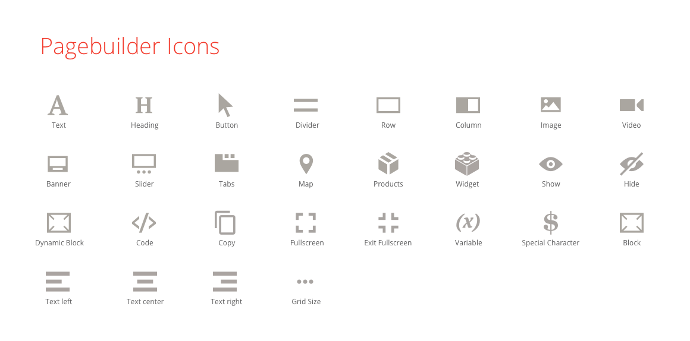
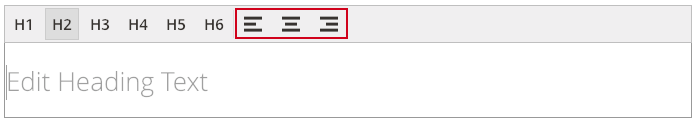
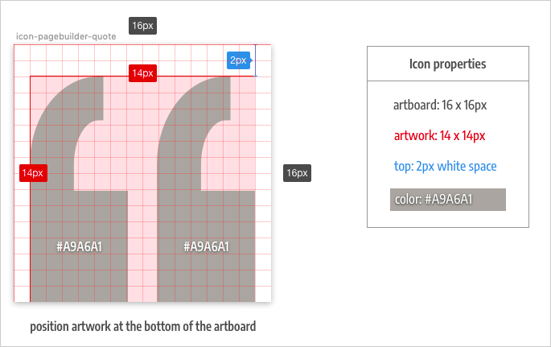
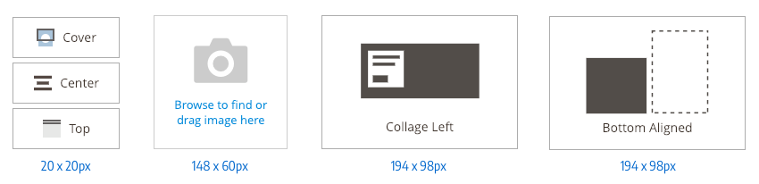
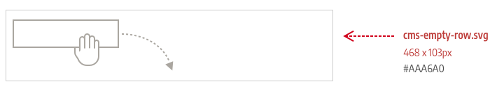
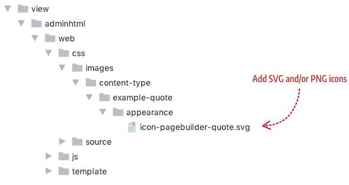
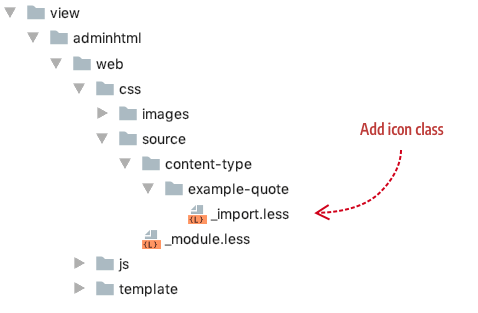

# How to add icons and images

## Overview

Page Builder Admin icons follow the same design principles as the core [Magento Admin icons]. They are simple, flat, and monochromatic to prevent the loss of detail at smaller sizes, while making their shapes easier to comprehend.

## Page Builder icons

Here are the available Page Builder Admin font icons (with class names) for use within your content type:

{:width="870px" height="auto"}

Page Builder references these icons by their class names. For example, Page Builder's Heading content type references `icon-pagebuilder-heading` for its panel icon configuration file, as shown here:

```xml
<config xmlns:xsi="http://www.w3.org/2001/XMLSchema-instance" xsi:noNamespaceSchemaLocation="urn:magento:module:Magento_PageBuilder:etc/content_type.xsd">
    <type name="heading"
          label="Heading"
          icon="icon-pagebuilder-heading"
          ...>
```

Page Builder's Heading also references three more icons in its toolbar as defined in `Magento/PageBuilder/view/adminhtml/web/js/content-type/heading/preview.js`, shown here:

```js
{
    key: "text_align",
    type: "select",
    values: [{
				value: "left",
        label: "Left",
        icon: "icon-pagebuilder-align-left"
      }, {
        value: "center",
        label: "Center",
        icon: "icon-pagebuilder-align-center"
      }, {
        value: "right",
        label: "Right",
        icon: "icon-pagebuilder-align-right"
      }]
}];
```

The icons render in the Heading's toolbar, as shown here:



You can use these icon class names in your own content types or create your own icons using SVG files (recommended) or PNGs, as described next.

## Creating SVG or PNG icons

To add your own icons, we recommend creating SVG images because they are smaller and render more clearly on high-resolution screens, including mobile devices. 

The size, appearance, and color of your images depend on where within Page Builder you want to use them. You can add icons to Page Builder in three areas:

- Panel
- Form
- Stage

### Panel icons

To create a panel icon that integrates seamlessly with the existing panel icons, use the following specifications:



The *artboard* represents the actual width and height of your icon when it is exported from your graphics application (16 x 16px). The *artwork* represents the content of your icon. Following these dimensions to ensure your icons match the size and positioning of the existing Page Builder font icons within the panel.

### Form icons

Most of the images used in the Page Builder base forms are one of three sizes: 20 x 20px, 148 x 60px, and 194 x 98px.



Your images should match Page Builder's images in both size and appearance. This ensures a professional, integrated look alongside Page Builder's existing icons. We recommend creating three artboards to match these three sizes. Then give your artwork 1-2 pixels of white space from the artboard's edge, as described for panel icons.

### Stage icons

Stage images can be a variety of sizes. For example, Page Builder's `cms-empty-row.svg` image (shown for an empty row, no doubt) is 468 x 103px with a color of #AAA6A0, as shown here:



Again, take note of its simple design and subtle color. 

## Adding your images

Add all your SVG and/or PNG icons to the `adminhtml/web/css/images` directory for your content type. For example, if your content type is called `example-quote`, you would put your icons in `adminhtml/web/css/images/content-type/example-quote/appearance/`, as follows: 



## Create CSS classes

As discussed earlier in this topic, Page Builder references its icon fonts using class names from a variety of locations, such as the panel, the toolbar, and the visual selectors within forms. To participate in this icon system, you need to create a CSS class for each SVG and/or PNG image you want to reference by class name. 

Add the CSS classes for your icons to your LESS file in `adminhtml` (and to the `frontend` LESS file if relevant), as shown here:



The following CSS rule set shows one general way to link your icons through CSS:  

```css
.icon-pagebuilder-quote {
    background-image: url('@{baseDir}Example_PageBuilderQuote/css/images/content-type/example-quote/appearance/icon-pagebuilder-quote.svg');
    width: 16px;
    height: 16px;
}
```

If you create an icon for the panel, replace the `background-image` attribute with `content` (as described in the content type tutorial, [Step 6: Add an icon](../create-custom-content-type/step-6-add-icon.md)).

| Attribute              | Description                                                  |
| ---------------------- | ------------------------------------------------------------ |
| `class name`           | To match the class names of Page Builder's native icons, we recommend prefixing your icon names with `icon-pagebuilder`, as we have done with the Quote panel icon. |
| `background-image url` | The `url` used for the `background-image` is the most critical part of your own CSS classes. Always use the `@{baseDir}` variable followed by your full module name, followed by the path to your image, starting with `css`. When deployed, Page Builder creates a link in the static output where the browser can resolve it, as described below. |
| `width`                | Sets the width of the icon image.                            |
| `height`               | Sets the height of the icon image.                           |
{:style="table-layout:auto"}

When deployed, your CSS classes and links to your icons are generated in `pub/static`, as shown here: 


For more general information about Magento's Admin icons and how to create your own icons for use in Magento, take a look at these topics:

* [Magento Admin icons]
* [Create your own icons]
* [The CMS icons repository]


[Magento Admin icons]: https://devdocs.magento.com/guides/v2.2/pattern-library/graphics/iconography/iconography.html
[Create your own icons]: https://devdocs.magento.com/guides/v2.2/pattern-library/graphics/iconography/iconography.html#creating-icons
[The CMS icons repository]: https://github.com/magento-ux/cms-icons
