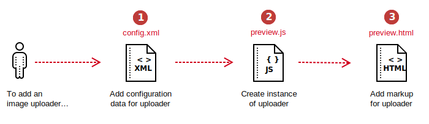

# How to add an image uploader

This topic describes how to add the image uploader component to your content type so that end-users can add images from the Admin stage as needed.



## Step 1: Add configuration data for the uploader

The first step is to customize the image uploader to suit your needs. To do this, you must add the `additional_data` element to your content type's config file to create the data types and values needed to initialize the image uploader for your specific needs.

``` xml
<?xml version="1.0"?>
<config xmlns:xsi="http://www.w3.org/2001/XMLSchema-instance" xsi:noNamespaceSchemaLocation="urn:magento:module:Magento_PageBuilder:etc/content_type.xsd">
    <type name="example_quote"
		...
        <additional_data>
            <item name="uploaderConfig" xsi:type="array">
                <item name="isShowImageUploadInstructions" xsi:type="boolean">false</item>
                <item name="isShowImageUploadOptions" xsi:type="boolean">true</item>
                <item name="maxFileSize" xsi:type="object">ImageMaxFileSizeDesktop</item>
                <item name="allowedExtensions" xsi:type="string">jpg jpeg gif png</item>
                <item name="component" xsi:type="string">Magento_PageBuilder/js/form/element/image-uploader</item>
                <item name="componentType" xsi:type="string">imageUploader</item>
                <item name="dataScope" xsi:type="string">background_image</item>
                <item name="formElement" xsi:type="string">imageUploader</item>
                <item name="uploaderConfig" xsi:type="array">
                    <item name="url" xsi:type="object">Magento\PageBuilder\Model\Config\ContentType\AdditionalData\Provider\Uploader\SaveUrl</item>
                </item>
                <item name="previewTmpl" xsi:type="string">Magento_PageBuilder/form/element/uploader/preview</item>
                <item name="template" xsi:type="string">Magento_PageBuilder/form/element/uploader/preview/image</item>
                <item name="mediaGallery" xsi:type="array">
                    <item name="openDialogUrl" xsi:type="object">Magento\PageBuilder\Model\Config\ContentType\AdditionalData\Provider\Uploader\OpenDialogUrl</item>
                    <item name="openDialogTitle" xsi:type="string" translate="true">Insert Images...</item>
                    <item name="initialOpenSubpath" xsi:type="string">wysiwyg</item>
                    <item name="storeId" xsi:type="object">Magento\PageBuilder\Model\Config\ContentType\AdditionalData\Provider\StoreId</item>
                </item>
                <item name="validation" xsi:type="array">
                    <item name="required-entry" xsi:type="boolean">true</item>
                </item>
            </item>
        </additional_data>
    </type>
</config>
```

## Step 2: Create an instance of the uploader

To create an instance of the image uploader in your preview component (`preview.js`), import the `Magento_PageBuilder/js/content-type/uploader` component as a dependency and call the uploader constructor, passing in your content type's configuration options (added in step 1) and the other required arguments, as shown here :

``` js
define(['Magento_PageBuilder/js/content-type/uploader'], function (Uploader) {
    
        Preview.prototype.getUploader = function () {
            var initialImageValue = this.contentType.dataStore
                .get(this.config.additional_data.uploaderConfig.dataScope, "");
    
            return new Uploader(
                "imageuploader_" + this.contentType.id,
                this.config.additional_data.uploaderConfig,
                this.contentType.id,
                this.contentType.dataStore,
                initialImageValue,
            );
        };
```

**Uploader constructor arguments**


| Argument           | Type      | Description                                                                         | Required | Default                                                                                                 |
| ------------------ | --------- | ----------------------------------------------------------------------------------- | -------- | ------------------------------------------------------------------------------------------------------- |
| `name`             | String    | Used to locate the component in the UI registry.                  | yes     | None                                                                                                    |
| `uploaderConfig`   | Object    | Initializes the image uploader UI component with the configuration settings from the `additional_data` element. | yes     | None                                                                                                    |
| `contentTypeId`    | String    | The ID of the content type you are adding the uploader to.  | yes     | None                                                                                                    |
| `dataStore`        | DataStore | The DataStore to store the selected image in.                          | yes     | None                                                                                                    |
| `initialValue`     | Object[]  | The image value to set for the initial state of the uploader component. | yes     | None                                                                                                    |
| `onChangeCallback` | Function  | The callback to execute when the end-user selects an image.                           | no    | Magento saves the image to the provided `dataStore` using `uploaderConfig.dataScope` as the key.        |
| `onDeleteCallback` | Function  | The callback to execute when the end-user deletes the current image from storage. | no    | Magento removes the image from to the provided `dataStore` using `uploaderConfig.dataScope` as the key. |
{:style="table-layout:auto"}

## Step 3: Add markup for the uploader

To add the image uploader to your preview template (`preview.html`), use Knockout's `scope` binding element to render an instance of your configured uploader component from the Magento registry, as shown here:

``` html
<div ...>
   ...
    <scope args="getUploader().getUiComponent()">
        <render />
    </scope>
   ...
</div>
```

{: .bs-callout .bs-callout-info }
When an end-user deletes a file from the media browser, Magento triggers the `fileDeleted` event on the window with the `mediabrowser` namespace. The passed argument is an object containing the `ids` property, which is an array of ID strings for each of the deleted files. Magento adds the IDs of the selected files in the objects dispatched by the `addFile` and `processFile` methods inside the image uploader component.