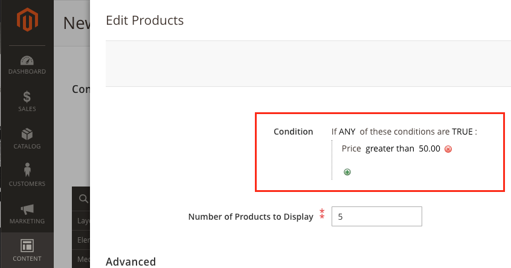

# How to apply product conditions

<!--  -->

Out-of-the-box, product conditions can be set on Page Builder's Product content type to define which products you want to display based on a variety of product attributes. For example, if you only want display products in a category with a price greater than $50, you would setup a condition for the product as shown here:



This topic describes how you can apply the conditions mechanism to your own custom content types.

## Overview

To reuse conditions for custom content types:

1. [Add an attribute to the content type](#add-attribute)
2. [Add the conditions](#add-conditions)
3. [Create a custom `form` data provider](#data-provider)
4. [Include the `conditionsDataProcessor` and attribute](#include)

## Add an attribute to the content type {#add-attribute}

To add an attribute within your custom content type:

``` xml
<attribute source="data-myconditions" name="myconditions"/>
 ```

## Add the conditions {#add-conditions}

To add the conditions `form` element to the `form` UI component:

``` xml
<htmlContent name="myconditions" template="Magento_PageBuilder/form/element/widget-conditions">
    <settings>
        <additionalClasses>
            <class name="admin__field">true</class>
        </additionalClasses>
    </settings>
    <block name="myconditions" class="Magento\PageBuilder\Block\Adminhtml\Form\Element\Conditions">
        <arguments>
            <argument name="formNamespace" xsi:type="string">my_form_namespace</argument>
            <argument name="attribute" xsi:type="string">myconditions</argument>
            <argument name="label" xsi:type="string" translate="true">My Conditions</argument>
        </arguments>
    </block>
</htmlContent>
```

## Create a custom `form` data provider {#data-provider}

To create a custom `form` data provider for the edit form:

``` xml
<dataSource name="mycomponent_form_data_source">
    <argument name="data" xsi:type="array">
        <item name="js_config" xsi:type="array">
            <item name="component" xsi:type="string">Magento_PageBuilder/js/content-type/mycomponent/form/provider</item>
        </item>
    </argument>
</dataSource>
```

The preceding code is an example of how to add a custom `form` data provider. Replace values with ones specific to your custom content type and component.

## Include the `conditionsDataProcessor` and attribute {#include}

To include the `conditionsDataProcessor` and accompanying attribute in the data provider file, `view/adminhtml/web/js/content-type/mycomponent/form/provider.js`:

``` js
define([
    'Magento_PageBuilder/js/form/provider',
    'Magento_PageBuilder/js/form/provider/conditions-data-processor'
], function (Provider, conditionsDataProcessor) {
    'use strict';

    return Provider.extend({
        save: function () {
            var data = this.get('data');

            conditionsDataProcessor(data, 'myconditions');

            return this._super();
        }
    });
});
```

<!--  -->