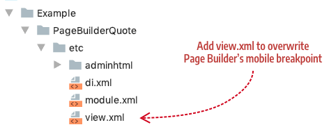

# How to change breakpoints

This topic describes how to change the default mobile breakpoint in Page Builder.

## Default mobile breakpoint

By default, when you configure Page Builder to render a background image for a container, it uses a mobile image when the container's width is equal to or less than 768px. Page Builder defines this mobile breakpoint in the `Magento_PageBuilder/etc/view.xml` file, as shown here:

```xml
<?xml version="1.0"?>
<view xmlns:xsi="http://www.w3.org/2001/XMLSchema-instance" xsi:noNamespaceSchemaLocation="urn:magento:framework:Config/etc/view.xsd">
...
<vars module="Magento_PageBuilder">
    <var name="breakpoints">
        <var name="mobile">
            <var name="conditions">
                <var name="max-width">768px</var>
            </var>
        </var>
    </var>
</vars>
```

## Changing the mobile breakpoint

If your custom theme also uses this max-width breakpoint for your mobile layout, no changes are required.

However, if your custom theme uses a different mobile breakpoint, you need to overwrite the default breakpoint by either: 

1. Adding the theme's breakpoint to the theme's `view.xml` file.
2. Adding a `view.xml` file in the `etc` directory of your content type as shown here:

    

In either case, if your theme uses a mobile breakpoint `max-width` of `600px`, you would add the following markup to the `view.xml` file:

```xml
<?xml version="1.0"?>
<view xmlns:xsi="http://www.w3.org/2001/XMLSchema-instance" xsi:noNamespaceSchemaLocation="urn:magento:framework:Config/etc/view.xsd">
    <vars module="Magento_PageBuilder">
        <var name="breakpoints">
            <var name="mobile">
                <var name="conditions">
                    <var name="max-width">600px</var>
                </var>
            </var>
        </var>
    </vars>
</view>
```

This directs Page Builder to use this mobile breakpoint instead of its default breakpoint of 768px. You can add other responsive breakpoints from your custom theme in the same way.