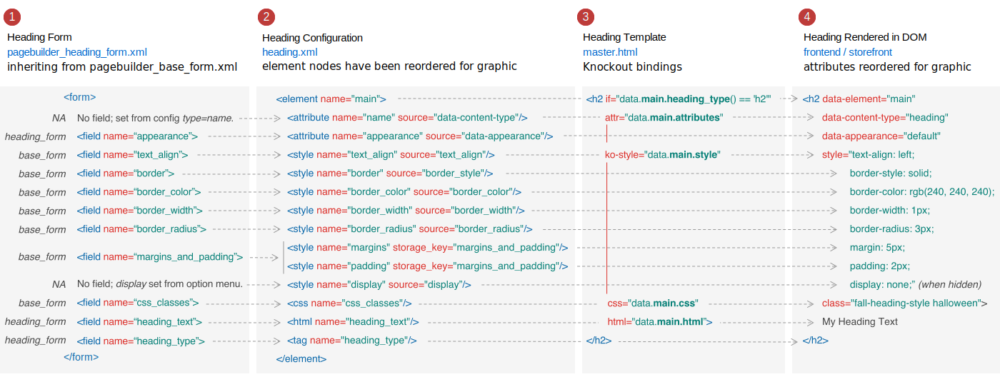
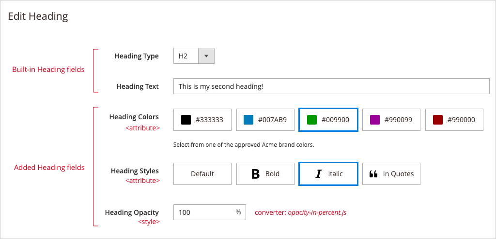
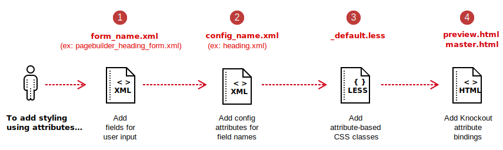
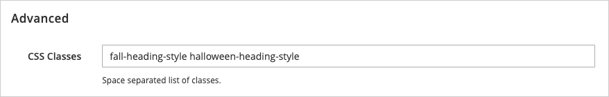

# How to configure styling options

Out of the box, Page Builder provides a variety of interactive CSS styling options for your content types. For example, Page Builder's `Heading` content type provides options for setting heading types (`h1` through `h6`), text alignments, border properties, margins, and paddings. It also lets users apply one or more static CSS classes by entering them into an text input field.

But what if you want to give users even more styling options? For example, maybe you want to add Heading color options. Or Heading text-style options. This topic will show you how to use the `<attribute>`, `<style>`, and `<css>` configuration options to style the elements in your content types.

## Understanding the big picture

Before we dive into the particulars of using different configuration options, let's take a moment to understand the role of the configurations within a Page Builder content type. The following diagram shows how the configuration options for the `Heading` content type connect or map the inputs from the Heading form to the bindings in the Heading templates and finally to the rendered output in the DOM:



1. **Heading Form** (`pagebuilder_heading_form.xml`). This form inherits from the `pagebuilder_base_form.xml`, which provides most of the input fields for the Heading. The Heading form itself provides input fields selecting an `appearance`, entering the `heading_text`, and selecting a `heading_type` (`h1` to `h6`). The text to the left of each field specifies which form the field comes from, the `heading_form` or the `base_form`.

2. **Heading Configuration** (`heading.xml`). The main purpose of all content type configuration files is to provide the data mapping between the form fields and the HTML templates. Configurations map to fields with matching names.

3. **Heading Template** (`master.html`, `preview.html`). Template Knockout bindings map to configurations using their element naming hierarchies.

4. **Heading Rendered in DOM**. Page Builder renders the template bindings to the DOM. The `<attribute>` configurations are rendered as custom attributes for the element. The `<style>` configurations are rendered as inline styles on the element. The `<css>` configuration is rendered as a `class` attribute for the element. And the `<html>` configuration renders the text for the element.

You may not understand all the details right away, but we hope that by providing the whole story up front, it will help you start putting the pieces together as you work your way through this topic and play with the companion example module.

## Install the example module

To help you get started and follow along, we created an example module you can clone and install from [magento-devdocs/PageBuilderStylingOptions](https://github.com/magento-devdocs/PageBuilderStylingOptions). The instructions for installing the module are provided from the `README` file on the repo.

For this example module, we chose to extend the `Heading` content type by adding three new Heading fields: `Heading Colors`, `Heading Styles`, and `Heading Opacity`, as shown here:



_Extended `Heading` form with color, text style, and opacity options_

The example module provides all the code used here to describe how to style elements using `<attribute>` and `<style>` nodes. It also shows the use of a custom converter for our `opacity` style to ensure that users can enter the opacity as a percentage.

## Steps overview

An overview of the steps for styling content type elements is shown here, followed by the detailed instructions for each step:



## Step 1: Add form fields for user input

First, you need to add fields to your content type's form so that users have a way of selecting or entering styling options. In our Heading extension, we add three new fields:

-  `heading_color` for selecting a color for the Heading text
-  `heading_style` for selecting text styles
-  `heading_opacity` for entering an opacity for the Heading text

The UI component form for these fields is shown here:

```xml
<!-- pagebuilder_heading_form.xml form extension -->

<?xml version="1.0" encoding="UTF-8"?>
<form xmlns:xsi="http://www.w3.org/2001/XMLSchema-instance" xsi:noNamespaceSchemaLocation="urn:magento:module:Magento_Ui:etc/ui_configuration.xsd">
    <fieldset name="general">
        <field name="heading_color" sortOrder="25" formElement="select" component="Magento_PageBuilder/js/form/element/visual-select">
            <argument name="data" xsi:type="array">
                <item name="config" xsi:type="array">
                    <item name="default" xsi:type="string">brand-black</item>
                </item>
            </argument>
            <settings>
                <dataType>text</dataType>
                <label translate="true">Heading Colors</label>
                <elementTmpl>Magento_PageBuilder/form/element/visual-select</elementTmpl>
                <notice translate="true">Select from one of the approved Acme brand colors.</notice>
            </settings>
            <formElements>
                <select>
                    <settings>
                        <options class="BrandColorSource"/>
                    </settings>
                </select>
            </formElements>
        </field>
        <field name="heading_style" sortOrder="26" formElement="select" component="Magento_PageBuilder/js/form/element/visual-select">
            <argument name="data" xsi:type="array">
                <item name="config" xsi:type="array">
                    <item name="default" xsi:type="string">style-default</item>
                </item>
            </argument>
            <settings>
                <dataType>text</dataType>
                <label translate="true">Heading Styles</label>
                <elementTmpl>Magento_PageBuilder/form/element/visual-select</elementTmpl>
            </settings>
            <formElements>
                <select>
                    <settings>
                        <options class="TextStyleSource"/>
                    </settings>
                </select>
            </formElements>
        </field>
        <field name="heading_opacity" sortOrder="27" formElement="input">
            <argument name="data" xsi:type="array">
                <item name="config" xsi:type="array">
                    <item name="default" xsi:type="string">100</item>
                </item>
            </argument>
            <settings>
                <label translate="true">Heading Opacity</label>
                <additionalClasses>
                    <class name="admin__field-small">true</class>
                </additionalClasses>
                <addAfter translate="true">%</addAfter>
                <validation>
                    <rule name="validate-number" xsi:type="boolean">true</rule>
                    <rule name="greater-than-equals-to" xsi:type="number">0</rule>
                    <rule name="less-than-equals-to" xsi:type="number">100</rule>
                </validation>
            </settings>
        </field>
    </fieldset>
</form>
```

_New fields to extend the `Heading` form_

The names of these fields, `heading_color`, `heading_style`, and `heading_opacity` are particularly important. They are the same names you must assign to their corresponding `<attribute>` and `<style>` nodes for the `<element>` in your configuration file. We'll do that next.

## Step 2: Add element configuration options

Adding `<attribute>` and `<style>` nodes to an `<element>` configuration is how you add custom attributes and inline styles to the DOM, respectively. Both `<attributes>` and `<style>` nodes have a `name` property and a `source` property.

The `name` properties of these nodes **must** match the corresponding field's name in the form. Using the same names (between config and field) is what allows Page Builder to map the field's input values to the template's output values.

The `source` property for `<attribute>` nodes defines the name of the custom attribute added to the element's DOM so you can use it for targeting the element with your attribute-based CSS classes (step 4).

The `source` property for `<style>` nodes specifies the CSS property (in `snake_case`) added to the element's `style` attribute in the DOM.

In our extended Heading configuration, we added two `<attribute>` nodes and one `<style>` node, with names corresponding to the previously defined `Heading` form fields: `heading_color`, `heading_style`, and `heading_opacity`:

```xml
<!-- heading.xml config extension -->

<?xml version="1.0"?>
<config xmlns:xsi="http://www.w3.org/2001/XMLSchema-instance" xsi:noNamespaceSchemaLocation="urn:magento:module:Magento_PageBuilder:etc/content_type.xsd">
     <type name="heading">
        <appearances>
            <appearance name="default">
                <elements>
                    <element name="main">
                        <attribute name="heading_color" source="data-heading-color"/>
                        <attribute name="heading_style" source="data-heading-style"/>
                        <style name="heading_opacity" source="opacity"/>
                    </element>
                </elements>
            </appearance>
        </appearances>
    </type>
</config>
```

_Configuration attributes for the `Heading` element_

In this example, the `source` values for the nodes (`data-heading-color`, `data-heading-style`, and `opacity`) will be rendered in the DOM for the Heading's `main` element (which is `h2` by default), as shown here:

```html
<h2 data-content-type="heading"
    data-appearance="default"
    data-heading-color="brand-green"
    data-heading-style="style-italic"
    data-element="main"
    style="...; opacity: 1;">
    My Heading Text
</h2>
```

The values shown for these attributes and inline-style properties are set by the user from the form fields. In this example, the user selected `brand-green` from the `heading_color` field, `style-italic` from the `heading_style` field, and entered `100` (in percent) in the `heading_opacity` field (converted to the decimal form you see here using a custom converter you will find in the example).

But before these `attributes` and `styles` can be rendered to the DOM as shown, we need to add the necessary Knockout bindings to our HTML templates. We'll do that next.

## Step 3: Add template Knockout bindings

In our example module, we are using the Heading's native `master.html` and `preview.html` templates, which already have all the Knockout bindings needed to render our new `<attribute>` and `<style>` configurations to the DOM. But its critical that you understand what these bindings are and what they do. Because without them, nothing will be rendered to the screen.

In order for our configuration options to be rendered in the DOM (as described in step 2), we must add or ensure that Knockout bindings for our three configuration styling options are within our HTML templates. The three Knockout bindings for the `<attribute>`, `<style>`, and `<css>` configuration nodes are `attr`, `ko-style`, and `css`, respectively:

```html
<h2 attr="data.main.attributes" ko-style="data.main.style" css="data.main.css"...></h2>
```
For all three Knockout bindings, `data.main` references the `main` element in the configuration file (`heading.xml`). The other binding references are as follows:

-  For the `attr` binding, the `attributes` property references the collection of `<attribute>` nodes defined for the `main` element.

-  For the `ko-style` binding, the `style` property references the collection of `<style>` nodes defined for the `main` element.

-  For the `css` binding, the `css` property references the `<css>` node defined for the `main` element.

These Knockout bindings are applied to the Heading's `master.html` template (as well as the `preview.html` template), as shown here:

```html
<!-- Heading master.html -->

<h1 if="data.main.heading_type() == 'h1'" attr="data.main.attributes" ko-style="data.main.style" css="data.main.css" html="data.main.html"></h1>
<h2 if="data.main.heading_type() == 'h2'" attr="data.main.attributes" ko-style="data.main.style" css="data.main.css" html="data.main.html"></h2>
<h3 if="data.main.heading_type() == 'h3'" attr="data.main.attributes" ko-style="data.main.style" css="data.main.css" html="data.main.html"></h3>
<h4 if="data.main.heading_type() == 'h4'" attr="data.main.attributes" ko-style="data.main.style" css="data.main.css" html="data.main.html"></h4>
<h5 if="data.main.heading_type() == 'h5'" attr="data.main.attributes" ko-style="data.main.style" css="data.main.css" html="data.main.html"></h5>
<h6 if="data.main.heading_type() == 'h6'" attr="data.main.attributes" ko-style="data.main.style" css="data.main.css" html="data.main.html"></h6>
```

_Knockout bindings for the Heading's `data.main` config elements_

With these bindings in place, Page Builder will rendered them to the DOM, using the values from the form fields (as noted in step 2), to look something like this:

```html
<h2 data-content-type="heading"
    data-appearance="default"
    data-heading-color="brand-green"
    data-heading-style="style-italic"
    data-element="main"
    style="...; opacity: 1;">
    My Heading Text
</h2>
```

Knowing how the attributes and their user-selected values are written to the DOM, we can now target our content type's `main` element (`<h2>` in this example) using attribute-based CSS classes from our `_default.less` files. We'll do this next.

## Step 4: Add CSS classes

To target our DOM output, we will use attribute-based CSS classes in our `_default.less` files for both the `adminhtml` and `frontend`, as shown here from our module's adminhtml area:

```scss
/*-- adminhtml _default.less attribute-based classes */
/*-- the frontend  _default.less is the same, but without the .pagebuilder-stage wrapper */

& when (@media-common = true) {
    // Heading Colors
    .pagebuilder-stage {
        [data-heading-color='brand-black'] {
            color: #333333;
        }
        [data-heading-color='brand-blue'] {
            color: #007ab9;
        }
        [data-heading-color='brand-green'] {
            color: #009900;
        }
        [data-heading-color='brand-red'] {
            color: #990000;
        }
        [data-heading-color='brand-purple'] {
            color: #990099;
        }
    }
    // Heading Styles
    [data-heading-style='style-default'] {
        font-weight: normal;
        font-style: normal;
    }
    [data-heading-style='style-bold'] {
        font-weight: bold;
    }
    [data-heading-style='style-italic'] {
        font-style: italic;
    }
    [data-heading-style='style-quotes'] {
        &:before {
            content: '\201C';
        }
        &:after {
            content: '\201D';
        }
    }
}
```

_Attribute-based CSS classes_

Since the values for these attributes are set by the user from the form field, we can add a variety of different CSS properties for each available value. This makes it easy to target and style your content type elements in both small and large ways, depending on your use cases.

## Discussion

Page Builder provides three configuration options for styling the elements in your content types. The differences in usage are summarized here:

-  Use `<attribute>` nodes to style content-type elements with attribute-based CSS classes.
-  Use `<style>` nodes to style content-type elements with specific CSS properties.
-  Use `<css>` nodes to style content-type elements with one or more static CSS classes chosen by the end user.

The `<attribute>` and `<style>` nodes can be added multiple times to a content-type `element`. But the `<css>` node can only be added once per element. Refer to [Understanding the `<css>` node](#understandthecssnode) for more information.

To aid in our discussion of these configuration nodes and how to use them, we will refer to the `element` configuration from `heading.xml` (`PageBuilder/view/adminhtml/pagebuilder/content_type/heading.xml`):

```xml
<!-- snippet from heading.xml -->

<element name="main">
    <style name="text_align" source="text_align"/>
    <style name="border" source="border_style" converter="Magento_PageBuilder/js/converter/style/border-style"/>
    <style name="border_color" source="border_color"/>
    <style name="border_width" source="border_width" converter="Magento_PageBuilder/js/converter/style/border-width"/>
    <style name="border_radius" source="border_radius" converter="Magento_PageBuilder/js/converter/style/remove-px"/>
    <style name="display" source="display" converter="Magento_PageBuilder/js/converter/style/display" preview_converter="Magento_PageBuilder/js/converter/style/preview/display"/>
    <style name="margins" storage_key="margins_and_padding" reader="Magento_PageBuilder/js/property/margins" converter="Magento_PageBuilder/js/converter/style/margins"/>
    <style name="padding" storage_key="margins_and_padding" reader="Magento_PageBuilder/js/property/paddings" converter="Magento_PageBuilder/js/converter/style/paddings"/>
    <attribute name="name" source="data-content-type"/>
    <attribute name="appearance" source="data-appearance"/>
    <tag name="heading_type"/>
    <html name="heading_text" converter="Magento_PageBuilder/js/converter/html/tag-escaper"/>
    <css name="css_classes"/>
</element>
```

{: .bs-callout .bs-callout-info }
The `<tag>` and `<html>` nodes are beyond the scope of this topic, but like the other nodes, they also map to fields in a form. In this case, the `<tag>` node maps to the Heading's `heading_type` field and the `<html>` node maps to the `heading_text` field from the `pagebuilder_heading_form.xml`.

### Understanding and using `style` nodes

By configuring `<elements>` with `<style>` nodes, you can provide end users with a form field that changes a _specific_ CSS property, such as we did with `opacity`.

In the `heading.xml` config example, the `<style>` nodes map to the same-named fields defined in the `pagebuilder_base_form.xml`. This form gives users the fields needed to change each of the CSS properties specified. When rendered to the DOM, Page Builder adds these `<style>`-defined properties (and their user-entered values) to the inline `style` attribute of the `main` DOM element, `<h1>` to `<h6>` depending on the Heading Type selected from the Heading's form.

For example, if a user selected a value for each of the styles defined in the `heading.xml` config, the inline `style` attribute in the storefront DOM would list the `property:values` for all the `<style>` nodes defined, as shown here:

```html
<h2 data-content-type="heading"
    data-element="main"
    style="text-align: left;
           border-style: solid;
           border-color: rgb(240, 240, 240);
           border-width: 1px;
           border-radius: 3px;
           margin: 5px;
           padding: 2px;">
    My Heading Text
</h2>
```

Each `<style>` node defined for the element's configuration gets added to the DOM as another CSS property in the element's `style` attribute. In the example module for this topic, we added `<style name="heading_opacity" source="opacity"/>` to the `heading.xml` config. So when Page Builder renders the extended Heading content type in the DOM, it adds `opacity` to the existing list of CSS properties in the `style` attribute:

```html
<h2 data-content-type="heading"
    data-element="main"
    style="text-align: left;
           border-style: solid;
           border-color: rgb(240, 240, 240);
           border-width: 1px;
           border-radius: 3px;
           margin: 5px;
           padding: 2px;
           opacity: 1;">
    My Heading Text
</h2>
```

### Deciding to use `attribute` or `style` configurations

As mentioned, adding an `<attribute>` node to an `element` configuration gives you a way to provide end users with a form field that can use _CSS classes_, allowing you to change _several_ CSS properties at once. This can be more powerful that using `<style>` configurations that can only change single CSS properties. But depending on your use case, you may not need to use `<attribute>` configurations.

Using `<attribute>` or `<style>` configurations is transparent to end users. But for you, the developer, the choice really depends on how much you need to change the element. If the user option needs to change the element significantly, you may want to use an `<attribute>` so you can apply CSS classes to the element. And if the user option is focused on making a simple property change to the element, you can use a `<style>` configuration.

### Understanding the `css` node {#understandthecssnode}

The `<css>` config node is a bit different from the `<attribute>` and `<style>` nodes. The `<css>` node wasn't designed to be added to an element more than once like the other two nodes. Instead, it was designed to capture multiple CSS classes from a single form field and render those classes to the DOM within the `class` attribute. For this reason, it is currently not possible to add CSS classes to an element's `class` attribute from other form fields.

Out of the box, Page Builder maps the `<css>` config node (for each content type) to the `css_classes` input field from the `pagebuilder_base_form.xml`. For example, if you were to enter two CSS classes into this field within the Heading form, Page Builder would add the `class` attribute to the Heading's `main` element (`<h2>`) and populate it with the CSS classes entered, as shown on the first line here:



```html
<h2 class="fall-heading-style halloween-heading-style"
    data-content-type="heading"
    data-appearance="default"
    data-heading-color="brand-blue"
    data-heading-style="style-default"
    data-element="main"
    style="text-align: left; border-style: solid; border-color: rgb(240, 240, 240); border-width: 1px; border-radius: 3px; margin: 5px; padding: 2px; opacity: 1;">
    My Heading Text
</h2>
```

As mentioned, you can override the `<css>` node to map it to a different field name and/or type. You just can't use it more than once per element.

Regardless of the limitation, you can still use the `<css>` node to provide creative styling options for a content type. For example, if a merchant has a set of standard CSS classes they use during the year for holidays, you could map the `<css>` node to a `select` field that allows end users to choose from sets of merchant-approved classes with descriptive names, like Halloween styling, Christmas styling, and so on.

## Final thoughts

Knowing how to create new content styling options by connecting form inputs to template outputs is one of the most important skills to have as a Page Builder developer. And knowing how to make those connections using `<attribute>`, `<style>`, and `<css>` configurations will give you a variety of powerful and flexible content styling options to offer your end users. So get creative and have fun!
