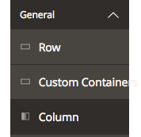
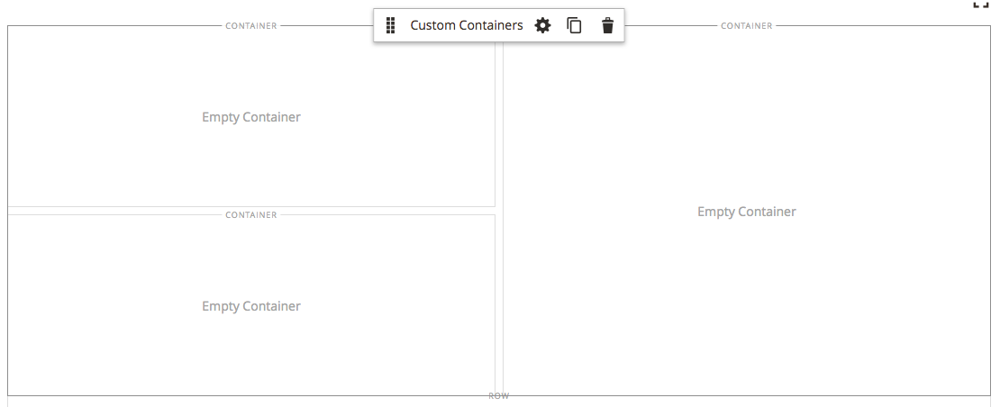
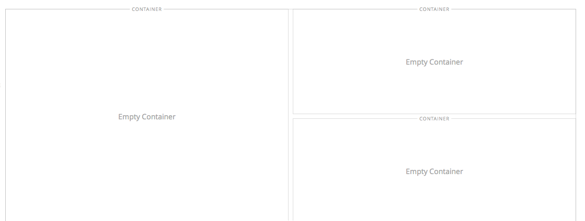
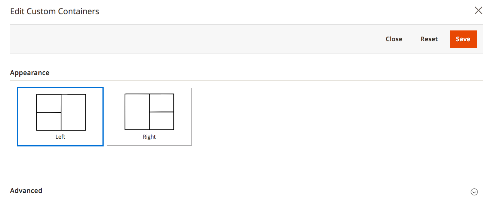

# How to create a container content type

This tutorial takes you through the process of creating a module with the name `VendorName_CustomContainer`.

The module creates a new custom container group content type with a `left` and `right` appearance.
It also creates a new custom container content type for the container group.

Each container group has 3 containers in a grid and styled differently based on the appearance of the container group.

## Before you begin

For creating a generic content type and content type collection, see [How to develop a new content type][].

Make sure you know how to register your custom module.
See [Register your component](https://devdocs.magento.com/guides/v2.2/extension-dev-guide/build/component-registration.html) in devdocs.

## Configuration

### Custom container group

Create the following file to hold the configuration for the custom container group:

``` text
view/base/pagebuilder/content_type/custom_container_group.xml
```

Write the following content into this configuration file:

``` xml
<config xmlns:xsi="http://www.w3.org/2001/XMLSchema-instance" xsi:noNamespaceSchemaLocation="urn:magento:module:Magento_PageBuilder:etc/content_type.xsd">
    <type name="custom-container-group"
          label="Custom Containers"
          component="Magento_PageBuilder/js/content-type-collection"
          preview_component="VendorName_CustomContainer/js/content-type/custom-container-group/preview"
          master_component="Magento_PageBuilder/js/content-type/master-collection"
          form="pagebuilder_custom_container_group_form"
          menu_section="general"
          icon="icon-pagebuilder-row"
          sortOrder="1"
          translate="label">
        <parents default_policy="deny">
            <parent name="stage" policy="allow"/>
        </parents>
        <children default_policy="deny">
            <child name="custom-container" policy="allow"/>
        </children>
        <appearances>
            <appearance default="true"
                        name="left"
                        preview_template="VendorName_CustomContainer/content-type/custom-container-group/left/preview"
                        master_template="VendorName_CustomContainer/content-type/custom-container-group/left/master"
                        reader="Magento_PageBuilder/js/master-format/read/configurable">
                <elements>
                    <element name="main">
                        <style name="text_align" source="text_align"/>
                        <style name="border" source="border_style" converter="Magento_PageBuilder/js/converter/style/border-style"/>
                        <style name="border_color" source="border_color" converter="Magento_PageBuilder/js/converter/style/color"/>
                        <style name="border_width" source="border_width" converter="Magento_PageBuilder/js/converter/style/remove-px"/>
                        <style name="border_radius" source="border_radius" converter="Magento_PageBuilder/js/converter/style/remove-px"/>
                        <style name="margins" storage_key="margins_and_padding" reader="Magento_PageBuilder/js/property/margins" converter="Magento_PageBuilder/js/converter/style/margins" preview_converter="Magento_PageBuilder/js/content-type/row/converter/style/margins"/>
                        <style name="padding" storage_key="margins_and_padding" reader="Magento_PageBuilder/js/property/paddings" converter="Magento_PageBuilder/js/converter/style/paddings" preview_converter="Magento_PageBuilder/js/content-type/row/converter/style/paddings"/>
                        <attribute name="name" source="data-content-type"/>
                        <attribute name="appearance" source="data-appearance"/>
                        <css name="css_classes"/>
                    </element>
                </elements>
            </appearance>
            <appearance name="right"
                        preview_template="VendorName_CustomContainer/content-type/custom-container-group/right/preview"
                        master_template="VendorName_CustomContainer/content-type/custom-container-group/right/master"
                        reader="Magento_PageBuilder/js/master-format/read/configurable">
                <elements>
                    <element name="main">
                        <style name="text_align" source="text_align"/>
                        <style name="border" source="border_style" converter="Magento_PageBuilder/js/converter/style/border-style"/>
                        <style name="border_color" source="border_color" converter="Magento_PageBuilder/js/converter/style/color"/>
                        <style name="border_width" source="border_width" converter="Magento_PageBuilder/js/converter/style/remove-px"/>
                        <style name="border_radius" source="border_radius" converter="Magento_PageBuilder/js/converter/style/remove-px"/>
                        <style name="margins" storage_key="margins_and_padding" reader="Magento_PageBuilder/js/property/margins" converter="Magento_PageBuilder/js/converter/style/margins" preview_converter="Magento_PageBuilder/js/content-type/row/converter/style/margins"/>
                        <style name="padding" storage_key="margins_and_padding" reader="Magento_PageBuilder/js/property/paddings" converter="Magento_PageBuilder/js/converter/style/paddings" preview_converter="Magento_PageBuilder/js/content-type/row/converter/style/paddings"/>
                        <attribute name="name" source="data-content-type"/>
                        <attribute name="appearance" source="data-appearance"/>
                        <css name="css_classes"/>
                    </element>
                </elements>
            </appearance>
        </appearances>
    </type>
</config>
```

Some important configurations to note:

* The "left" and "right" appearances have different custom preview components:

  ``` xml
  preview_template="VendorName_CustomContainer/content-type/custom-container-group/left/preview"
  ```

  ``` xml
  preview_template="VendorName_CustomContainer/content-type/custom-container-group/right/preview"
  ```

* The icon used for this component is the custom container icon:

  ``` xml
  icon="icon-pagebuilder-custom-container"
  ```

* This content type cannot be used anywhere except the stage:

  ``` xml
  <parents default_policy="deny">
      <parent name="stage" policy="allow"/>
  </parents>
  ```

* This content type only accepts [custom container][] content types as children:

  ``` xml
  <children default_policy="deny">
      <child name="custom-container" policy="allow"/>
  </children>
  ```

### Custom container

Create the following file to hold the configuration for the custom container:

``` text
view/base/pagebuilder/content_type/custom_container.xml
```

Write the following content into this configuration file:

``` xml
<config xmlns:xsi="http://www.w3.org/2001/XMLSchema-instance" xsi:noNamespaceSchemaLocation="urn:magento:module:Magento_PageBuilder:etc/content_type.xsd">
    <type name="custom-container"
          label="Container"
          component="Magento_PageBuilder/js/content-type-collection"
          preview_component="VendorName_CustomContainer/js/content-type/custom-container/preview"
          master_component="Magento_PageBuilder/js/content-type/master-collection"
          form="pagebuilder_custom_container_form"
          menu_section="general"
          icon="icon-pagebuilder-row"
          sortOrder="1"
          translate="label">
        <parents default_policy="deny">
            <parent name="custom-container-group" policy="allow"/>
        </parents>
        <children default_policy="allow">
            <child name="custom-container-group" policy="deny"/>
            <child name="row" policy="deny"/>
            <child name="column" policy="deny"/>
            <child name="column-group" policy="deny"/>
            <child name="tabs" policy="deny"/>
            <child name="tab-item" policy="deny"/>
        </children>
        <is_system>false</is_system>
        <appearances>
            <appearance default="true"
                        name="default"
                        preview_template="VendorName_CustomContainer/content-type/custom-container/default/preview"
                        master_template="VendorName_CustomContainer/content-type/custom-container/default/master"
                        reader="Magento_PageBuilder/js/master-format/read/configurable">
                <elements>
                    <element name="main">
                        <style name="background_color" source="background_color" converter="Magento_PageBuilder/js/converter/style/color"/>
                        <style name="background_image" source="background_image" converter="Magento_PageBuilder/js/converter/style/background-image" preview_converter="Magento_PageBuilder/js/converter/style/preview/background-image"/>
                        <style name="background_position" source="background_position"/>
                        <style name="background_size" source="background_size"/>
                        <style name="background_repeat" source="background_repeat"/>
                        <style name="background_attachment" source="background_attachment"/>
                        <style name="text_align" source="text_align"/>
                        <style name="border" source="border_style" converter="Magento_PageBuilder/js/converter/style/border-style"/>
                        <style name="border_color" source="border_color" converter="Magento_PageBuilder/js/converter/style/color"/>
                        <style name="border_width" source="border_width" converter="Magento_PageBuilder/js/converter/style/remove-px"/>
                        <style name="border_radius" source="border_radius" converter="Magento_PageBuilder/js/converter/style/remove-px"/>
                        <style name="margins" storage_key="margins_and_padding" reader="Magento_PageBuilder/js/property/margins" converter="Magento_PageBuilder/js/converter/style/margins" preview_converter="Magento_PageBuilder/js/content-type/row/converter/style/margins"/>
                        <style name="padding" storage_key="margins_and_padding" reader="Magento_PageBuilder/js/property/paddings" converter="Magento_PageBuilder/js/converter/style/paddings" preview_converter="Magento_PageBuilder/js/content-type/row/converter/style/paddings"/>
                        <attribute name="name" source="data-content-type"/>
                        <attribute name="appearance" source="data-appearance"/>
                        <attribute name="background_color_format" source="data-background-color-format" persistence_mode="write"/>
                        <css name="css_classes"/>
                    </element>
                </elements>
                <converters>
                    <converter name="preferred_color_format" component="Magento_PageBuilder/js/mass-converter/preferred-color-format">
                        <config>
                            <item name="background_color_format" value="background_color_format"/>
                        </config>
                    </converter>
                </converters>
            </appearance>
        </appearances>
    </type>
</config>
```

Some important configurations to note:

* This content type can only be used inside a [custom container group][].

  ``` xml
  <parents default_policy="deny">
      <parent name="custom-container-group" policy="allow"/>
  </parents>
  ```

* This content type can contain all content types except:

  * custom container groups
  * columns
  * rows
  * tabs

  ``` xml
  <children default_policy="allow">
      <child name="custom-container-group" policy="deny"/>
      <child name="row" policy="deny"/>
      <child name="column" policy="deny"/>
      <child name="column-group" policy="deny"/>
      <child name="tabs" policy="deny"/>
      <child name="tab-item" policy="deny"/>
  </children>
  ```

## Form

Forms let users edit attributes in the admin panel.

### Layout

Create the following layout files with the given content:

#### Custom container group layout

File name and location: `view/adminhtml/layout/pagebuilder_custom_container_group_form.xml`

Content:

``` xml
<page xmlns:xsi="http://www.w3.org/2001/XMLSchema-instance" layout="admin-1column" xsi:noNamespaceSchemaLocation="urn:magento:framework:View/Layout/etc/page_configuration.xsd">
    <update handle="styles"/>
    <body>
        <referenceContainer name="content">
            <uiComponent name="pagebuilder_custom_container_group_form"/>
        </referenceContainer>
    </body>
</page>
```

#### Custom container layout

File name and location: `view/adminhtml/layout/pagebuilder_custom_container_form.xml`

Content:

``` xml
<page xmlns:xsi="http://www.w3.org/2001/XMLSchema-instance" layout="admin-1column" xsi:noNamespaceSchemaLocation="urn:magento:framework:View/Layout/etc/page_configuration.xsd">
    <update handle="styles"/>
    <body>
        <referenceContainer name="content">
            <uiComponent name="pagebuilder_custom_container_form"/>
        </referenceContainer>
    </body>
</page>
```

#### Custom container group form layout

File name and location: `view/adminhtml/ui_component/pagebuilder_custom_container_group_form.xml`

Content:

``` xml
<form xmlns:xsi="http://www.w3.org/2001/XMLSchema-instance" xsi:noNamespaceSchemaLocation="urn:magento:module:Magento_Ui:etc/ui_configuration.xsd"  extends="pagebuilder_base_form">
    <argument name="data" xsi:type="array">
        <item name="js_config" xsi:type="array">
            <item name="provider" xsi:type="string">pagebuilder_custom_container_group_form.pagebuilder_custom_container_group_form_data_source</item>
        </item>
        <item name="label" xsi:type="string" translate="true">Custom Container Group</item>
    </argument>
    <settings>
        <deps>
            <dep>pagebuilder_custom_container_group_form.pagebuilder_custom_container_group_form_data_source</dep>
        </deps>
        <namespace>pagebuilder_custom_container_group_form</namespace>
    </settings>
    <dataSource name="pagebuilder_custom_container_group_form_data_source">
        <argument name="data" xsi:type="array">
            <item name="js_config" xsi:type="array">
                <item name="component" xsi:type="string">Magento_PageBuilder/js/form/provider</item>
            </item>
        </argument>
        <dataProvider name="pagebuilder_custom_container_group_form_data_source" class="Magento\PageBuilder\Model\ContentType\DataProvider">
            <settings>
                <requestFieldName/>
                <primaryFieldName/>
            </settings>
        </dataProvider>
    </dataSource>
    <fieldset name="appearance_fieldset" sortOrder="10" component="Magento_PageBuilder/js/form/element/dependent-fieldset">
        <settings>
            <label translate="true">Appearance</label>
            <additionalClasses>
                <class name="admin__fieldset-visual-select-large">true</class>
            </additionalClasses>
            <collapsible>false</collapsible>
            <opened>true</opened>
            <imports>
                <link name="hideFieldset">${$.name}.appearance:options</link>
                <link name="hideLabel">${$.name}.appearance:options</link>
            </imports>
        </settings>
        <field name="appearance" formElement="select" sortOrder="10" component="Magento_PageBuilder/js/form/element/dependent-select">
            <argument name="data" xsi:type="array">
                <item name="config" xsi:type="array">
                    <item name="default" xsi:type="string">left</item>
                </item>
            </argument>
            <settings>
                <additionalClasses>
                    <class name="admin__field-wide">true</class>
                    <class name="admin__field-visual-select-container">true</class>
                </additionalClasses>
                <dataType>text</dataType>
                <validation>
                    <rule name="required-entry" xsi:type="boolean">true</rule>
                </validation>
                <elementTmpl>Magento_PageBuilder/form/element/visual-select</elementTmpl>
            </settings>
            <formElements>
                <select>
                    <settings>
                        <options class="VendorName\CustomContainers\Model\Source\AppearanceSourceCustomContainerGroup" />
                    </settings>
                </select>
            </formElements>
        </field>
    </fieldset>
</form>
```

#### Custom container form layout

File name and location: `view/adminhtml/ui_component/pagebuilder_custom_container_form.xml`

Content:

``` xml
<form xmlns:xsi="http://www.w3.org/2001/XMLSchema-instance" xsi:noNamespaceSchemaLocation="urn:magento:module:Magento_Ui:etc/ui_configuration.xsd"  extends="pagebuilder_base_form_with_background_attributes">
    <argument name="data" xsi:type="array">
        <item name="js_config" xsi:type="array">
            <item name="provider" xsi:type="string">pagebuilder_custom_container_form.pagebuilder_custom_container_form_data_source</item>
        </item>
        <item name="label" xsi:type="string" translate="true">Custom Container</item>
    </argument>
    <settings>
        <deps>
            <dep>pagebuilder_custom_container_form.pagebuilder_custom_container_form_data_source</dep>
        </deps>
        <namespace>pagebuilder_custom_container_form</namespace>
    </settings>
    <dataSource name="pagebuilder_custom_container_form_data_source">
        <argument name="data" xsi:type="array">
            <item name="js_config" xsi:type="array">
                <item name="component" xsi:type="string">Magento_PageBuilder/js/form/provider</item>
            </item>
        </argument>
        <dataProvider name="pagebuilder_custom_container_form_data_source" class="Magento\PageBuilder\Model\ContentType\DataProvider">
            <settings>
                <requestFieldName/>
                <primaryFieldName/>
            </settings>
        </dataProvider>
    </dataSource>
    <fieldset name="appearance_fieldset" sortOrder="10" component="Magento_PageBuilder/js/form/element/dependent-fieldset">
        <settings>
            <label translate="true">Appearance</label>
            <additionalClasses>
                <class name="admin__fieldset-visual-select-large">true</class>
            </additionalClasses>
            <collapsible>false</collapsible>
            <opened>true</opened>
            <imports>
                <link name="hideFieldset">${$.name}.appearance:options</link>
                <link name="hideLabel">${$.name}.appearance:options</link>
            </imports>
        </settings>
        <field name="appearance" formElement="select" sortOrder="10" component="Magento_PageBuilder/js/form/element/dependent-select">
            <argument name="data" xsi:type="array">
                <item name="config" xsi:type="array">
                    <item name="default" xsi:type="string">default</item>
                </item>
            </argument>
            <settings>
                <additionalClasses>
                    <class name="admin__field-wide">true</class>
                    <class name="admin__field-visual-select-container">true</class>
                </additionalClasses>
                <dataType>text</dataType>
                <validation>
                    <rule name="required-entry" xsi:type="boolean">true</rule>
                </validation>
                <elementTmpl>Magento_PageBuilder/form/element/visual-select</elementTmpl>
            </settings>
            <formElements>
                <select>
                    <settings>
                        <options class="VendorName\CustomContainers\Model\Source\AppearanceSource" />
                    </settings>
                </select>
            </formElements>
        </field>
    </fieldset>
</form>
```

***Note:** The custom container group extends from `pagebuilder_base_form` while the custom container extends from `pagebuilder_base_form_with_background_attributes`.*

## Appearance source

The layout file for a [custom container group form][] and [custom container form][] specify which data source to use to populate the option elements in the `appearance` select list field.

Example:

``` xml 
<formElements>
    <select>
        <settings>
            <options class="VendorName\CustomContainers\Model\Source\AppearanceSource" />
        </settings>
    </select>
</formElements>
```

The data sources are virtual types of the `VisualSelect` class and defined in your module's `etc/adminhtml/di.xml` file:

``` xml
<config xmlns:xsi="http://www.w3.org/2001/XMLSchema-instance" xsi:noNamespaceSchemaLocation="urn:magento:framework:ObjectManager/etc/config.xsd">
    <virtualType name="VendorName\CustomContainers\Model\Source\AppearanceSourceCustomContainerGroup" type="Magento\PageBuilder\Model\Source\VisualSelect">
        <arguments>
            <argument name="optionsSize" xsi:type="string">large</argument>
            <argument name="optionsData" xsi:type="array">
                <item name="10" xsi:type="array">
                    <item name="value" xsi:type="string">left</item>
                    <item name="title" xsi:type="string" translate="true">Left</item>
                    <item name="icon" xsi:type="string">VendorName_CustomContainer/css/images/content-type/custom-container-group/appearance/left.svg</item>
                </item>
                <item name="20" xsi:type="array">
                    <item name="value" xsi:type="string">right</item>
                    <item name="title" xsi:type="string" translate="true">Right</item>
                    <item name="icon" xsi:type="string">VendorName_CustomContainer/css/images/content-type/custom-container-group/appearance/right.svg</item>
                </item>
            </argument>
        </arguments>
    </virtualType>
    <virtualType name="VendorName\CustomContainers\Model\Source\AppearanceSource" type="Magento\PageBuilder\Model\Source\VisualSelect">
        <arguments>
            <argument name="optionsSize" xsi:type="string">large</argument>
            <argument name="optionsData" xsi:type="array">
                <item name="0" xsi:type="array">
                    <item name="value" xsi:type="string">default</item>
                    <item name="title" xsi:type="string" translate="true">Default</item>
                </item>
            </argument>
        </arguments>
    </virtualType>
</config>
```

Create the icon files in the following locations inside your module to match the deployed location specified in the configuration:

* `view/adminhtml/web/css/images/content-type/custom-container-group/appearance/left.svg`
* `view/adminhtml/web/css/images/content-type/custom-container-group/appearance/right.svg`

## Templates

Templates define the HTML used to render the content type on the store front and in preview mode.

### Container group templates

The following sections describe the preview and master templates for the left and right views for container groups.

#### Container group left preview template

File name and location: `view/adminhtml/web/template/content-type/custom-container-group/left/preview.html`

Content:

``` xml
<div class="pagebuilder-content-type type-container pagebuilder-custom-container-group"
     attr="data.main.attributes"
     ko-style="data.main.style"
     css="data.main.css"
     event="{ mouseover: onMouseOver, mouseout: onMouseOut }">
    <render args="getOptions().template" />
    <render args="childTemplate" />
</div>
```

#### Container group left master template

File name and location: `view/adminhtml/web/template/content-type/custom-container-group/left/master.html`

Content:

``` xml
<div attr="data.main.attributes" ko-style="data.main.style" css="data.main.css">
    <render args="masterTemplate"/>
</div>
```

#### Container group right preview template

File name and location: `view/adminhtml/web/template/content-type/custom-container-group/right/preview.html`

Content:

``` xml
<div class="pagebuilder-content-type type-container pagebuilder-custom-container-group"
     attr="data.main.attributes"
     ko-style="data.main.style"
     css="data.main.css"
     event="{ mouseover: onMouseOver, mouseout: onMouseOut }">
    <render args="getOptions().template" />
    <render args="childTemplate" />
</div>
```

#### Container group right master template

File name and location: `view/adminhtml/web/template/content-type/custom-container-group/right/master.html`

Content:

``` xml
<div attr="data.main.attributes" ko-style="data.main.style" css="data.main.css">
    <render args="masterTemplate"/>
</div>
```

### Container templates

The following sections describe the preview and master templates for the container types.

#### Container preview template

File name and location: `view/adminhtml/web/template/content-type/custom-container/default/preview.html`

Content:

``` xml
<div class="pagebuilder-content-type type-container pagebuilder-custom-container"
     attr="data.main.attributes"
     ko-style="data.main.style"
     css="Object.assign(data.main.css(), {'empty-container': parent.children().length == 0})"
     event="{ mouseover: onMouseOver, mouseout: onMouseOut }, mouseoverBubble: false">
    <render args="getOptions().template" />
    <render args="childTemplate" />

    <div class="pagebuilder-display-label" html="function () { return displayLabel().toUpperCase(); }()"></div>
    <div class="pagebuilder-empty-container" css="{visible: parent.children().length == 0}" translate="'Empty Container'">
        <div class="pagebuilder-drop-indicator"></div>
    </div>
</div>
```

#### Container master template

File name and location: `view/adminhtml/web/template/content-type/custom-container/default/master.html`

Content:

``` html
<div attr="data.main.attributes" ko-style="data.main.style" css="data.main.css">
    <render args="masterTemplate"/>
</div>
```

## JavaScript components

The following JavaScript components add logic to the preview for the custom container group and custom container types.

### Custom container group JS component

File name and location: `view/adminhtml/web/js/content-type/custom-container-group/preview.js`

Content:

``` js
define([
    'jquery',
    'knockout',
    'Magento_PageBuilder/js/events',
    'underscore',
    'Magento_PageBuilder/js/content-type/preview-collection',
    'Magento_PageBuilder/js/content-type-factory',
    'Magento_PageBuilder/js/config'
], function ($, ko, events, underscore, PreviewCollection, createContentType, pageBuilderConfig) {
    'use strict';

    /**
     * Preview Constructor
     *
     * @param parent
     * @param config
     * @param stageId
     * @constructor
     */
    function Preview(parent, config, stageId) {
        var self = this;

        PreviewCollection.call(this, parent, config, stageId);

        events.on("custom-container-group:dropAfter", function (args) {
            if (args.id === self.parent.id && self.parent.children().length === 0) {
                // Once the grid is ready, let's add in our children
                self.populateContainerGroup();
            }
        });
    }
    Preview.prototype = Object.create(PreviewCollection.prototype);

    /**
     * Populate the custom container group with 3 children
     */
    Preview.prototype.populateContainerGroup = function () {
        var self = this;
        var i;

        // Create 3 containers inside container group
        for (i = 0; i < 3; i++) {
            createContentType(
                pageBuilderConfig.getContentTypeConfig("custom-container"),
                this.parent,
                this.parent.stageId
            ).then(function (container) {
                self.parent.addChild(container);
            });
        }
    };

    /**
     * Mark as not a standard container
     *
     * @returns {boolean}
     */
    Preview.prototype.isContainer = function () {
        return false;
    };

    return Preview;
});
```

The code for this component does the following:

* Since custom container group is a collection content type, the component extends the `PreviewCollection` component in the constructor.
* An event listener is added during construction to listen for when the container group is dropped onto the stage.
  The `populateContainerGroup()` method executes when this event occurs.
* The `populateContainerGroup()` method adds 3 containers inside the container group when executed.
* The `isContainer()` method marks this content type as not a standard container.

### Custom container JS component

File name and location: `view/adminhtml/web/js/content-type/custom-container/preview.js`

Content:

``` js
define([
    'jquery',
    'underscore',
    'Magento_PageBuilder/js/content-type/preview-collection'
], function ($, _, PreviewCollection) {
    'use strict';
    var $super;

    /**
     * Preview Constructor
     *
     * @param parent
     * @param config
     * @param stageId
     * @constructor
     */
    function Preview(parent, config, stageId) {
        PreviewCollection.call(this, parent, config, stageId);
    }
    Preview.prototype = Object.create(PreviewCollection.prototype);
    $super = PreviewCollection.prototype;

    /**
     * Remove move, duplicate and remove options
     *
     * @returns {*}
     */
    Preview.prototype.retrieveOptions = function retrieveOptions() {
        var options = $super.retrieveOptions.call(this, arguments);

        return _.filter(options, function (option) {
            return option.code !== "move" &&  option.code !== "duplicate" && option.code !== "remove";
        });
    };

    return Preview;
});
```

The code for this component does the following:

* Since custom container is a collection content type, the component extends the `PreviewCollection` component in the constructor.
* The `retrieveOptions()` method overwrites the content types options list and removes the `move`, `duplicate` , and `remove` options.

## Styling

The following sections describe files that add styles to the content types for the admin panel and storefront.


### Admin panel styles

Lets start with custom-containers left appearance styling.

File name and location: `view/adminhtml/web/css/source/content-type/custom-container/_left.less`

Content:

``` less
.pagebuilder-custom-container-group.pagebuilder-content-type.type-container {
    border: none;
    outline: none;

    > .element-children {
        display: grid;
        grid-gap: 10px;
        grid-template-columns: 1fr 1fr;
        grid-template-rows: 200px 200px;

        .pagebuilder-content-type-wrapper {
            height: 100%;

            .pagebuilder-custom-container {
                height: 100%;

                > .element-children {
                    height: 100%;
                }
            }
        }
    }

    &[data-appearance='left'] {
        > .element-children {
            .pagebuilder-content-type-wrapper {
                &:nth-child(1) {
                    grid-column: 1;
                    grid-row: 1;
                }
                &:nth-child(2) {
                    grid-column: 1;
                    grid-row: 2;
                }
                &:nth-child(3) {
                    grid-column: 2;
                    grid-row: ~"1 / 3";
                }
            }
        }
    }
}

.icon-pagebuilder-custom-container:before {
    content: '\e912';
}
```

Next create custom-containers right appearance styling.

File name and location: `view/adminhtml/web/css/source/content-type/custom-container/_right.less`

Content:

``` less
.pagebuilder-custom-container-group.pagebuilder-content-type.type-container {
    border: none;
    outline: none;

    > .element-children {
        display: grid;
        grid-gap: 10px;
        grid-template-columns: 1fr 1fr;
        grid-template-rows: 200px 200px;

        .pagebuilder-content-type-wrapper {
            height: 100%;

            .pagebuilder-custom-container {
                height: 100%;

                > .element-children {
                    height: 100%;
                }
            }
        }
    }

    &[data-appearance='right'] {
        > .element-children {
            .pagebuilder-content-type-wrapper {
                &:nth-child(1) {
                    grid-column: 1;
                    grid-row: ~"1 / 3";
                }
                &:nth-child(2) {
                    grid-column: 2;
                    grid-row: 1;
                }
                &:nth-child(3) {
                    grid-column: 2;
                    grid-row: 2;
                }
            }
        }
    }
}

.icon-pagebuilder-custom-container:before {
    content: '\e912';
}
```

Then create an import styling sheet to merge the 2 appearance styles.

File name and location: `view/adminhtml/web/css/source/content-type/custom-container/_import.less`

Content:

``` less
@import './_left.less';
@import './_right.less';
```

Then create the module style that will grab the imported styles.

File name and location: `view/adminhtml/web/css/source/module.less`

Content:

``` less
@import 'content-type/custom-container/_import.less';
```

***Note:** The `.icon-pagebuilder-custom-container:before` entry creates the custom icon for the content type.*

### Storefront styles

Lets start with custom-containers left appearance styling.

File name and location: `view/frontend/web/css/source/content-type/custom-container/_left.less`

Content:

``` less
div[data-content-type='custom-container-group'] {
    display: grid;
    grid-gap: 10px;
    grid-template-columns: 1fr 1fr;
    grid-template-rows: 200px 200px;

    &[data-appearance='left'] {
        div[data-content-type='custom-container'] {
            &:nth-child(1) {
                grid-column: 1;
                grid-row: 1;
            }
            &:nth-child(2) {
                grid-column: 1;
                grid-row: 2;
            }
            &:nth-child(3) {
                grid-column: 2;
                grid-row: ~"1 / 3";
            }
        }
    }
}

@media all and (max-width: @screen__m) {
    div[data-content-type='custom-container-group'] {
        grid-template-columns: 1fr;


        &[data-appearance='left'] {
            grid-template-rows: 200px 200px 400px;
        }

        &[data-appearance='left'] {
            div[data-content-type='custom-container'] {
                &:nth-child(1) {
                    grid-column: 1;
                    grid-row: 1;
                }
                &:nth-child(2) {
                    grid-column: 1;
                    grid-row: 2;
                }
                &:nth-child(3) {
                    grid-column: 1;
                    grid-row: 3;
                }
            }
        }

    }
}
```

Next create custom-containers right appearance styling.

File name and location: `view/frontend/web/css/source/content-type/custom-container/_right.less`

Content:

``` less
div[data-content-type='custom-container-group'] {
    display: grid;
    grid-gap: 10px;
    grid-template-columns: 1fr 1fr;
    grid-template-rows: 200px 200px;

    &[data-appearance='right'] {
        div[data-content-type='custom-container'] {
            &:nth-child(1) {
                grid-column: 1;
                grid-row: ~"1 / 3";
            }
            &:nth-child(2) {
                grid-column: 2;
                grid-row: 1;
            }
            &:nth-child(3) {
                grid-column: 2;
                grid-row: 2;
            }
        }
    }
}

@media all and (max-width: @screen__m) {
    div[data-content-type='custom-container-group'] {
        grid-template-columns: 1fr;

        &[data-appearance='right'] {
            grid-template-rows: 400px 200px 200px;
        }

        &[data-appearance='right'] {
            div[data-content-type='custom-container'] {
                &:nth-child(1) {
                    grid-column: 1;
                    grid-row: 1;
                }
                &:nth-child(2) {
                    grid-column: 1;
                    grid-row: 2;
                }
                &:nth-child(3) {
                    grid-column: 1;
                    grid-row: 3;
                }
            }
        }

    }
}
```

Then create an import styling sheet to merge the 2 appearance styles.

File name and location: `view/frontend/web/css/source/content-type/custom-container/_import.less`

Content:

``` less
@import './_left.less';
@import './_right.less';
```

Then create the module style that will grab the imported styles.

File name and location: `view/frontend/web/css/source/module.less`

Content:

``` less
@import 'content-type/custom-container/_import.less';
```

***Note:** The @media section sets up the responsive design feature of stacking the containers.*

## Final steps

Enable and install your component using the following commands:

```
bin/magento module:enable --clear-static-content VendorName_CustomContainer
bin/magento setup:upgrade
```

You should now see a new custom content type in Page Builder called **Custom Container** with a default appearance of **left**.



When you place it onto the stage, it should be filled with 3 container content types that have only one option to edit.

The left appearance will have 2 rows of containers on the left side and the right appearance will have 2 rows on the right side.

Left:


Right:


Use the configuration form in the container group's edit panel to switch between the left and right appearances.



[Register your component]: https://devdocs.magento.com/guides/v2.2/extension-dev-guide/build/component-registration.html
[custom container]: #custom-container
[custom container group]: #custom-container-group
[custom container group form]: #custom-container-group-form-layout
[custom container form]: #custom-container-form-layout