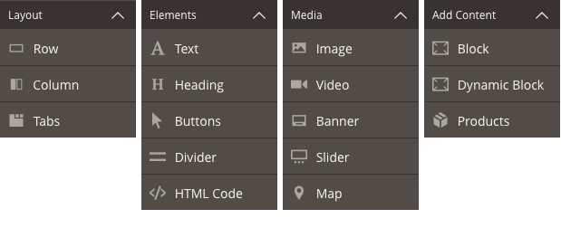
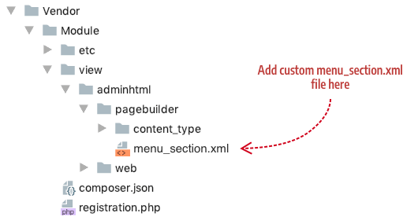
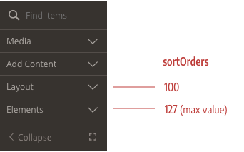
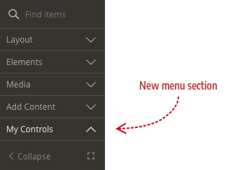
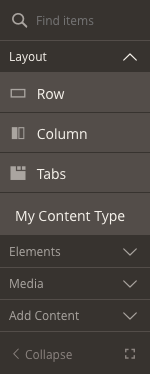

# How to customize the panel

By default, the Page Builder panel has four menu sections (Layout, Elements, Media, Add Content) and 16 content types as shown here:



These menu sections are defined in the Page Builder `menu_section.xml` file and can be extended and customized from your content type by adding new menu sections with unique names and/or changing the `label` and `sortOrder` of the existing menu sections noted in the table below. 

| name          | label       | sortOrder | purpose                                                |
| ------------- | ----------- | --------- | ------------------------------------------------------ |
| `layout`      | Layout      | 1         | Groups containers that control the structure of a page |
| `elements`    | Elements    | 10        | Groups common text and input elements                  |
| `media`       | Media       | 20        | Groups visual and interactive elements                 |
| `add_content` | Add Content | 30        | Groups dynamic storefront elements                     |
{:style="table-layout:auto"}

## Overview

This topic describes four ways to customize the Page Builder panel:

- [Rename panel menu sections](#rename-panel-menu-sections)
- [Reorder panel menu sections](#reorder-panel-menu-sections)
- [Add new panel menu sections](#add-new-panel-menu-sections)
- [Add content types to different panel menu sections](#add-content-types-to-different-panel-menu-sections)

{: .bs-callout .bs-callout-info }
For the sake of the user experience, please don't forget the affect your panel configurations may have on the end user. User's should have access the most important content types first, so be careful how you reorder menu sections and content types within menu sections. We strongly encourage you to place your content types into the existing menu sections when possible, instead of creating your own menu section.

## Rename panel menu sections

To rename the panel menu sections, you need to extend the defaults configured in the Page Builder `menu_section.xml` file as follows:

1. Add an XML file named `menu_section.xml` to your module's `view/adminhtml/pagebuilder/` directory:

    

2. Your `menu_section.xml` file should extend the Page Builder `menu_section.xml` (located here: `app/code/Magento/PageBuilder/view/adminhtml/pagebuilder/menu_section.xml`) as follows:

    ```xml
    <?xml version="1.0"?>
    <config xmlns:xsi="http://www.w3.org/2001/XMLSchema-instance" xsi:noNamespaceSchemaLocation="urn:magento:module:Magento_PageBuilder:etc/menu_section.xsd">
       <!--menu section definitions go here-->
    </config>
    ```

3. Change one or more of the existing menu sections by overriding their `label` values. This example changes the layout menu section from "Layout" to "Structure": 

    ```xml
    <?xml version="1.0"?>
    <config xmlns:xsi="http://www.w3.org/2001/XMLSchema-instance" xsi:noNamespaceSchemaLocation="urn:magento:module:Magento_PageBuilder:etc/menu_section.xsd">
        <menu_section name="layout" translate="label" sortOrder="1" label="Structure"/>
    </config>
    ```

## Reorder panel menu sections

To reorder existing panel menu sections, you need to override the default `sortOrder`s applied to existing panel menu sections. The `sortOrder` is defined as a `byte` value, so technically, it can be set any where from -128 to 127, but we don't recommend using negative values! Just keep the byte value in mind when you try to set the `sortOrder` above 127. The following example changes the order of the `layout` and `elements` menu sections to display as the last two menu sections. 

```xml
<?xml version="1.0"?>
<config xmlns:xsi="http://www.w3.org/2001/XMLSchema-instance" xsi:noNamespaceSchemaLocation="urn:magento:module:Magento_PageBuilder:etc/menu_sections.xsd">
    <menu_section name="layout" sortOrder="100"/>
    <menu_section name="elements" sortOrder="127"/>
</config>
```

The result looks like this:



## Add new panel menu sections

To add a new panel menu section, add a new `<menu_section>` element  in your module's `menu_section.xml` file with a unique `name` as shown here:

```xml
<?xml version="1.0"?>
<config xmlns:xsi="http://www.w3.org/2001/XMLSchema-instance" xsi:noNamespaceSchemaLocation="urn:magento:module:Magento_PageBuilder:etc/menu_sections.xsd">
    <menu_section name="my_controls" translate="label" sortOrder="100" label="My Controls"/>
</config>
```

The result shows the new menu section (My Controls) positioned at the bottom of the panel because the `sortOrder` is set to `100`, after the default `sortOrder` of `add_content` menu section, which is set at `30`.



## Add content types to different panel menu sections

To add your content type to a new menu section or one of the existing menu sections, set your content types configuration `menu_section` attribute to the name of the menu section. This example configuration example adds `my-content-type` to the the `layout` menu section:

```xml
<?xml version="1.0"?>
<config xmlns:xsi="http://www.w3.org/2001/XMLSchema-instance" xsi:noNamespaceSchemaLocation="urn:magento:module:Magento_PageBuilder:etc/content_type.xsd">
    <type name="my-content-type  "
          label="My Content Type"
          menu_section="layout"
          sortOrder="100"
          ...
          >
```

The result looks like this:


