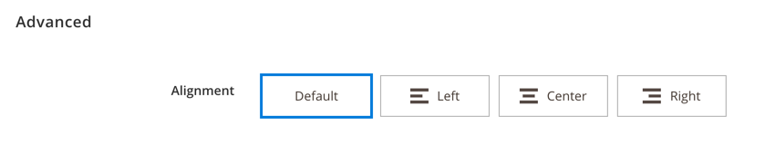

# How to customize selectors

<!--  -->

## What's in this topic

This topic describes how to extend some Page Builder fields to accommodate a custom look and feel for the text alignment option.

In the Advanced section of the content editor, the text alignment field for each content type now shows an icon and title. You can customize the text alignment field to show this new look and feel for your custom content types.



All image formats are supported for icons, though we suggest using an SVG format.

## Overview

To add Visual Select customization to a Page Builder content block:

1. [Override the select component with an element template](#element-template)
2. [Add Visual Select to the XML config](#xml-config)
3. [How to reuse vertical alignment between different content types](#vertical-alignment)

## Override the select component with an element template {#element-template}

We use the default select component in the `/app/code/Magento/PageBuilder/view/adminhtml/ui-component/pagebuilder_base_form.xml` file. You can override the default template, by specifying an element template and component for this functionality to implement the Visual Select option.

In the provided template, specify `<elementTmpl>` alongside updating the fields component to `Magento_PageBuilder/js/form/element/visual-select`:

``` xml
<field name="text_align" sortOrder="10" formElement="select" component="Magento_PageBuilder/js/form/element/visual-select">
    <settings>
        <dataType>text</dataType>
        <label translate="true">Alignment</label>
        <elementTmpl>Magento_PageBuilder/form/element/align</elementTmpl>
    </settings>
```

## Add Visual Select to the XML config {#xml-config}

The available options for select, `value`, `title`, `icon` and `noticeMessage`, can be provided by the PHP class that implements the `\Magento\Framework\Option\ArrayInterface` method.

Options should return an array with the following format:

``` php
[
    value => "value", //key used in the component dataSource
    title => "Title",
    icon => "path/to/picture/on/server",
    noticeMessage => "A message to be displayed when option is selected"
]
```

These new configuration values are used in the `align.html` template file stored in Page Builder's `app/code/Magento/Pagebuilder/view/adminhtml/web/template/form/element` directory.

Use a virtual type of `Magento\PageBuilder\Model\Source\VisualSelect` in your module's `di.xml` configuration file to define the options in a visual select field.

```xml
<virtualType name="AlignmentSource" type="Magento\PageBuilder\Model\Source\VisualSelect">
       <arguments>
           <argument name="optionsSize" xsi:type="string">small</argument>
           <argument name="optionsData" xsi:type="array">
               <item name="0" xsi:type="array">
                   <item name="value" xsi:type="string"/>
                   <item name="title" xsi:type="string" translate="true">Default</item>
               </item>
               <item name="1" xsi:type="array">
                   <item name="value" xsi:type="string">left</item>
                   <item name="title" xsi:type="string" translate="true">Left</item>
                   <item name="icon" xsi:type="string">Magento_PageBuilder/css/images/form/element/visual-select/alignment/left.svg</item>
               </item>
               <item name="2" xsi:type="array">
                   <item name="value" xsi:type="string">center</item>
                   <item name="title" xsi:type="string" translate="true">Center</item>
                   <item name="icon" xsi:type="string">Magento_PageBuilder/css/images/form/element/visual-select/alignment/center.svg</item>
               </item>
               <item name="3" xsi:type="array">
                   <item name="value" xsi:type="string">right</item>
                   <item name="title" xsi:type="string" translate="true">Right</item>
                   <item name="icon" xsi:type="string">Magento_PageBuilder/css/images/form/element/visual-select/alignment/right.svg</item>
               </item>
           </argument>
       </arguments>
   </virtualType>
```

### Display notice when option is selected

For some options you may wish to display an additional notice when the user selects the item. You can do this by providing a `noticeMessage` within the items declaration.

```xml
<item name="3" xsi:type="array">
   <item name="value" xsi:type="string">right</item>
   <item name="title" xsi:type="string" translate="true">Right</item>
   <item name="icon" xsi:type="string">Magento_PageBuilder/css/images/form/element/visual-select/alignment/right.svg</item>
   <item name="noticeMessage" xsi:type="string" translate="true">Message to be displayed below field when selected.</item>
</item>
```

## How to reuse vertical alignment between different content types {#vertical-alignment}

To apply vertical alignment to a content type using the Visual Select component, use the virtualType `Magento\PageBuilder\Model\Source\VerticalAlignment` with options in your module's `di.xml` configuration file.

```xml
<virtualType name="Magento\PageBuilder\Model\Source\VerticalAlignment" type="Magento\PageBuilder\Model\Source\VisualSelect">
    <arguments>
        <argument name="optionsSize" xsi:type="string">small</argument>
        <argument name="optionsData" xsi:type="array">
            <item name="0" xsi:type="array">
                <item name="value" xsi:type="string">flex-start</item>
                <item name="title" xsi:type="string" translate="true">Top</item>
                <item name="icon" xsi:type="string">Magento_PageBuilder/css/images/form/element/visual-select/vertical-align/top.svg</item>
            </item>
            <item name="1" xsi:type="array">
                <item name="value" xsi:type="string">center</item>
                <item name="title" xsi:type="string" translate="true">Center</item>
                <item name="icon" xsi:type="string">Magento_PageBuilder/css/images/form/element/visual-select/vertical-align/center.svg</item>
            </item>
            <item name="2" xsi:type="array">
                <item name="value" xsi:type="string">flex-end</item>
                <item name="title" xsi:type="string" translate="true">Bottom</item>
                <item name="icon" xsi:type="string">Magento_PageBuilder/css/images/form/element/visual-select/vertical-align/bottom.svg</item>
            </item>
        </argument>
    </arguments>
</virtualType>
```

### Add the Visual Select option in your module's form configuration file

```xml
<field name="justify_content" sortOrder="20" formElement="select" component="Magento_PageBuilder/js/form/element/visual-select">
    <argument name="data" xsi:type="array">
        <item name="config" xsi:type="array">
            <item name="default" xsi:type="string">flex-start</item>
        </item>
    </argument>
    <settings>
        <dataType>text</dataType>
        <label translate="true">Vertical Alignment</label>
        <notice translate="true">Vertical alignment controls how the child blocks of this container will be positioned. Set minimum height in order to use vertical alignment.</notice>
        <elementTmpl>Magento_PageBuilder/form/element/visual-select</elementTmpl>
    </settings>
    <formElements>
        <select>
            <settings>
                <options class="Magento\PageBuilder\Model\Source\VerticalAlignment"/>
            </settings>
        </select>
    </formElements>
</field>
```

### Configure the content type with the vertical alignment style properties. This example is from Row.

```html
<elements>
    <element name="main" path=".">
        <style name="background_color" source="background_color" converter="Magento_PageBuilder/js/converter/style/color"/>
        <style name="background_image" source="background_image" converter="Magento_PageBuilder/js/converter/style/background-image" preview_converter="Magento_PageBuilder/js/converter/style/preview/background-image"/>
        <style name="background_position" source="background_position"/>
        <style name="background_size" source="background_size"/>
        <style name="background_repeat" source="background_repeat"/>
        <style name="background_attachment" source="background_attachment"/>
        <style name="text_align" source="text_align"/>
        <style name="border" source="border_style" converter="Magento_PageBuilder/js/converter/style/border-style"/>
        <style name="border_color" source="border_color" converter="Magento_PageBuilder/js/converter/style/color"/>
        <style name="border_width" source="border_width" converter="Magento_PageBuilder/js/converter/style/remove-px"/>
        <style name="border_radius" source="border_radius" converter="Magento_PageBuilder/js/converter/style/remove-px"/>
        <style name="justify_content" source="justify_content" persistence_mode="read"/>
        <style name="min_height" source="min_height" converter="Magento_PageBuilder/js/converter/style/remove-px"/>
        <style name="margins_and_padding" reader="Magento_PageBuilder/js/property/margins" converter="Magento_PageBuilder/js/converter/style/margins" preview_converter="Magento_PageBuilder/js/content-type/row/converter/style/margins"/>
        <style name="margins_and_padding" reader="Magento_PageBuilder/js/property/paddings" converter="Magento_PageBuilder/js/converter/style/paddings" preview_converter="Magento_PageBuilder/js/content-type/row/converter/style/paddings"/>
        <attribute name="name" source="data-content-type"/>
        <attribute name="appearance" source="data-appearance"/>
        <attribute name="enable_parallax" source="data-enable-parallax"/>
        <attribute name="parallax_speed" source="data-parallax-speed"/>
        <attribute name="background_color_format" source="data-background-color-format" persistence_mode="write"/>
        <css name="css_classes"/>
    </element>
    <element name="container">
        <style name="justify_content" source="justify_content"/>
        <static_style source="display" value="flex"/>
        <static_style source="flex_direction" value="column"/>
    </element>
</elements>
```

### Specify which elements in the preview and master templates should receive the style properties

Example master template:

```html
<div attr="data.main.attributes"
     ko-style="Object.assign(data.container.style(), data.main.style())"
     css="data.main.css">
    <render args="masterTemplate"/>
</div>
```

Example preview template:

```html
<div class="pagebuilder-content-type type-container pagebuilder-row children-min-height" data-bind="attr: data.main.attributes, style: data.main.style, css: Object.assign(data.main.css(), {'empty-container': parent.children().length == 0, 'jarallax': data.main.attributes()['data-enable-parallax'] == 1}), event: {mouseover: onMouseOver, mouseout: onMouseOut }, mouseoverBubble: false, afterRender: function (element) { setTimeout(function () { initParallax.call($data, element); }, 0) }">
    <render args="getOptions().template"></render>
    <div class="element-children content-type-container" each="parent.getChildren()" ko-style="data.container.style" css="getChildrenCss()" attr="{id: parent.id + '-children'}" data-bind="sortable: getSortableOptions()" afterRender="function (element) { if (typeof afterChildrenRender === 'function') { afterChildrenRender(element); } }">
        <if args="$parent.isContainer()">
            <div class="pagebuilder-drop-indicator"></div>
        </if>
        <div class="pagebuilder-content-type-wrapper" template="{ name: preview.template, data: preview, afterRender: function () { preview.dispatchAfterRenderEvent.apply(preview, arguments); } }" attr="{ id: id }"></div>
        <if args="$parent.isContainer() && $index() === $parent.parent.getChildren()().length - 1">
            <div class="pagebuilder-drop-indicator"></div>
        </if>
    </div>
    <div class="pagebuilder-display-label" data-bind="text: function () { return displayLabel().toUpperCase(); }()"></div>
    <div class="pagebuilder-empty-container empty-placeholder" data-bind="css: {visible: parent.children().length == 0}, i18n: 'Drag content types or columns here'"></div>
</div>
```

<!--  -->