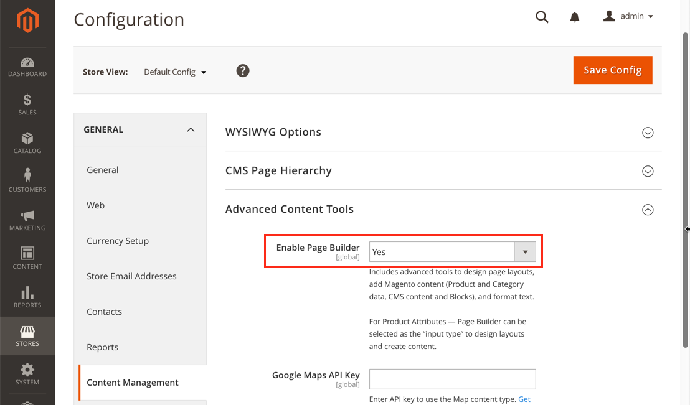

# How to deactivate Page Builder

We recommend deactivating the Page Builder editor through the Admin UI instead of disabling the module through the CLI using `bin/magento`. If you use the CLI, you could break various layouts, for example, the full-width layouts. Deactivating from the Admin UI allows the Page Builder module to continue rendering the content on the storefront even if the editor is not used in the Admin.

Follow these steps to deactivate Page Builder in the Admin UI:

1. In the **Stores** tab, select **Configuration** under the Settings group.
2. In the **General** group on the page, select **Content Management**.
3. Under **Advanced Content Tools**, select **No** for **Enable Page Builder**.

   
   
4. Click **Save Config**

If you disabled or uninstalled the entire Page Builder module instead of just the editor, you need to do the following to continue using Page Builder content:

1. Implement Page Builder widgets and initialize them on dynamic blocks since the JavaScript functionality provided by Page Builder will no longer work.
2. Change the layout in the database for entities that use the full width layout to prevent blank layout content.
