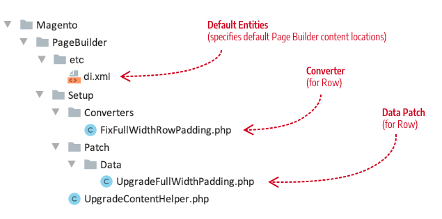
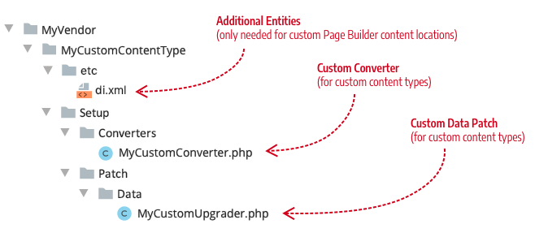

# How to make configuration changes backwards compatible

Before version 1.3, changes to a content-type configuration could (and usually would) break the existing content that was saved with the previous configuration. Why? Because a content type's configuration maps data from its source (the master format) to its display templates. So when the configuration mapping changes, the display of existing content might also change. With significant configuration changes, data (such as styles, attributes, and html) is lost. This change causes existing content to appear incorrectly, or not at all.

The Page Builder content upgrade framework provides an API to convert existing content so it maps to new configurations and displays correctly.

## Example usage for Row

The Page Builder team recently had to change the configuration of the Row's full-width appearance to fix a layout issue. The fix was simple. We moved a style attribute from one element in the Row's full-width appearance to another element. But without the upgrade framework, our change to the Row's configuration would have broken all previously saved Page Builder content with Rows. And because all Page Builder content starts with a Row, all Page Builder content would be broken!

Our fix to this issue was to build a framework that requires two classes:

1. **Converter** (See `FixFullWidthRowPadding.php`)
2. **Patcher** (See `UpgradeFullWidthPadding.php`)

   

### Converter class example

The converter class implements the `DataConverterInterface`. Specifically, it implements the `convert` function where it makes the actual DOM changes to the content types within each master format it receives.

Page Builder's `FixFullWidthRowPadding` class is provided here as an example implementation:

```php
<?php
/**
 * Copyright © Magento, Inc. All rights reserved.
 * See COPYING.txt for license details.
 */

declare(strict_types=1);

namespace Magento\PageBuilder\Setup\Converters;

use Magento\Framework\DB\DataConverter\DataConverterInterface;
use Magento\PageBuilder\Model\Dom\Adapter\ElementInterface;
use Magento\PageBuilder\Model\Dom\HtmlDocument;
use Magento\PageBuilder\Model\Dom\HtmlDocumentFactory;

/**
 * Converter to move padding in full width columns from the main row element to the inner element
 */
class FixFullWidthRowPadding implements DataConverterInterface
{
    /**
     * @var HtmlDocumentFactory
     */
    private $htmlDocumentFactory;

    /**
     * @param HtmlDocumentFactory $htmlDocumentFactory
     */
    public function __construct(HtmlDocumentFactory $htmlDocumentFactory)
    {
        $this->htmlDocumentFactory = $htmlDocumentFactory;
    }

    /**
     * @inheritDoc
     */
    public function convert($value)
    {
        /** @var HtmlDocument $document */
        $document = $this->htmlDocumentFactory->create([ 'document' => $value ]);
        $fullWidthRows = $document->querySelectorAll("div[data-content-type='row'][data-appearance='full-width']");
        /** @var ElementInterface $row */
        foreach ($fullWidthRows as $row) {
            $style = $row->getAttribute("style");
            preg_match("/padding:(.*?);/", $style, $results);
            $padding = isset($results[1]) ? trim($results[1]) : '';
            if (!$padding) {
                continue;
            }
            // remove padding from main row element
            $row->removeStyle("padding");
            // add padding to inner row element
            $innerDiv = $row->querySelector(".row-full-width-inner");
            $innerDiv->addStyle("padding", $padding);
        }
        return $fullWidthRows->count() > 0 ? $document->stripHtmlWrapperTags() : $value;
    }
}
```

### Patcher class example

The patcher class implements the `DataPatchInterface`. Specifically, it uses the framework's `UpgradeContentHelper.php` class to apply the converter class to all the database entities where Page Builder content exists. These locations are provided by the `UpgradableEntitiesPool`, described later in this topic

Page Builder's `UpgradeFullWidthPadding` class is provided here as an example implementation:

```php
<?php
/**
 * Copyright © Magento, Inc. All rights reserved.
 * See COPYING.txt for license details.
 */
namespace Magento\PageBuilder\Setup\Patch\Data;

use Magento\Framework\DB\FieldDataConversionException;
use Magento\Framework\Setup\Patch\DataPatchInterface;
use Magento\PageBuilder\Setup\Converters\FixFullWidthRowPadding;
use Magento\PageBuilder\Setup\UpgradeContentHelper;

/**
 * Patch upgrade mechanism allows us to do atomic data changes
 */
class UpgradeFullWidthPadding implements DataPatchInterface
{
    /**
     * @var UpgradeContentHelper
     */
    private $helper;

    /**
     * @param UpgradeContentHelper $helper
     */
    public function __construct(
        UpgradeContentHelper $helper
    ) {
        $this->helper = $helper;
    }

    /**
     * Do upgrade
     *
     * @return void
     * @throws FieldDataConversionException
     */
    public function apply()
    {
        $this->helper->upgrade([
            FixFullWidthRowPadding::class
        ]);
    }

    /**
     * @inheritdoc
     */
    public function getAliases()
    {
        return [];
    }

    /**
     * @inheritdoc
     */
    public static function getDependencies()
    {
        return [];
    }
}
```

## UpgradableEntitiesPool

The `UpgradableEntitiesPool` provides the locations in the database where Page Builder content can exist. By default, these entities include: `cms_block`, `cms_page`, `catalog_category_entity_text`, `catalog_product_entity_text`, and `pagebuilder_template`. Page Builder defines these entities in `Magento/PageBuilder/etc/di.xml`, as shown here:

```xml
<type name="Magento\PageBuilder\Model\UpgradableEntitiesPool">
    <arguments>
        <argument name="entities" xsi:type="array">
            <item name="cms_block" xsi:type="array">
                <item name="identifier" xsi:type="string">block_id</item>
                <item name="fields" xsi:type="array">
                    <item name="content" xsi:type="boolean">true</item>
                </item>
            </item>
            <item name="cms_page" xsi:type="array">
                <item name="identifier" xsi:type="string">page_id</item>
                <item name="fields" xsi:type="array">
                    <item name="content" xsi:type="boolean">true</item>
                </item>
            </item>
            <item name="catalog_category_entity_text" xsi:type="array">
                <item name="identifier" xsi:type="string">value_id</item>
                <item name="fields" xsi:type="array">
                    <item name="value" xsi:type="boolean">true</item>
                </item>
            </item>
            <item name="catalog_product_entity_text" xsi:type="array">
                <item name="identifier" xsi:type="string">value_id</item>
                <item name="fields" xsi:type="array">
                    <item name="value" xsi:type="boolean">true</item>
                </item>
            </item>
            <item name="pagebuilder_template" xsi:type="array">
                <item name="identifier" xsi:type="string">template_id</item>
                <item name="fields" xsi:type="array">
                    <item name="template" xsi:type="boolean">true</item>
                </item>
            </item>
        </argument>
    </arguments>
</type>
```

If you have created additional database entities for storing Page Builder content, you need to add your custom entity to your `etc/di.xml` as shown in the following example:

```xml
<type name="Magento\PageBuilder\Model\UpgradableEntitiesPool">
    <arguments>
        <argument name="entities" xsi:type="array">
            <item name="my_custom_block" xsi:type="array">
                <item name="identifier" xsi:type="string">custom_block_id</item>
                <item name="fields" xsi:type="array">
                    <item name="content" xsi:type="boolean">true</item>
                </item>
            </item>
        </argument>
    </arguments>
</type>
```

## How to upgrade your custom content types

To use this framework for your custom content-type configuration changes, follow these steps:

1. Set up a new environment that uses a _copy_ of your production data, far away from any real data.

1. Create a test branch off your local environment where you can make and test your data patch converters. You will switch back and forth off this branch to reset the data in your Magento instance as needed.

1. Within the test branch for your content type module changes, set up a directory structure similar to this:

   

1. Implement the `DataConverterInterface` for your content type, using Page Builder's `FixFullWidthRowPadding` class as an example.

1. Implement the `DataPatchInterface` for your content type, using Page Builder's `UpgradeFullWidthPadding` class as an example.

1. Make a copy of the data in the `content` fields of existing entities (`cms_page`, `cms_block`, and so on). You will compare this content with the content changes made after running your upgrade patch.

1. Run `bin/magento setup:upgrade` to test your custom conversion.

   After running `setup:upgrade`, you should see an entry at the bottom of the `patch_list` table of your Magento database. The entry uses your module's namespace with the name of your DataPatch class. So use a descriptive name to ensure the `patch_list` entry makes sense to others.

1. Compare your post-upgraded content to the previous content.

   If the conversion didn't convert your content as planned, remove your entry from the `patch_list` table, switch off away from your test branch, and run `bin/magento setup:upgrade` to reset the database content to try again.

## How to upgrade overloaded Page Builder content types

If you have overloaded the configurations of native Page Builder content types, you need to review Page Builder's native configuration changes for each release and create converters to customize how the native content types are updated for your changes, as necessary.

For example, In version 1.3, we updated the configuration of the native Row content type. Specifically, we moved the padding attribute of the `full-width` appearance from the `<main>` element to the `<inner>` element. So if the Row configuration is different in your custom content type, maybe you removed the `<inner>` element, then you will need to upgrade your overloaded Row as described in the previous steps.
