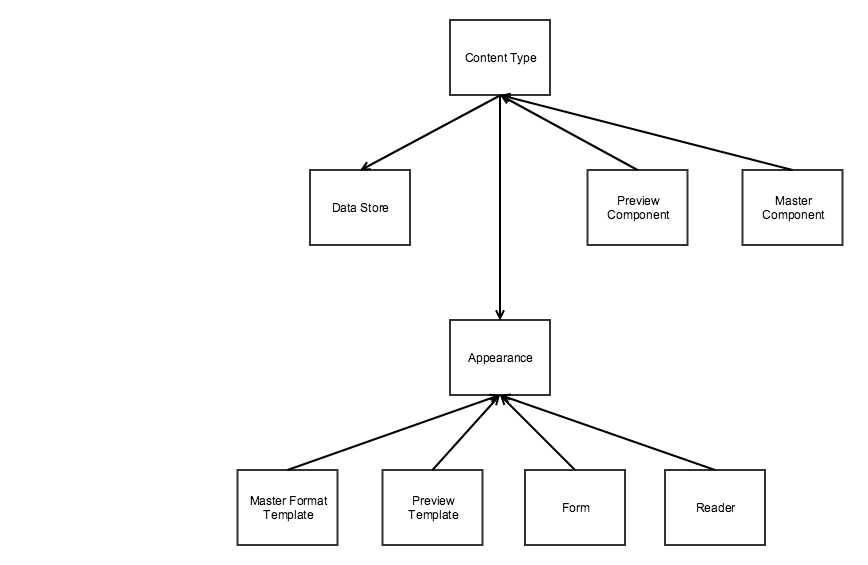
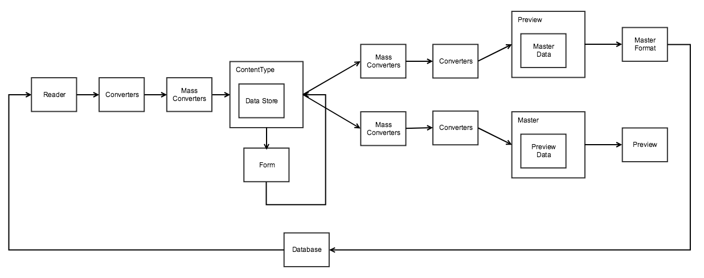

# Page Builder Architecture

We wrote Page Builder in [TypeScript], a superset of JavaScript. Before each release, we transpile the TypeScript to JavaScript.
Use the TypeScript components in the module as a reference to understand the flow of information.

**Note:**
*You need not use TypeScript in your module to work with the Page Builder code.*

Page Builder also uses core Magento technologies such as jQuery, Knockout, and UI Components, along with additional libraries to help with various content types shipped with the module.

## Storage format

Page Builder uses XHTML with inline styles and data attributes for storage and as the master format.
This allows Page Builder to display content with minimum changes to the Magento storefront and other third-party systems.
Use the following steps to display Page Builder content on a Magento storefront or third-party system:
<!--  -->

1. Replace all Magento directives such as `{{image url=path/to/image.png}}`
2. Add custom stylesheet to provide the base styles that the user can't edit. This includes styles for the content types, such as the `slider` and the `tabs`.
3. After the content renders, load and initialize the widgets and libraries on the frontend that need initialization, such as the `slider` and the `tabs`.
<!--  -->

## Integration with Magento and custom modules

When you activate Page Builder, it replaces all WYSIWYG instances by intercepting the WYSIWYG UI Component field and replacing the traditional WYSIWYG editor with the Page Builder editor.

This means you don't have to change your custom extensions if you're using UI components to implement their forms. However, if you don't want your module to use Page Builder for a specific field, you can revert to using the default WYSIWYG again by adding the following entry to the field in your XML configuration file:

```
<item name="wysiwygConfigData" xsi:type="array">
    <item name="is_pagebuilder_enabled" xsi:type="boolean">false</item>
</item>
```

## Big picture



| Entity            | Name in configuration | Description                                                  |
| ----------------- | --------------------- | ------------------------------------------------------------ |
| Content type      | `component`           | View model responsible for rendering the preview and master format |
| Preview component | `preview_component`   | Contains preview specific logic generic for all appearances. Preview component is optional |
| Master component  | `master_component`    | Contains master format rendering logic generic for all appearances. Master component is optional |
| Data Store        |                       | Contains data for the content type                           |
| Appearance        | `appearance`          | Configuration for content type that defines look and behavior. Includes data mapping, form, templates, reader. |
| Preview template  | `preview_template`    | Template used to display the element in the preview          |
| Master template   | `master_template`     | Template used to render the content type to the master format |
| Form              | `form`                | Form used to edit attributes of the content type             |
| Reader            | `reader`              | Reads data for the content type from the master format       |
{:style="table-layout:auto"}

## Data flow


The following is a simple overview of the data flow:

1. Page Builder's reader() reads the data from associated elements in the persisted rendered output of the master format. It does this by traversing through the content type's DOM tree and searching for the associated elements declared in the content types definition XML. Then it uses the various attributes, styles, and other configurations to read the data from the specific area of the DOM element.
2. Page Builder's element converters convert the data for each data mapping entry () to an internal supported format if required, this ensures the data collected from the DOM nodes is compatible with Page Builder's internal data store and UI component fields.
3. Page Builder's mass converters can change data for all content type elements, not just one. For more details, see [converter interface](configurations.md).
4. Page Builder creates its content types and populates the `Magento_PageBuilder/js/data-store` with data.
5. End-users change the data in the data store within the form editor or when using the various live-editing options on the stage.
6. Page Builder converts the data using mass converters.
7. Page Builder converts the data using element data converters.
8. Page Builder updates the preview and master component observables.
9. Page Builder updates the stage with the associated data from the preview update.
10. Page Builder completes a render cycle of the master format, which updates the underlying textarea with the changed content.
11. When the end-user saves the edited parent entity to the Page Builder instance (such as the CMS page or catalog product), Page Builder saves the rendered master format in the same way as any other content for the field.

### Mass converter

A mass converter changes data for all content type elements, not just one. You must define mass converters per appearance.
For example, the content type for two elements, main and image, has data stored in the fields `border`, `border_color`, `border_width`, `background_image`. A mass converter allows you to change all these fields, not just one of them.
Any content type using background images will have a mass converter. In the following example, we use a mass converter to generate a JSON string for an attribute on an element for the storefront to render as a <style /> block.

```xml
<converters>
    <converter name="background_images" component="Magento_PageBuilder/js/mass-converter/background-images">
        <config>
            <item name="attribute_name" value="background_images"/>
            <item name="desktop_image_variable" value="background_image"/>
            <item name="mobile_image_variable" value="mobile_image"/>
        </config>
    </converter>
</converters>
```

Here's the interface for these converters:

```typescript
/**
 * @api
 */
interface ConverterInterface {
    /**
     * Process data after it's read and converted by element converters
     *
     * @param {ConverterDataInterface} data
     * @param {ConverterConfigInterface} config
     * @returns {object}
     */
    fromDom(data: ConverterDataInterface, config: ConverterConfigInterface): object;

    /**
     * Process data before it's converted by element converters
     *
     * @param {ConverterDataInterface} data
     * @param {ConverterConfigInterface} config
     * @returns {object}
     */
    toDom(data: ConverterDataInterface, config: ConverterConfigInterface): object;
}
```

For more information, read about how Page Builder [stores data](#datastore).

### Element converter

An element converter changes a single field at a time.

For example:

```xml
<element name="main">
		<style name="display" source="display" converter="Magento_PageBuilder/js/converter/style/display" preview_converter="Magento_PageBuilder/js/converter/style/preview/display"/>
</element>
```


## Datastore

Page Builder stores data for content types in a simple object called the DataStore: `Magento_PageBuilder/js/data-store`.

The `name` parameter from the [content type configuration](configurations.md) (or `storage_key` if specified) is the name of a parameter in the DataStore. You can use the `subscribe` method to listen for changes in the `DataStore` and perform custom actions like updating the UI.

This is how the system binds the data from the DataStore to your elements attribute or style. When you include a new attribute or style, you must specify where it should retrieve its data from the content type. These `name` values normally bind to the field names within UI component forms. The field names are the keys we use to save the data.

## Content type configuration

See [content type configuration](configurations.md) for more information.

## Appearances

Appearances provide several ways to customize your content types. For example, you can:

1. Add new style properties to existing content types.
2. Add new attributes to existing content types. This is similar to adding new style properties.
3. Change templates.
4. Move data between elements, by data-mapping within the content type's configuration file. For example, a developer can move the `margin` style property from one element to another.
5. Change the form for a [content type].

## Module structure

| File type               | Location                                                     |
| ----------------------- | ------------------------------------------------------------ |
| Content type components | `Vendor/ModuleName/view/adminhtml/web/js/content-type/content-type-name` |
| Content type templates  | `Vendor/ModuleName/view/adminhtml/web/template/content-type/content-type-name/appearance-name` |
| Styles                  | `Vendor/ModuleName/view/adminhtml/web/css/source/content-type/content-type-name` |
{:style="table-layout:auto"}

**Note:**
We have also considered introducing an appearance component and/or moving the initialization of the libraries to bindings. This would allow you to add custom logic per appearance changes and libraries per appearance for content types like the `slider` and the `tabs`.

[TypeScript]: https://www.typescriptlang.org/
